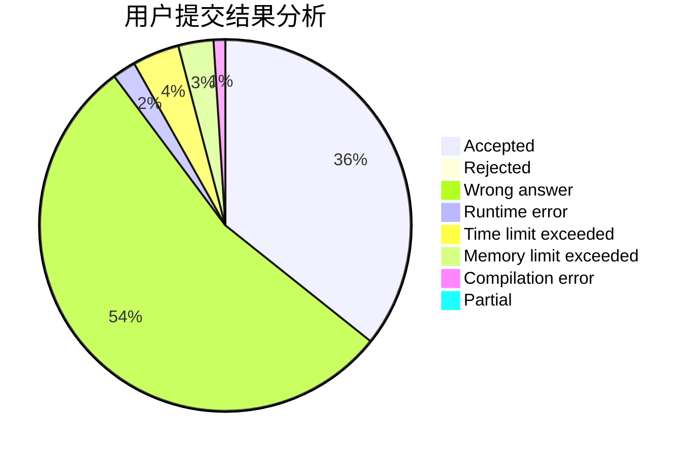
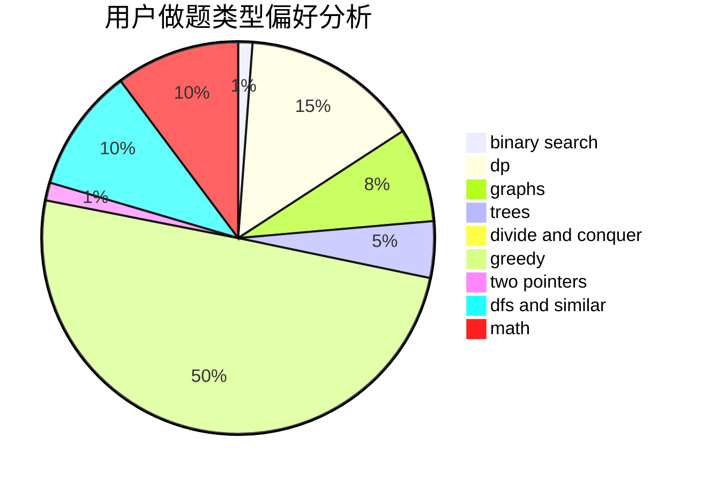

# lvjia8021

<!-- tabs:start -->

#### **用户提交结果分析**

#### **用户做题类型偏好分析**

<!-- tabs:end -->
# 推荐题目
[311D](https://codeforces.com/contest/311/problem/D)
[347A](https://codeforces.com/contest/347/problem/A)
[359C](https://codeforces.com/contest/359/problem/C)
[19A](https://codeforces.com/contest/19/problem/A)
[1292D](https://codeforces.com/contest/1292/problem/D)
[468E](https://codeforces.com/contest/468/problem/E)
[1055B](https://codeforces.com/contest/1055/problem/B)
[1156C](https://codeforces.com/contest/1156/problem/C)
[1196A](https://codeforces.com/contest/1196/problem/A)
[1085G](https://codeforces.com/contest/1085/problem/G)
