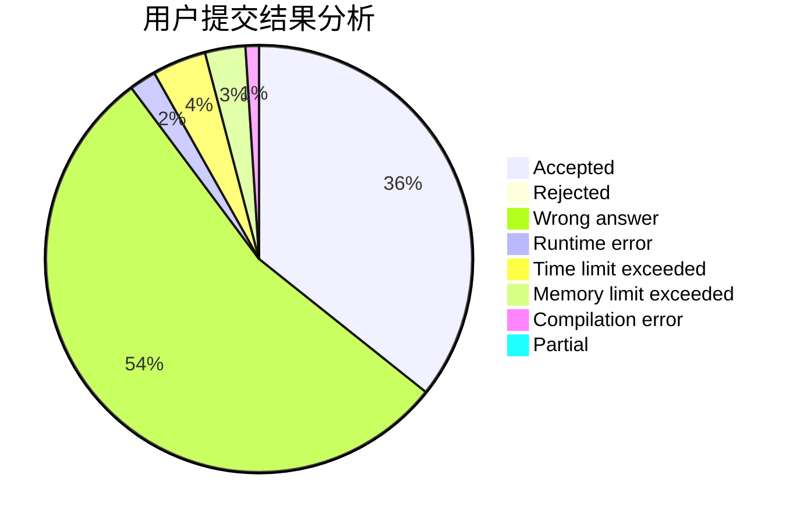
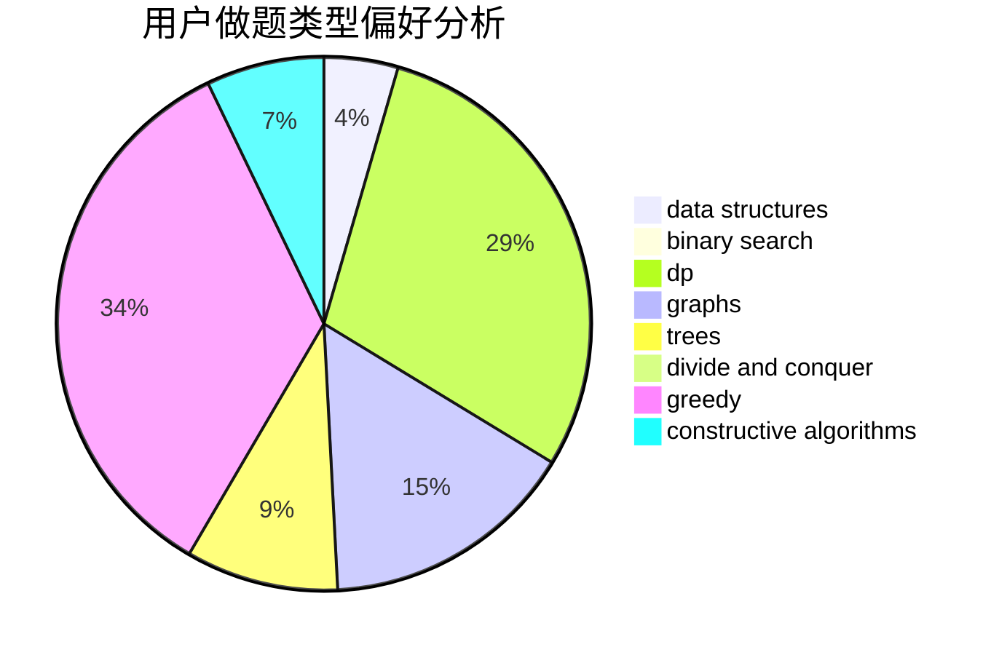

# lvjia8021

<!-- tabs:start -->

#### **用户提交结果分析**

#### **用户做题类型偏好分析**

#### **用户错题知识点分析**

<!-- tabs:end -->
# 推荐题目
[311D](https://codeforces.com/contest/311/problem/D)		data structures,
                        math		  
[347A](https://codeforces.com/contest/347/problem/A)		constructive algorithms,
                        implementation,
                        sortings		  
[359C](https://codeforces.com/contest/359/problem/C)		math,
                        number theory		  
[19A](https://codeforces.com/contest/19/problem/A)		implementation		  
[1292D](https://codeforces.com/contest/1292/problem/D)		dp,
                        graphs,
                        greedy,
                        math,
                        number theory,
                        trees		  
[468E](https://codeforces.com/contest/468/problem/E)		dp,
                        graph matchings,
                        math,
                        meet-in-the-middle		  
[1055B](https://codeforces.com/contest/1055/problem/B)		dsu,
                        implementation		  
[1156C](https://codeforces.com/contest/1156/problem/C)		binary search,
                        greedy,
                        sortings,
                        ternary search,
                        two pointers		  
[1196A](https://codeforces.com/contest/1196/problem/A)		brute force,
                        constructive algorithms,
                        math		  
[1085G](https://codeforces.com/contest/1085/problem/G)		combinatorics,
                        data structures,
                        dp		  
