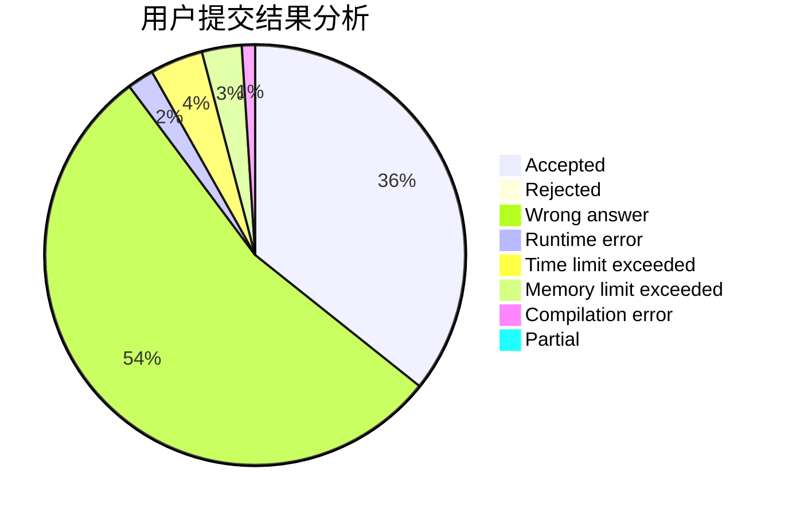
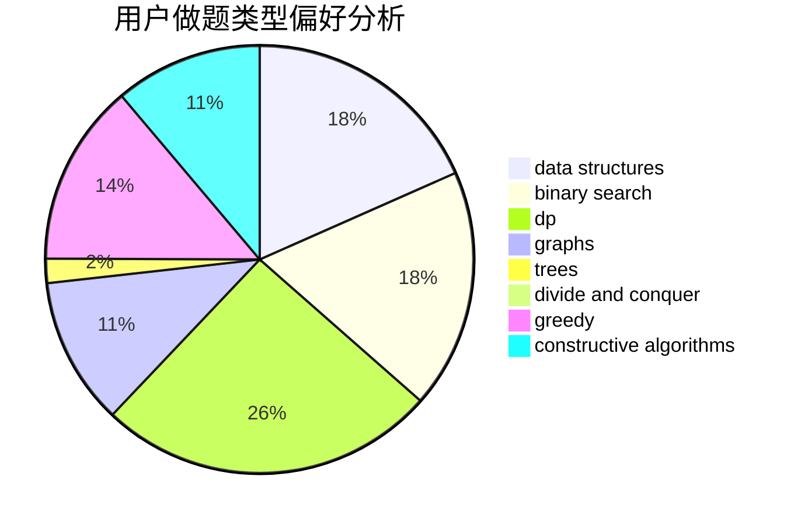

# lvjia8021

<!-- tabs:start -->

#### **用户提交结果分析**

#### **用户做题类型偏好分析**

#### **用户错题知识点分析**

<!-- tabs:end -->
# 推荐题目
[295A](https://codeforces.com/contest/295/problem/A)		data structures,
                        implementation		  
[317D](https://codeforces.com/contest/317/problem/D)		dp,
                        games		  
[331C3](https://codeforces.com/contest/331C/problem/3)		dp		  
[171H](https://codeforces.com/contest/171/problem/H)		*special problem,
                        implementation		  
[1285C](https://codeforces.com/contest/1285/problem/C)		brute force,
                        math,
                        number theory		  
[449B](https://codeforces.com/contest/449/problem/B)		graphs,
                        greedy,
                        shortest paths		  
[1054G](https://codeforces.com/contest/1054/problem/G)		constructive algorithms,
                        greedy,
                        math		  
[1154C](https://codeforces.com/contest/1154/problem/C)		implementation,
                        math		  
[1190C](https://codeforces.com/contest/1190/problem/C)		brute force,
                        games,
                        greedy		  
[1085B](https://codeforces.com/contest/1085/problem/B)		math		  
