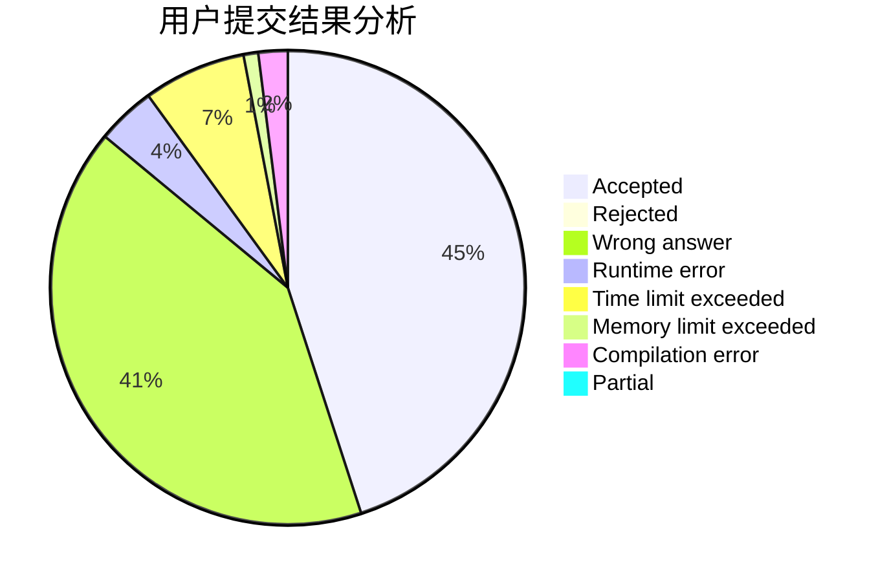
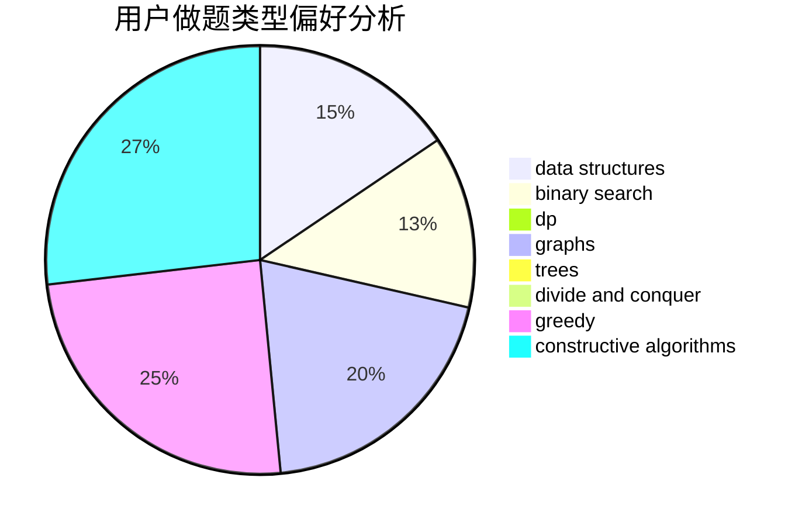
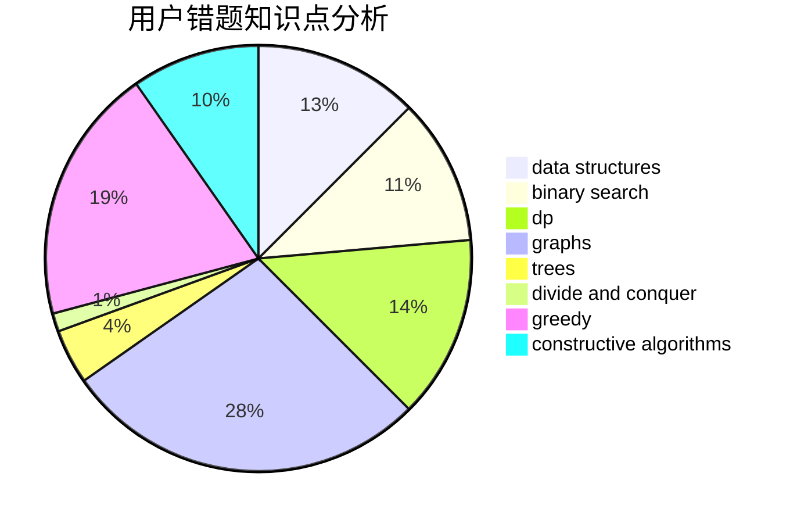

# lwn_16

<!-- tabs:start -->

#### **用户提交结果分析**

#### **用户做题类型偏好分析**

#### **用户错题知识点分析**

<!-- tabs:end -->
# 推荐题目
[371C](https://codeforces.com/contest/371/problem/C)		binary search,
                        brute force		  
[1141D](https://codeforces.com/contest/1141/problem/D)		greedy,
                        implementation		  
[808F](https://codeforces.com/contest/808/problem/F)		binary search,
                        flows,
                        graphs		  
[1103D](https://codeforces.com/contest/1103/problem/D)		bitmasks,
                        dp		  
[841A](https://codeforces.com/contest/841/problem/A)		brute force,
                        implementation		  
[544A](https://codeforces.com/contest/544/problem/A)		implementation,
                        strings		  
[835C](https://codeforces.com/contest/835/problem/C)		dp,
                        implementation		  
[930A](https://codeforces.com/contest/930/problem/A)		dfs and similar,
                        graphs,
                        trees		  
[666D](https://codeforces.com/contest/666/problem/D)		brute force,
                        geometry		  
[1290D](https://codeforces.com/contest/1290/problem/D)		constructive algorithms,
                        graphs,
                        interactive		  
