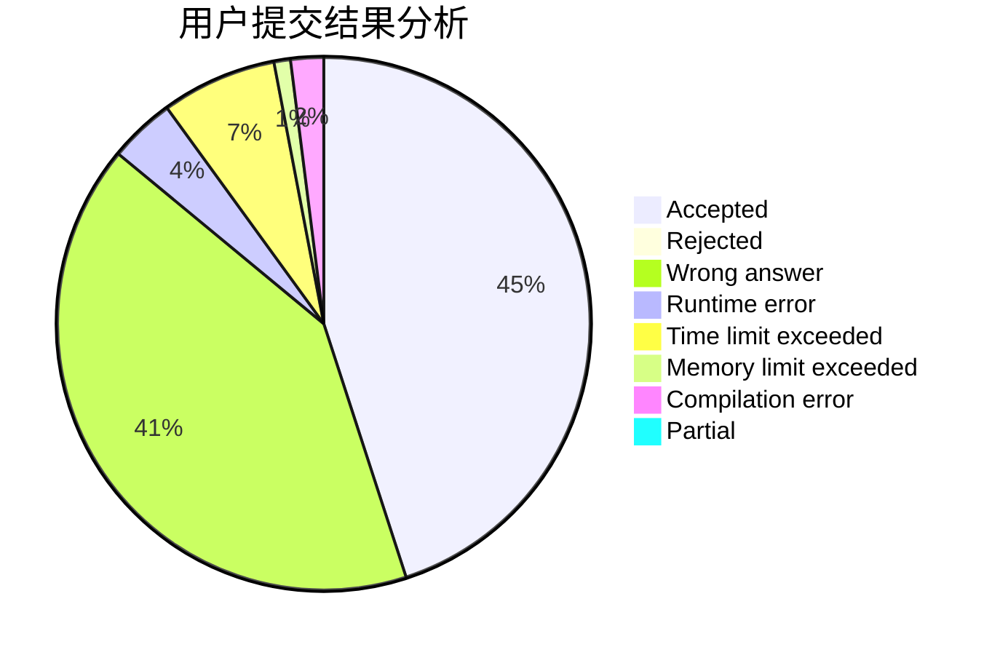
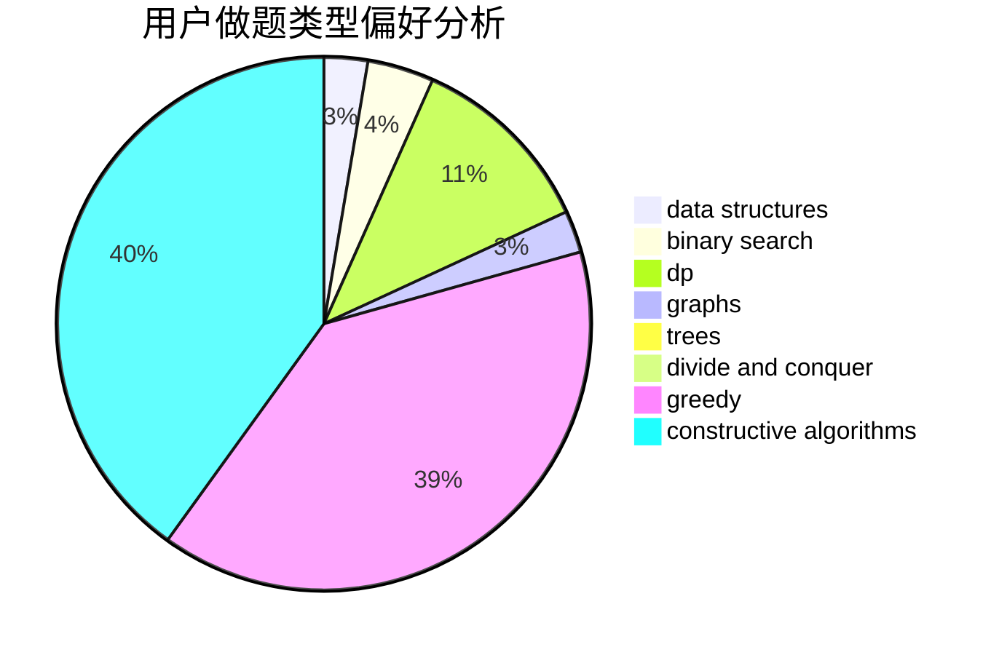
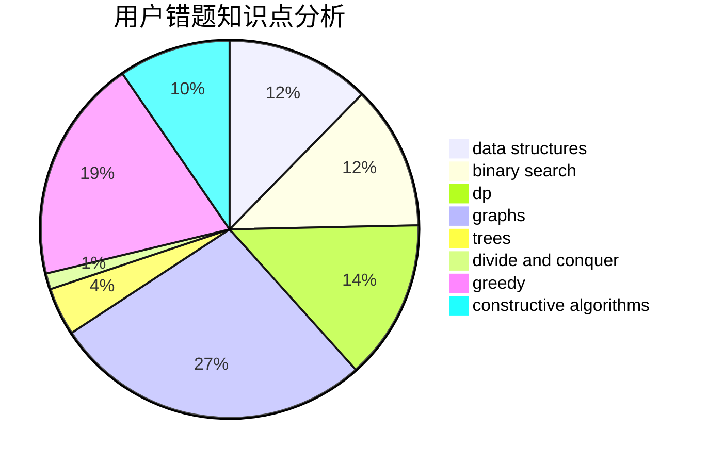

# lwn_16

<!-- tabs:start -->

#### **用户提交结果分析**

#### **用户做题类型偏好分析**

#### **用户错题知识点分析**

<!-- tabs:end -->
# 推荐题目
[345A](https://codeforces.com/contest/345/problem/A)		*special problem,
                        probabilities		  
[113D](https://codeforces.com/contest/113/problem/D)		math,
                        matrices,
                        probabilities		  
[793D](https://codeforces.com/contest/793/problem/D)		dp,
                        graphs,
                        shortest paths		  
[1103A](https://codeforces.com/contest/1103/problem/A)		constructive algorithms,
                        implementation		  
[821B](https://codeforces.com/contest/821/problem/B)		brute force,
                        math		  
[518B](https://codeforces.com/contest/518/problem/B)		greedy,
                        implementation,
                        strings		  
[816B](https://codeforces.com/contest/816/problem/B)		binary search,
                        data structures,
                        implementation		  
[911E](https://codeforces.com/contest/911/problem/E)		constructive algorithms,
                        data structures,
                        greedy,
                        implementation		  
[634A](https://codeforces.com/contest/634/problem/A)		constructive algorithms,
                        implementation		  
[1283D](https://codeforces.com/contest/1283/problem/D)		graphs,
                        greedy,
                        shortest paths		  
