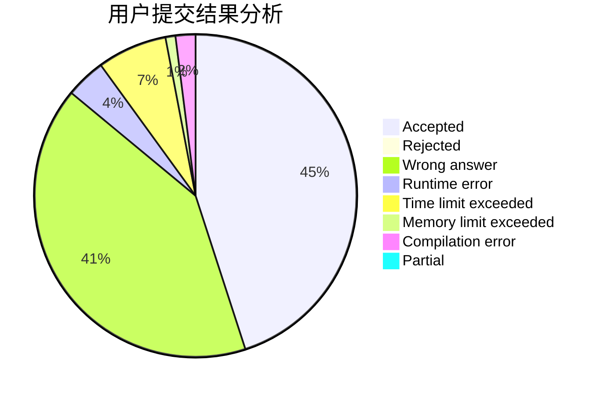
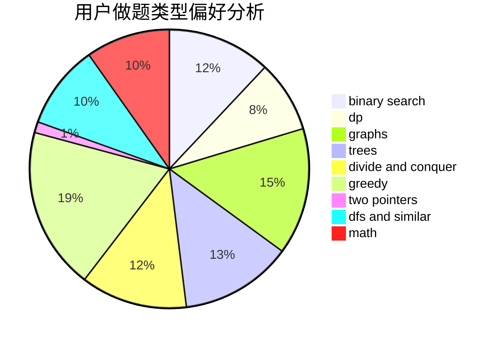

# lwn_16

<!-- tabs:start -->

#### **用户提交结果分析**

#### **用户做题类型偏好分析**

<!-- tabs:end -->
# 推荐题目
[371C](https://codeforces.com/contest/371/problem/C)
[1141D](https://codeforces.com/contest/1141/problem/D)
[808F](https://codeforces.com/contest/808/problem/F)
[1103D](https://codeforces.com/contest/1103/problem/D)
[841A](https://codeforces.com/contest/841/problem/A)
[544A](https://codeforces.com/contest/544/problem/A)
[835C](https://codeforces.com/contest/835/problem/C)
[930A](https://codeforces.com/contest/930/problem/A)
[666D](https://codeforces.com/contest/666/problem/D)
[1290D](https://codeforces.com/contest/1290/problem/D)
