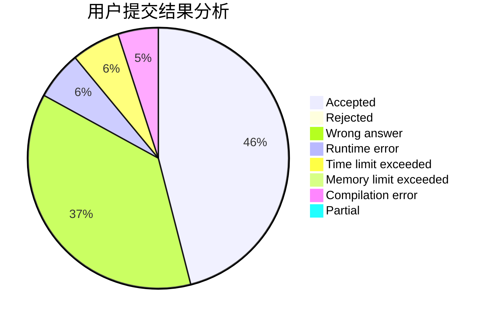
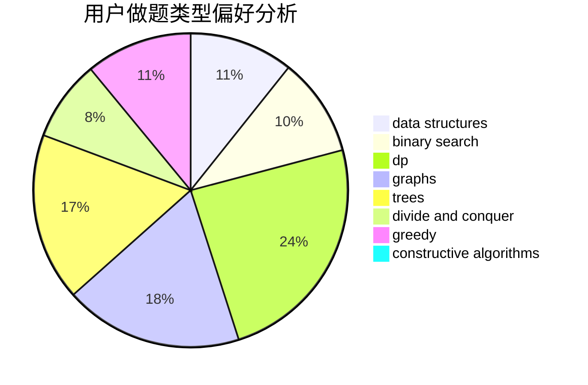

# BlockChanZJ

<!-- tabs:start -->

#### **用户提交结果分析**

#### **用户做题类型偏好分析**

#### **用户错题知识点分析**

<!-- tabs:end -->
# 推荐题目
[1430F](https://codeforces.com/contest/1430/problem/F)		dp,
                        greedy		  
[1493B](https://codeforces.com/contest/1493/problem/B)		brute force,
                        implementation		  
[1294F](https://codeforces.com/contest/1294/problem/F)		dfs and similar,
                        dp,
                        greedy,
                        trees		  
[1038D](https://codeforces.com/contest/1038/problem/D)		dp,
                        greedy,
                        implementation		  
[570A](https://codeforces.com/contest/570/problem/A)		implementation		  
[56B](https://codeforces.com/contest/56/problem/B)		implementation		  
[1284E](https://codeforces.com/contest/1284/problem/E)		combinatorics,
                        geometry,
                        math,
                        sortings		  
[1150E](https://codeforces.com/contest/1150/problem/E)		dsu,graphs,sortings,trees		  
[475B](https://codeforces.com/contest/475/problem/B)		brute force,
                        dfs and similar,
                        graphs,
                        implementation		  
[1316F](https://codeforces.com/contest/1316/problem/F)		data structures,
                        divide and conquer,
                        probabilities		  
