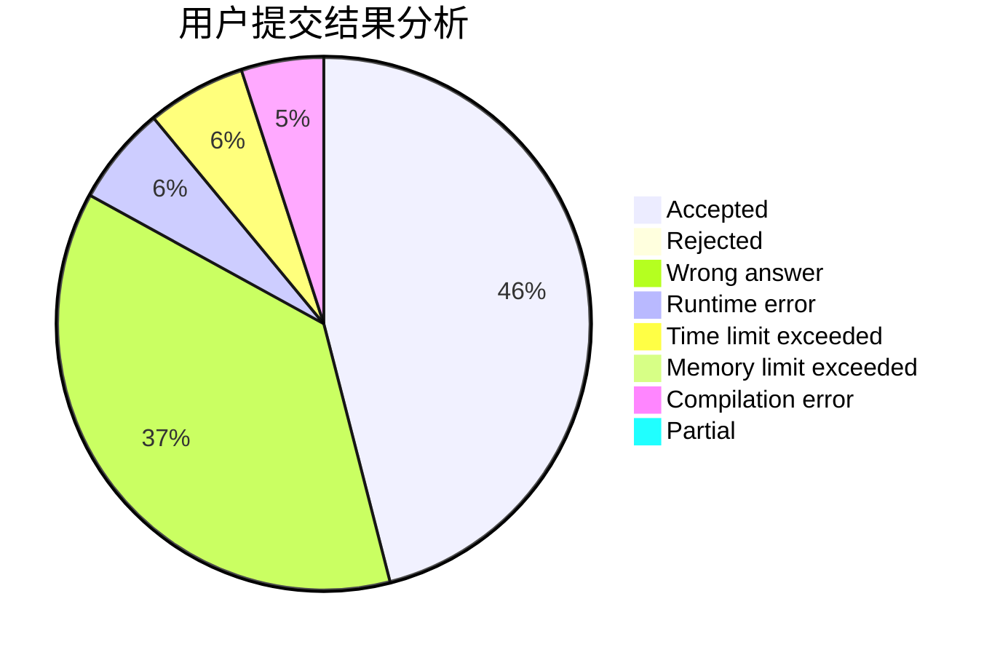
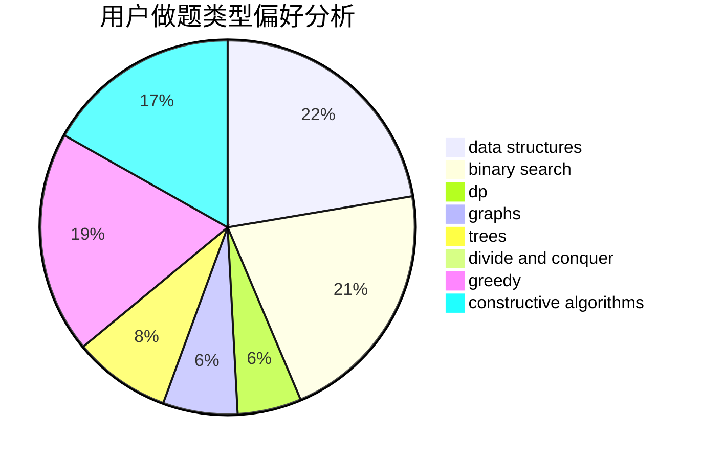
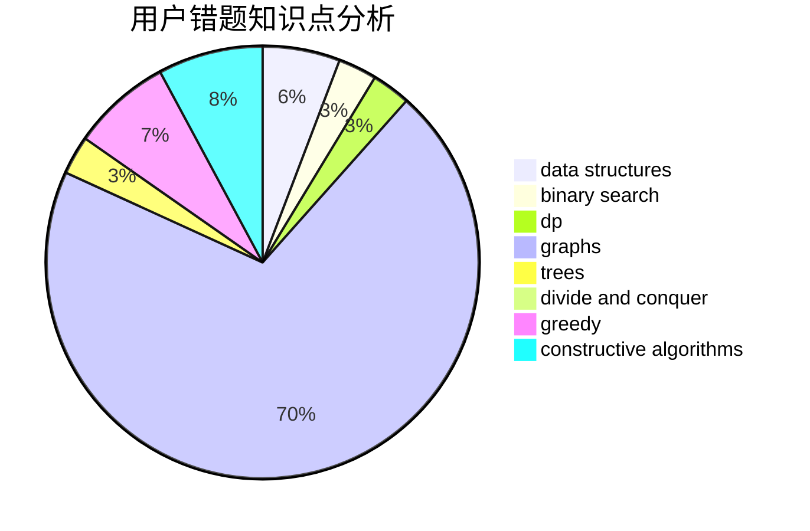

# BlockChanZJ

<!-- tabs:start -->

#### **用户提交结果分析**

#### **用户做题类型偏好分析**

#### **用户错题知识点分析**

<!-- tabs:end -->
# 推荐题目
[1423C](https://codeforces.com/contest/1423/problem/C)		divide and conquer,
                        graphs,
                        trees		  
[1485F](https://codeforces.com/contest/1485/problem/F)		combinatorics,
                        data structures,
                        dp,
                        sortings		  
[1287C](https://codeforces.com/contest/1287/problem/C)		dsu,graphs,sortings,trees		  
[1038A](https://codeforces.com/contest/1038/problem/A)		implementation,
                        strings		  
[545D](https://codeforces.com/contest/545/problem/D)		greedy,
                        implementation,
                        sortings		  
[545B](https://codeforces.com/contest/545/problem/B)		greedy		  
[1278C](https://codeforces.com/contest/1278/problem/C)		data structures,
                        dp,
                        greedy,
                        implementation		  
[1149B](https://codeforces.com/contest/1149/problem/B)		dp,
                        implementation,
                        strings		  
[453C](https://codeforces.com/contest/453/problem/C)		constructive algorithms,
                        dfs and similar,
                        graphs		  
[1310C](https://codeforces.com/contest/1310/problem/C)		binary search,
                        dp,
                        strings		  
