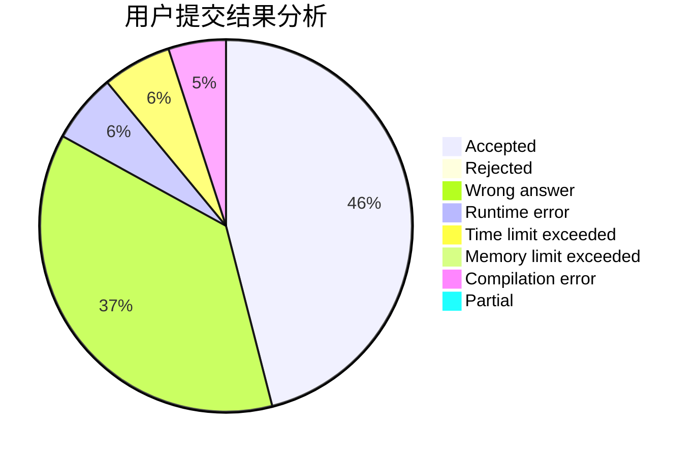
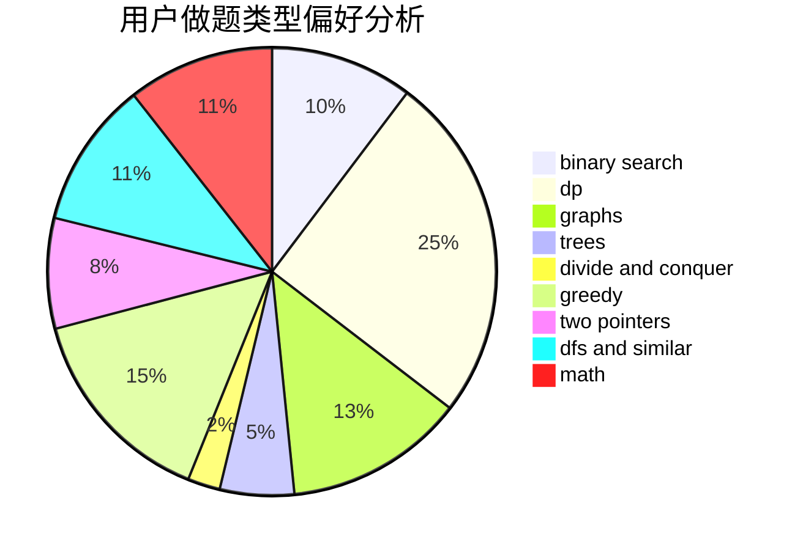

# BlockChanZJ

<!-- tabs:start -->

#### **用户提交结果分析**

#### **用户做题类型偏好分析**

<!-- tabs:end -->
# 推荐题目
[1430F](https://codeforces.com/contest/1430/problem/F)
[1493B](https://codeforces.com/contest/1493/problem/B)
[1294F](https://codeforces.com/contest/1294/problem/F)
[1038D](https://codeforces.com/contest/1038/problem/D)
[570A](https://codeforces.com/contest/570/problem/A)
[56B](https://codeforces.com/contest/56/problem/B)
[1284E](https://codeforces.com/contest/1284/problem/E)
[1150E](https://codeforces.com/contest/1150/problem/E)
[475B](https://codeforces.com/contest/475/problem/B)
[1316F](https://codeforces.com/contest/1316/problem/F)
