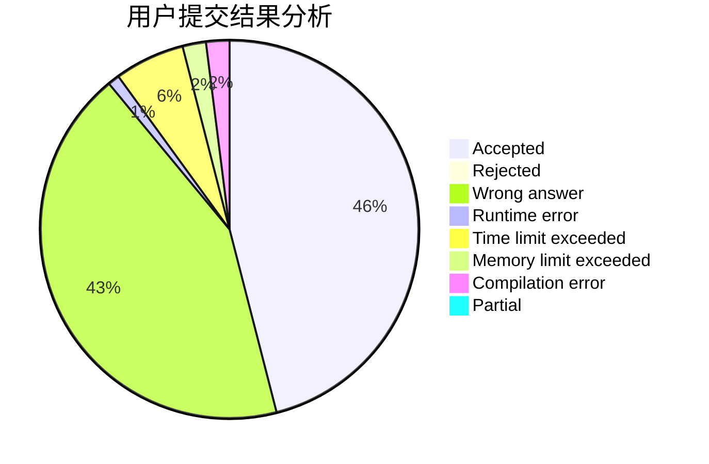
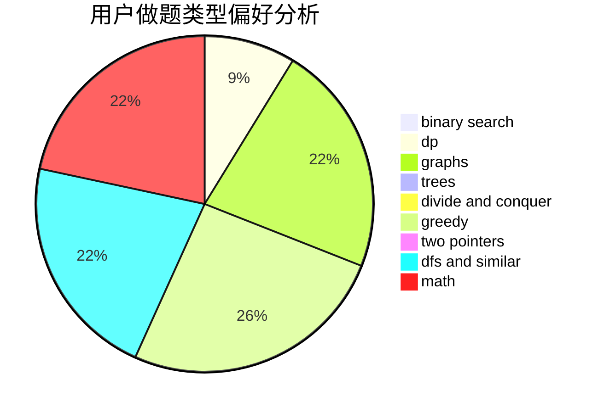

# lxlxl

<!-- tabs:start -->

#### **用户提交结果分析**

#### **用户做题类型偏好分析**

<!-- tabs:end -->
# 推荐题目
[1194C](https://codeforces.com/contest/1194/problem/C)
[441D](https://codeforces.com/contest/441/problem/D)
[1255A](https://codeforces.com/contest/1255/problem/A)
[994C](https://codeforces.com/contest/994/problem/C)
[866D](https://codeforces.com/contest/866/problem/D)
[240E](https://codeforces.com/contest/240/problem/E)
[354C](https://codeforces.com/contest/354/problem/C)
[966C](https://codeforces.com/contest/966/problem/C)
[372C](https://codeforces.com/contest/372/problem/C)
[1508C](https://codeforces.com/contest/1508/problem/C)
