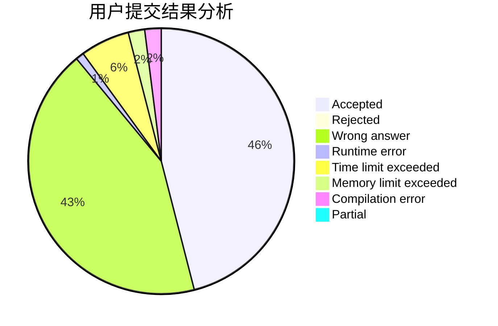
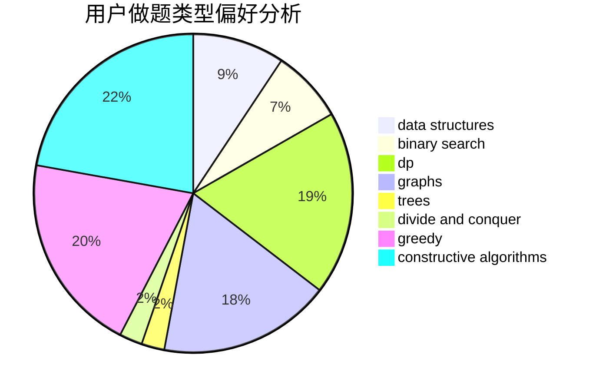
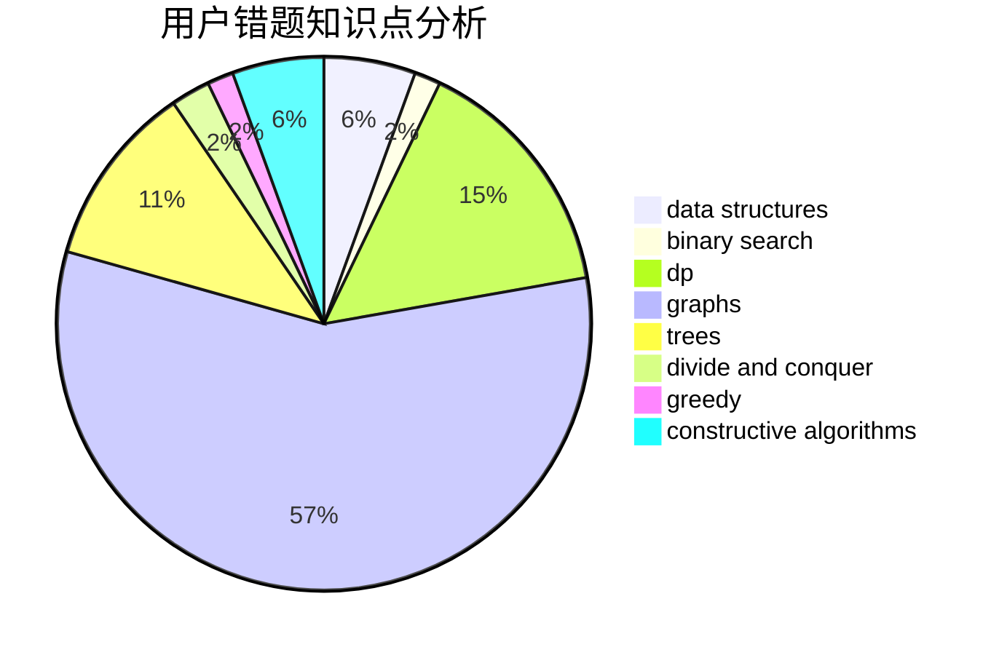

# lxlxl

<!-- tabs:start -->

#### **用户提交结果分析**

#### **用户做题类型偏好分析**

#### **用户错题知识点分析**

<!-- tabs:end -->
# 推荐题目
[1189A](https://codeforces.com/contest/1189/problem/A)		strings		  
[416D](https://codeforces.com/contest/416/problem/D)		greedy,
                        implementation,
                        math		  
[1250I](https://codeforces.com/contest/1250/problem/I)		binary search,
                        brute force,
                        greedy,
                        shortest paths		  
[97C](https://codeforces.com/contest/97/problem/C)		binary search,
                        graphs,
                        math,
                        shortest paths		  
[848A](https://codeforces.com/contest/848/problem/A)		constructive algorithms		  
[220E](https://codeforces.com/contest/220/problem/E)		data structures,
                        two pointers		  
[325B](https://codeforces.com/contest/325/problem/B)		binary search,
                        math		  
[949D](https://codeforces.com/contest/949/problem/D)		binary search,
                        brute force,
                        greedy,
                        sortings		  
[347A](https://codeforces.com/contest/347/problem/A)		constructive algorithms,
                        implementation,
                        sortings		  
[1498F](https://codeforces.com/contest/1498/problem/F)		bitmasks,
                        data structures,
                        dfs and similar,
                        dp,
                        games,
                        math,
                        trees		  
