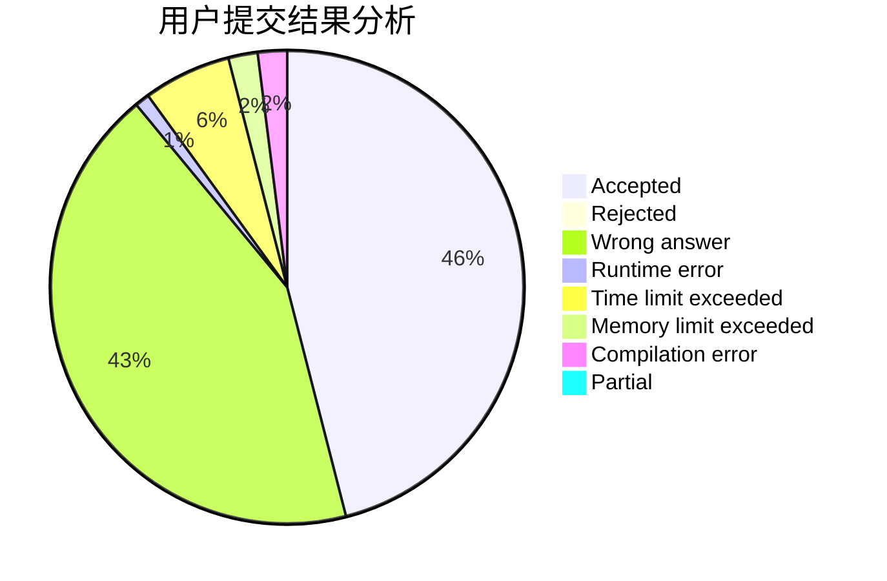
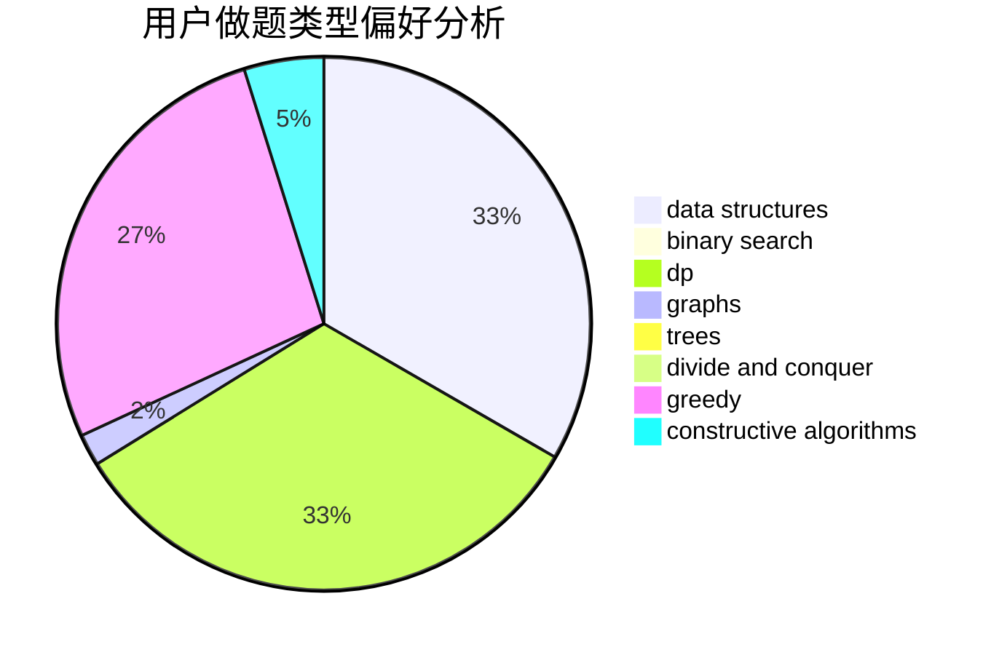
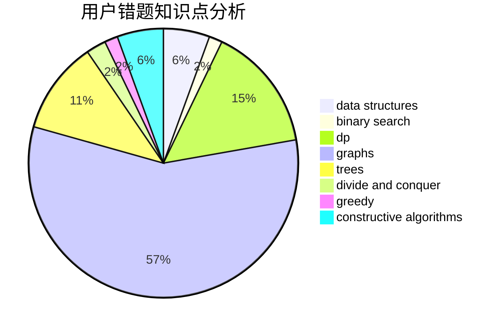

# lxlxl

<!-- tabs:start -->

#### **用户提交结果分析**

#### **用户做题类型偏好分析**

#### **用户错题知识点分析**

<!-- tabs:end -->
# 推荐题目
[1194C](https://codeforces.com/contest/1194/problem/C)		implementation,
                        strings		  
[441D](https://codeforces.com/contest/441/problem/D)		constructive algorithms,
                        dsu,
                        graphs,
                        implementation,
                        math,
                        string suffix structures		  
[1255A](https://codeforces.com/contest/1255/problem/A)		math		  
[994C](https://codeforces.com/contest/994/problem/C)		dsu,graphs,sortings,trees		  
[866D](https://codeforces.com/contest/866/problem/D)		dsu,graphs,sortings,trees		  
[240E](https://codeforces.com/contest/240/problem/E)		dfs and similar,
                        graphs,
                        greedy		  
[354C](https://codeforces.com/contest/354/problem/C)		brute force,
                        dp,
                        number theory		  
[966C](https://codeforces.com/contest/966/problem/C)		dsu,graphs,sortings,trees		  
[372C](https://codeforces.com/contest/372/problem/C)		data structures,
                        dp,
                        math		  
[1508C](https://codeforces.com/contest/1508/problem/C)		data structures,
                        dfs and similar,
                        dsu,
                        graphs,
                        greedy,
                        math		  
