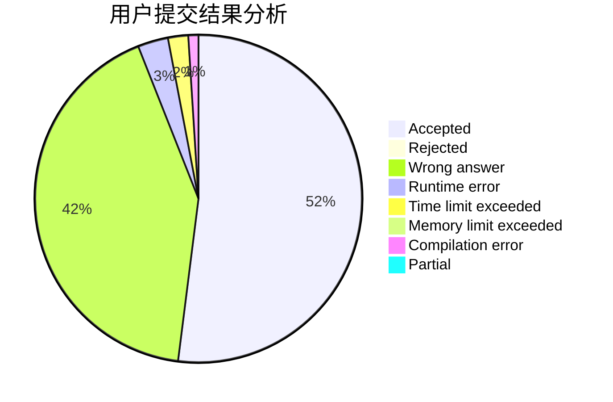
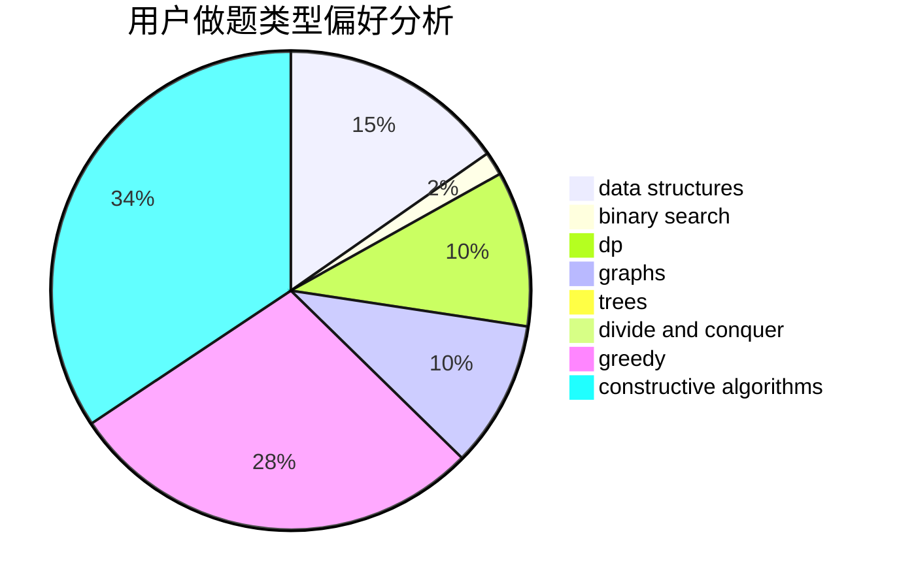
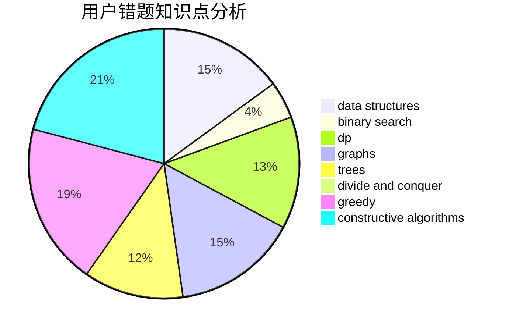

# lxy666

<!-- tabs:start -->

#### **用户提交结果分析**

#### **用户做题类型偏好分析**

#### **用户错题知识点分析**

<!-- tabs:end -->
# 推荐题目
[860D](https://codeforces.com/contest/860/problem/D)		dsu,graphs,sortings,trees		  
[957B](https://codeforces.com/contest/957/problem/B)		dsu,graphs,sortings,trees		  
[286D](https://codeforces.com/contest/286/problem/D)		data structures,
                        sortings		  
[690A2](https://codeforces.com/contest/690A/problem/2)		nan		  
[1227D2](https://codeforces.com/contest/1227D/problem/2)		data structures,
                        greedy		  
[1299D](https://codeforces.com/contest/1299/problem/D)		bitmasks,
                        combinatorics,
                        dfs and similar,
                        dp,
                        graphs,
                        graphs,
                        math,
                        trees		  
[261C](https://codeforces.com/contest/261/problem/C)		constructive algorithms,
                        dp,
                        math		  
[1451C](https://codeforces.com/contest/1451/problem/C)		dp,
                        greedy,
                        hashing,
                        implementation,
                        strings		  
[1349D](https://codeforces.com/contest/1349/problem/D)		math,
                        probabilities		  
[922E](https://codeforces.com/contest/922/problem/E)		dp		  
