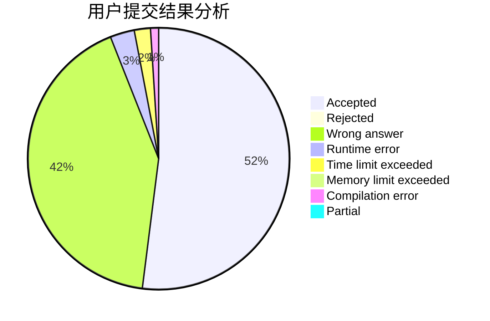
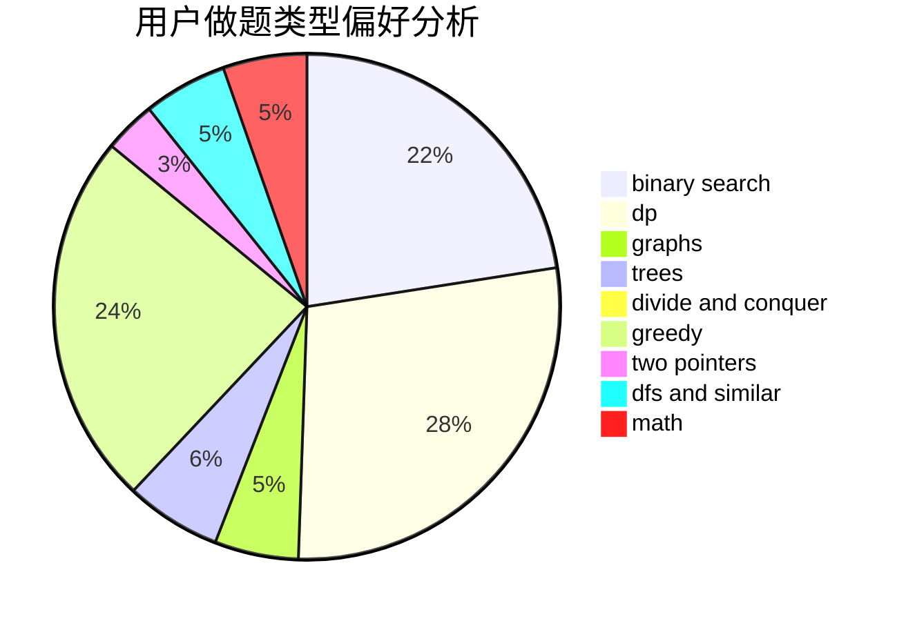

# lxy666

<!-- tabs:start -->

#### **用户提交结果分析**

#### **用户做题类型偏好分析**

<!-- tabs:end -->
# 推荐题目
[878D](https://codeforces.com/contest/878/problem/D)
[978E](https://codeforces.com/contest/978/problem/E)
[300E](https://codeforces.com/contest/300/problem/E)
[710C](https://codeforces.com/contest/710/problem/C)
[1236B](https://codeforces.com/contest/1236/problem/B)
[1305H](https://codeforces.com/contest/1305/problem/H)
[27A](https://codeforces.com/contest/27/problem/A)
[145C](https://codeforces.com/contest/145/problem/C)
[13562](https://codeforces.com/contest/1356/problem/2)
[946E](https://codeforces.com/contest/946/problem/E)
