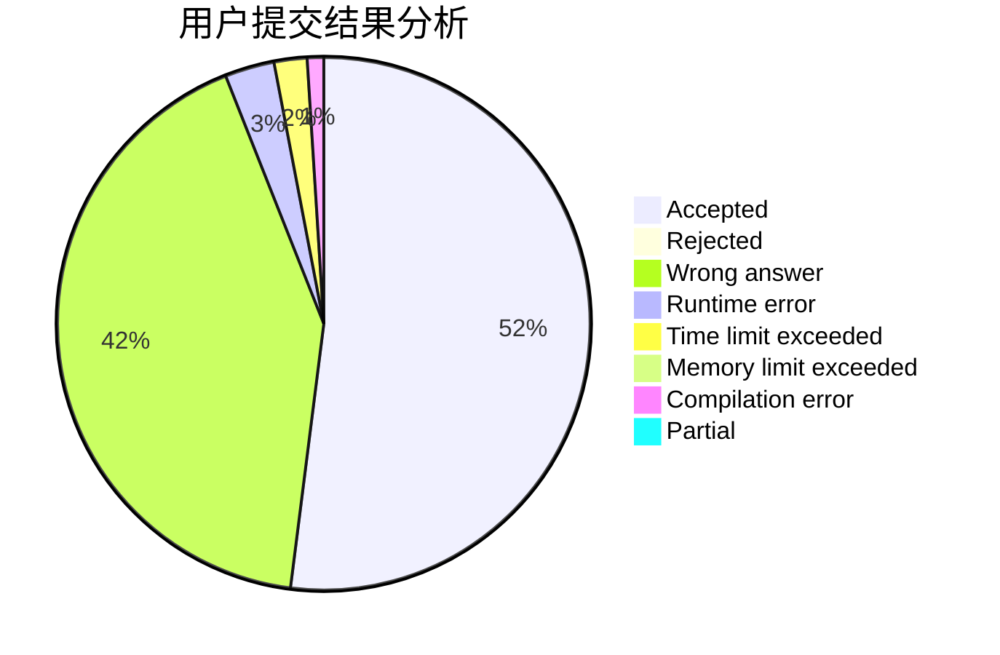
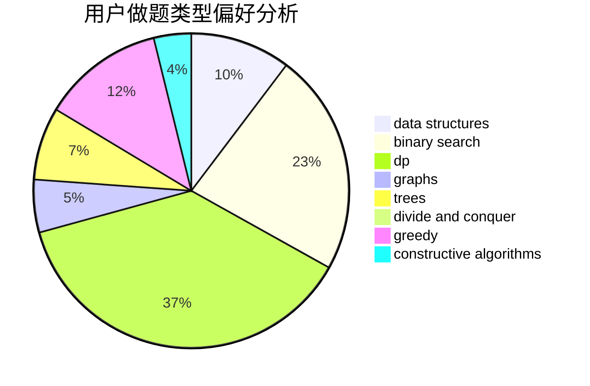
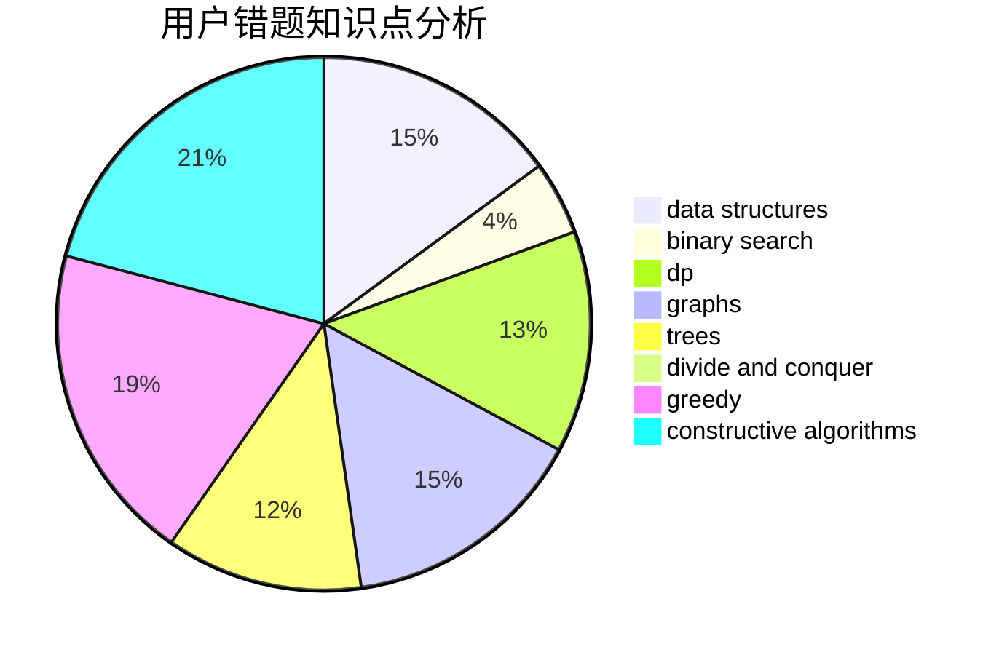

# lxy666

<!-- tabs:start -->

#### **用户提交结果分析**

#### **用户做题类型偏好分析**

#### **用户错题知识点分析**

<!-- tabs:end -->
# 推荐题目
[878D](https://codeforces.com/contest/878/problem/D)		bitmasks		  
[978E](https://codeforces.com/contest/978/problem/E)		combinatorics,
                        math		  
[300E](https://codeforces.com/contest/300/problem/E)		binary search,
                        math,
                        number theory		  
[710C](https://codeforces.com/contest/710/problem/C)		constructive algorithms,
                        math		  
[1236B](https://codeforces.com/contest/1236/problem/B)		combinatorics,
                        math		  
[1305H](https://codeforces.com/contest/1305/problem/H)		binary search,
                        greedy		  
[27A](https://codeforces.com/contest/27/problem/A)		implementation,
                        sortings		  
[145C](https://codeforces.com/contest/145/problem/C)		combinatorics,
                        dp,
                        math		  
[13562](https://codeforces.com/contest/1356/problem/2)		dsu,graphs,sortings,trees		  
[946E](https://codeforces.com/contest/946/problem/E)		greedy,
                        implementation		  
