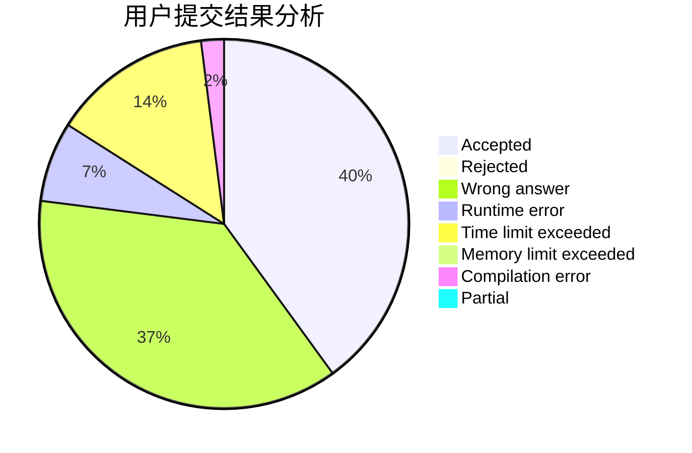
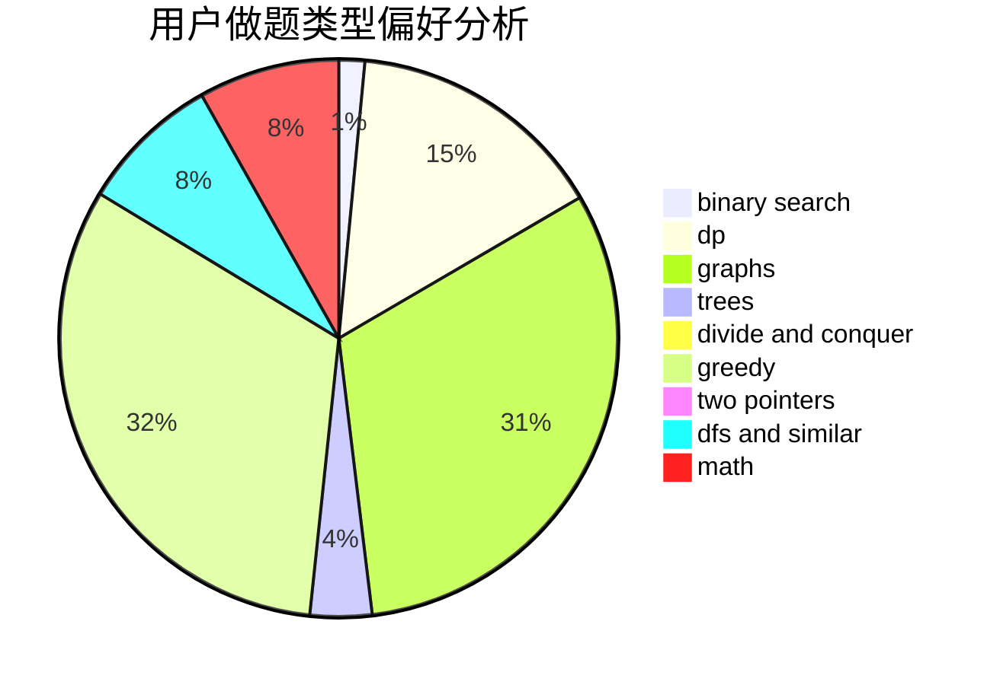

# ly_61

<!-- tabs:start -->

#### **用户提交结果分析**

#### **用户做题类型偏好分析**

<!-- tabs:end -->
# 推荐题目
[917C](https://codeforces.com/contest/917/problem/C)
[946D](https://codeforces.com/contest/946/problem/D)
[449C](https://codeforces.com/contest/449/problem/C)
[948A](https://codeforces.com/contest/948/problem/A)
[260A](https://codeforces.com/contest/260/problem/A)
[977D](https://codeforces.com/contest/977/problem/D)
[898D](https://codeforces.com/contest/898/problem/D)
[174B](https://codeforces.com/contest/174/problem/B)
[1217E](https://codeforces.com/contest/1217/problem/E)
[1084C](https://codeforces.com/contest/1084/problem/C)
