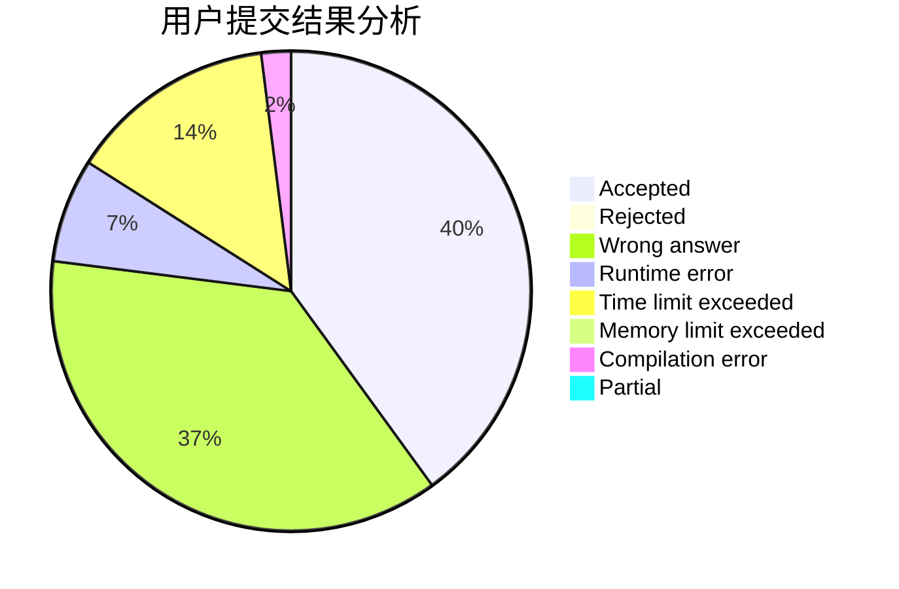
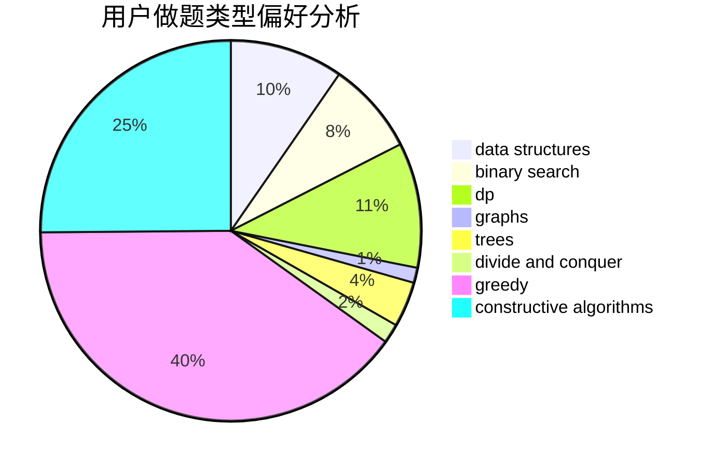
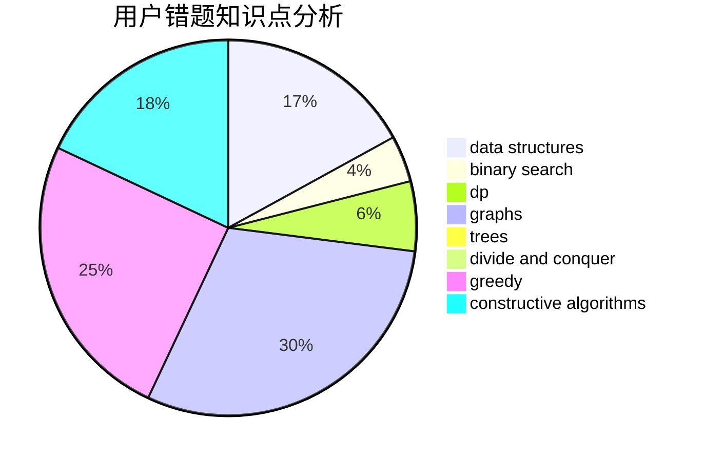

# ly_61

<!-- tabs:start -->

#### **用户提交结果分析**

#### **用户做题类型偏好分析**

#### **用户错题知识点分析**

<!-- tabs:end -->
# 推荐题目
[900E](https://codeforces.com/contest/900/problem/E)		data structures,
                        dp,
                        strings		  
[922D](https://codeforces.com/contest/922/problem/D)		greedy,
                        sortings		  
[425E](https://codeforces.com/contest/425/problem/E)		dp		  
[924C](https://codeforces.com/contest/924/problem/C)		data structures,
                        dp,
                        greedy		  
[238D](https://codeforces.com/contest/238/problem/D)		data structures,
                        implementation		  
[955D](https://codeforces.com/contest/955/problem/D)		brute force,
                        strings		  
[877E](https://codeforces.com/contest/877/problem/E)		bitmasks,
                        data structures,
                        trees		  
[1513F](https://codeforces.com/contest/1513/problem/F)		brute force,
                        constructive algorithms,
                        data structures,
                        sortings		  
[1213C](https://codeforces.com/contest/1213/problem/C)		math		  
[1083E](https://codeforces.com/contest/1083/problem/E)		data structures,
                        dp,
                        geometry		  
