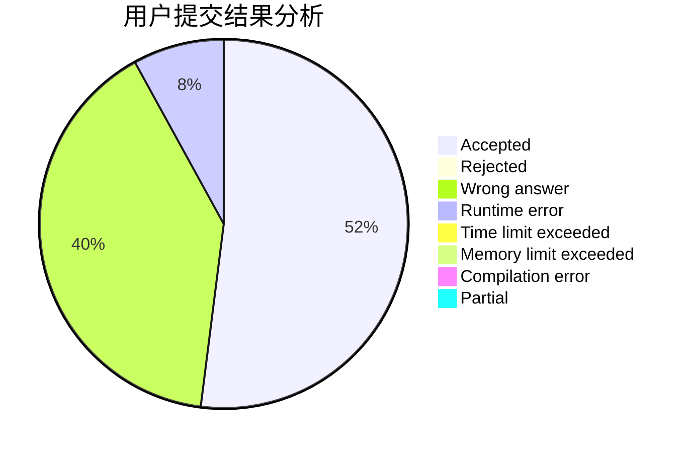
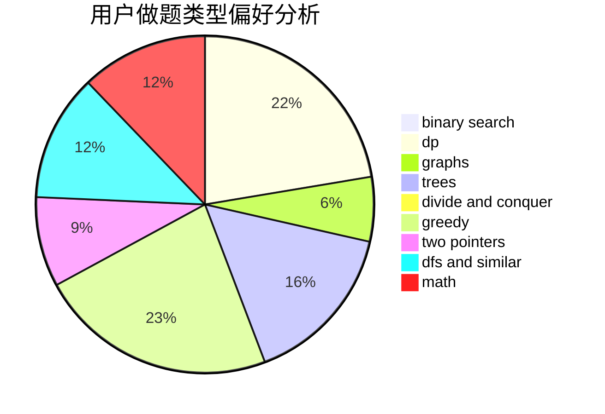

# lyfakioi

<!-- tabs:start -->

#### **用户提交结果分析**

#### **用户做题类型偏好分析**

<!-- tabs:end -->
# 推荐题目
[780G](https://codeforces.com/contest/780/problem/G)
[729D](https://codeforces.com/contest/729/problem/D)
[1337D](https://codeforces.com/contest/1337/problem/D)
[427B](https://codeforces.com/contest/427/problem/B)
[566G](https://codeforces.com/contest/566/problem/G)
[74A](https://codeforces.com/contest/74/problem/A)
[1063F](https://codeforces.com/contest/1063/problem/F)
[540A](https://codeforces.com/contest/540/problem/A)
[911C](https://codeforces.com/contest/911/problem/C)
[810D](https://codeforces.com/contest/810/problem/D)
