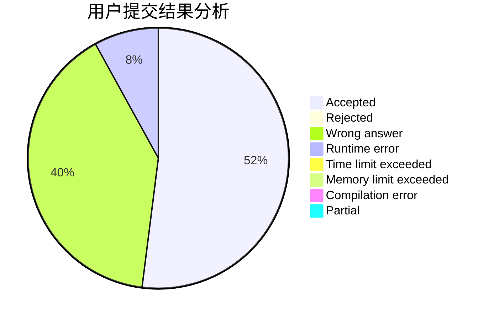
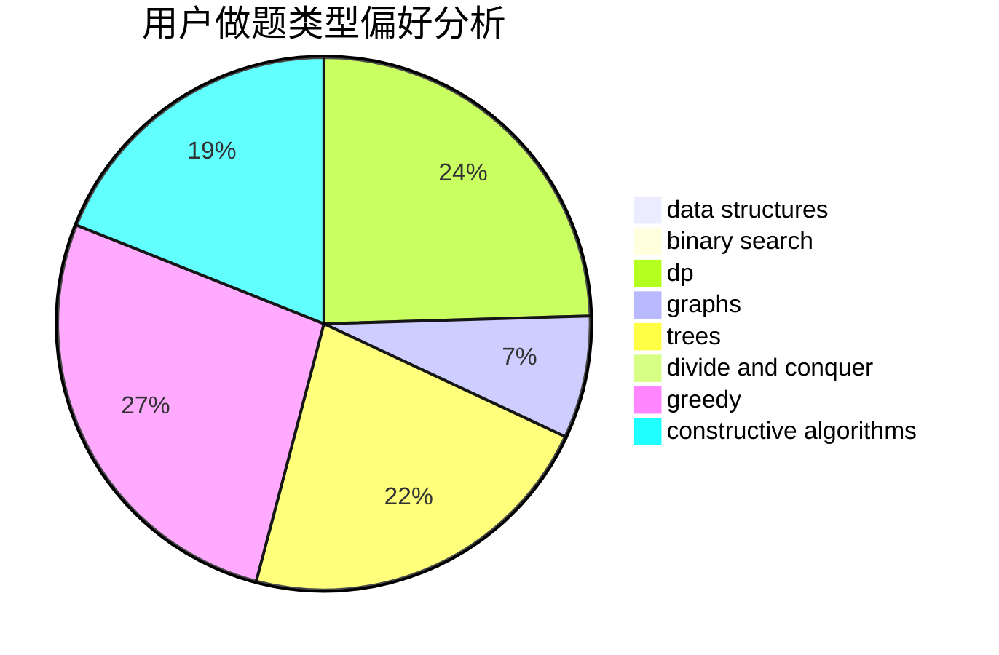
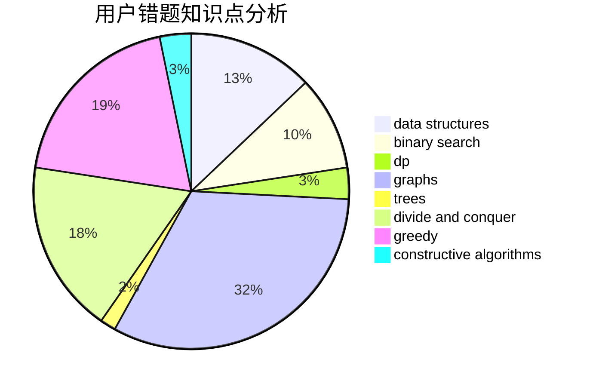

# lyfakioi

<!-- tabs:start -->

#### **用户提交结果分析**

#### **用户做题类型偏好分析**

#### **用户错题知识点分析**

<!-- tabs:end -->
# 推荐题目
[780G](https://codeforces.com/contest/780/problem/G)		data structures,
                        dp		  
[729D](https://codeforces.com/contest/729/problem/D)		constructive algorithms,
                        greedy,
                        math		  
[1337D](https://codeforces.com/contest/1337/problem/D)		dsu,graphs,sortings,trees		  
[427B](https://codeforces.com/contest/427/problem/B)		data structures,
                        implementation		  
[566G](https://codeforces.com/contest/566/problem/G)		geometry		  
[74A](https://codeforces.com/contest/74/problem/A)		implementation		  
[1063F](https://codeforces.com/contest/1063/problem/F)		data structures,
                        dp,
                        string suffix structures		  
[540A](https://codeforces.com/contest/540/problem/A)		implementation		  
[911C](https://codeforces.com/contest/911/problem/C)		brute force,
                        constructive algorithms		  
[810D](https://codeforces.com/contest/810/problem/D)		dsu,graphs,sortings,trees		  
