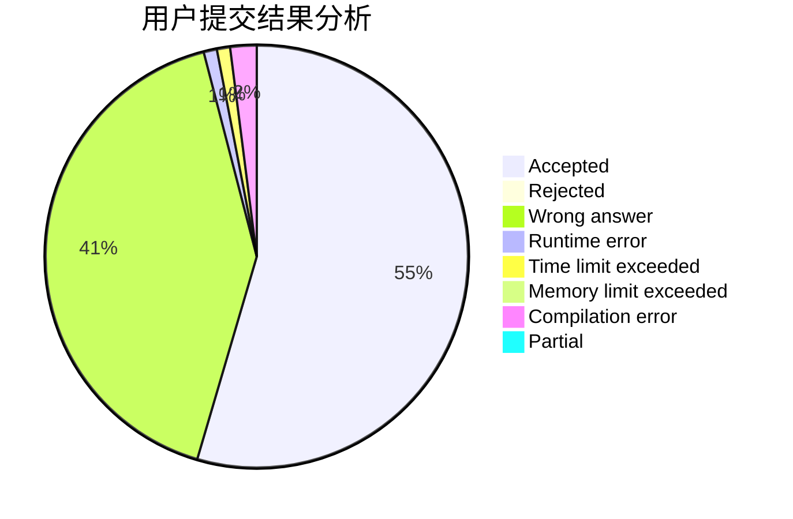
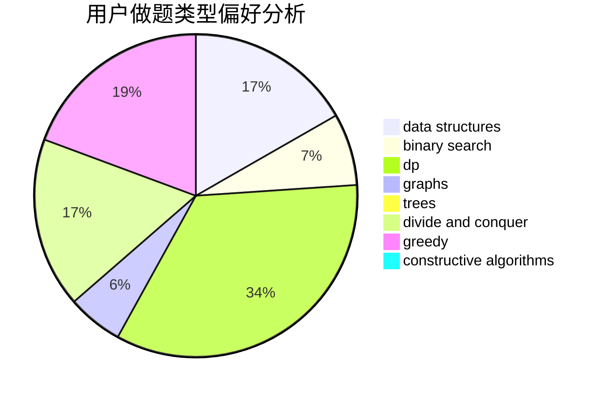
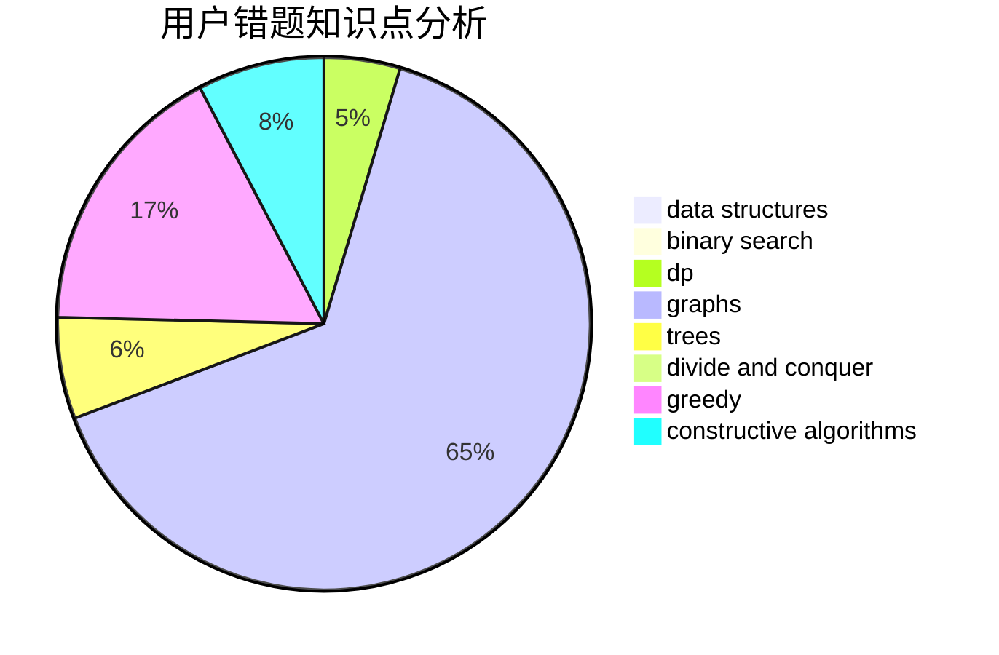

# lyh1999

<!-- tabs:start -->

#### **用户提交结果分析**

#### **用户做题类型偏好分析**

#### **用户错题知识点分析**

<!-- tabs:end -->
# 推荐题目
[466A](https://codeforces.com/contest/466/problem/A)		implementation		  
[1250F](https://codeforces.com/contest/1250/problem/F)		brute force,
                        implementation		  
[916E](https://codeforces.com/contest/916/problem/E)		data structures,
                        trees		  
[731E](https://codeforces.com/contest/731/problem/E)		dp,
                        games		  
[672C](https://codeforces.com/contest/672/problem/C)		dsu,graphs,sortings,trees		  
[1510D](https://codeforces.com/contest/1510/problem/D)		dp,
                        math,
                        number theory		  
[1471D](https://codeforces.com/contest/1471/problem/D)		dsu,graphs,sortings,trees		  
[367D](https://codeforces.com/contest/367/problem/D)		bitmasks,
                        dfs and similar		  
[1030E](https://codeforces.com/contest/1030/problem/E)		bitmasks,
                        dp		  
[1367F1](https://codeforces.com/contest/1367F/problem/1)		dp,
                        greedy,
                        two pointers		  
