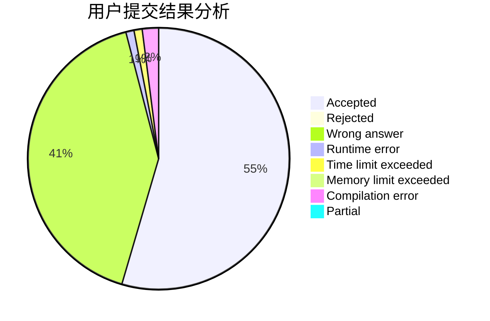
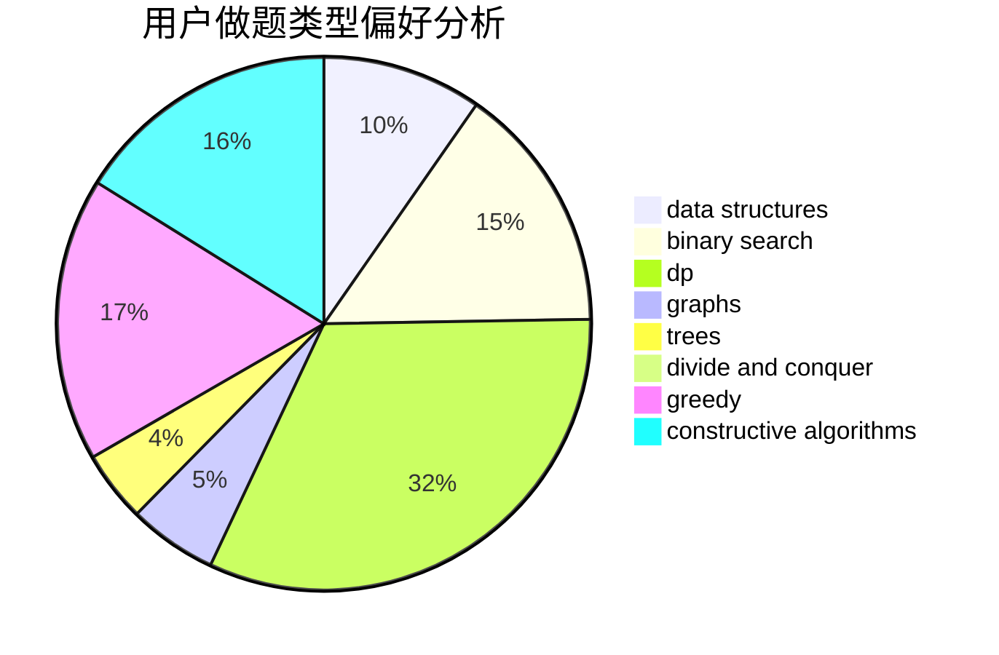
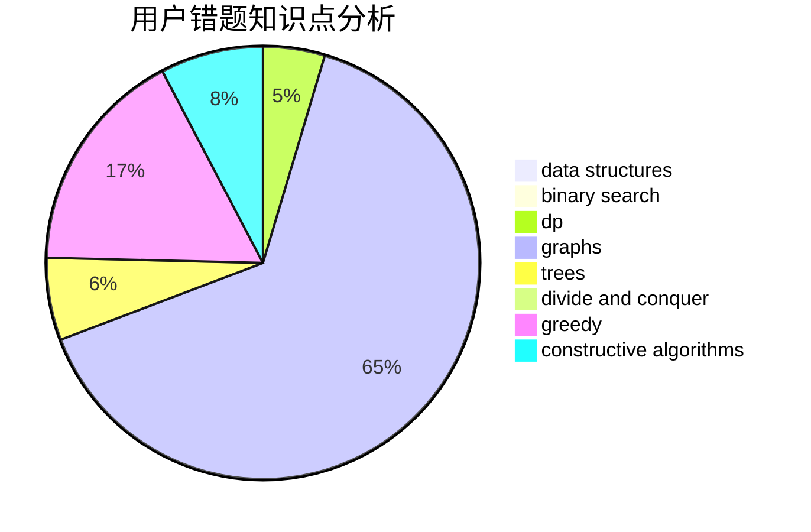

# lyh1999

<!-- tabs:start -->

#### **用户提交结果分析**

#### **用户做题类型偏好分析**

#### **用户错题知识点分析**

<!-- tabs:end -->
# 推荐题目
[485A](https://codeforces.com/contest/485/problem/A)		implementation,
                        math,
                        matrices		  
[1254E](https://codeforces.com/contest/1254/problem/E)		combinatorics,
                        dfs and similar,
                        dsu,
                        trees		  
[937A](https://codeforces.com/contest/937/problem/A)		implementation,
                        sortings		  
[74A](https://codeforces.com/contest/74/problem/A)		implementation		  
[698D](https://codeforces.com/contest/698/problem/D)		brute force,
                        geometry,
                        math		  
[164C](https://codeforces.com/contest/164/problem/C)		flows,
                        graphs		  
[147B](https://codeforces.com/contest/147/problem/B)		binary search,
                        graphs,
                        matrices		  
[398C](https://codeforces.com/contest/398/problem/C)		constructive algorithms		  
[1031B](https://codeforces.com/contest/1031/problem/B)		nan		  
[1374C](https://codeforces.com/contest/1374/problem/C)		greedy,
                        strings		  
