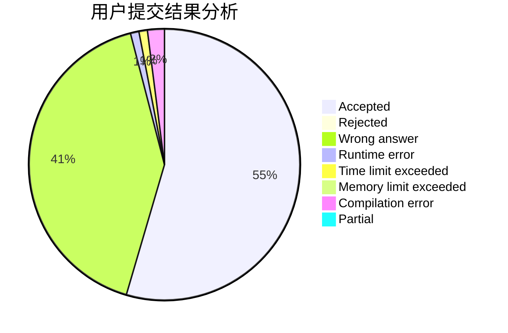
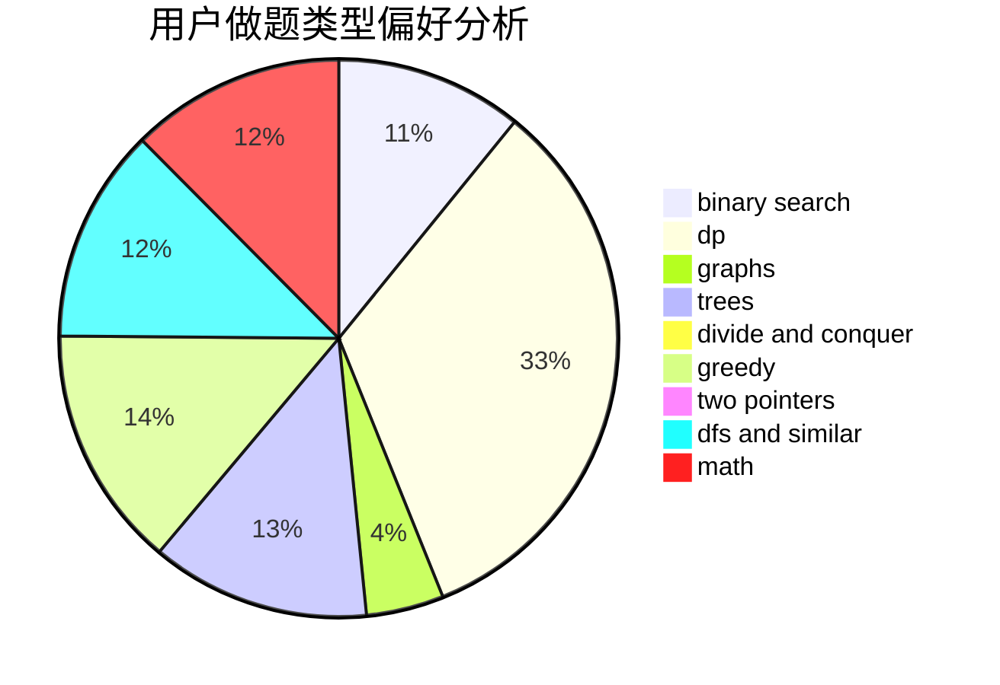

# lyh1999

<!-- tabs:start -->

#### **用户提交结果分析**

#### **用户做题类型偏好分析**

<!-- tabs:end -->
# 推荐题目
[485A](https://codeforces.com/contest/485/problem/A)
[1254E](https://codeforces.com/contest/1254/problem/E)
[937A](https://codeforces.com/contest/937/problem/A)
[74A](https://codeforces.com/contest/74/problem/A)
[698D](https://codeforces.com/contest/698/problem/D)
[164C](https://codeforces.com/contest/164/problem/C)
[147B](https://codeforces.com/contest/147/problem/B)
[398C](https://codeforces.com/contest/398/problem/C)
[1031B](https://codeforces.com/contest/1031/problem/B)
[1374C](https://codeforces.com/contest/1374/problem/C)
