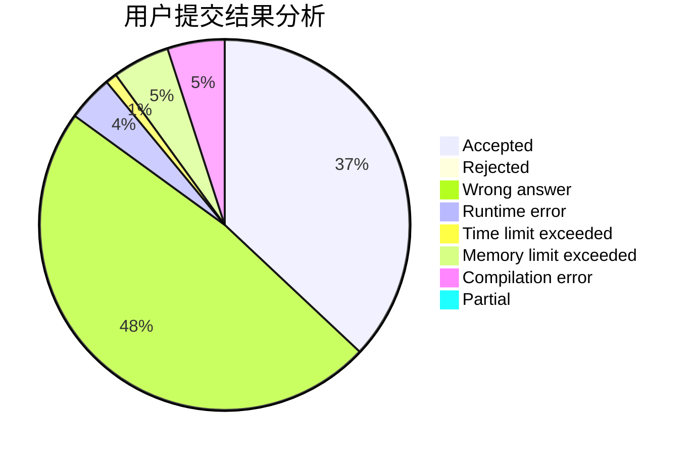
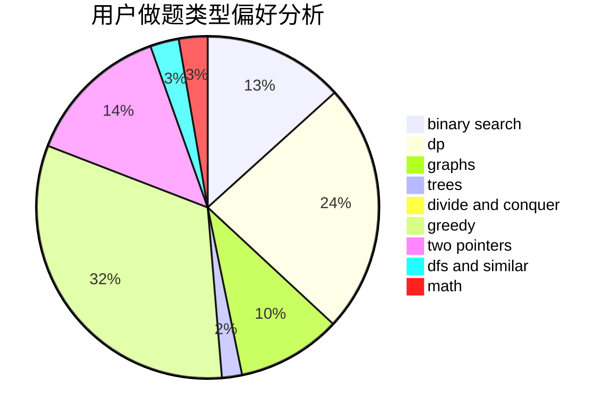

# lyk248289469

<!-- tabs:start -->

#### **用户提交结果分析**

#### **用户做题类型偏好分析**

<!-- tabs:end -->
# 推荐题目
[520A](https://codeforces.com/contest/520/problem/A)
[1030A](https://codeforces.com/contest/1030/problem/A)
[1358F](https://codeforces.com/contest/1358/problem/F)
[434C](https://codeforces.com/contest/434/problem/C)
[577A](https://codeforces.com/contest/577/problem/A)
[1286A](https://codeforces.com/contest/1286/problem/A)
[1290F](https://codeforces.com/contest/1290/problem/F)
[725G](https://codeforces.com/contest/725/problem/G)
[416C](https://codeforces.com/contest/416/problem/C)
[1090B](https://codeforces.com/contest/1090/problem/B)
