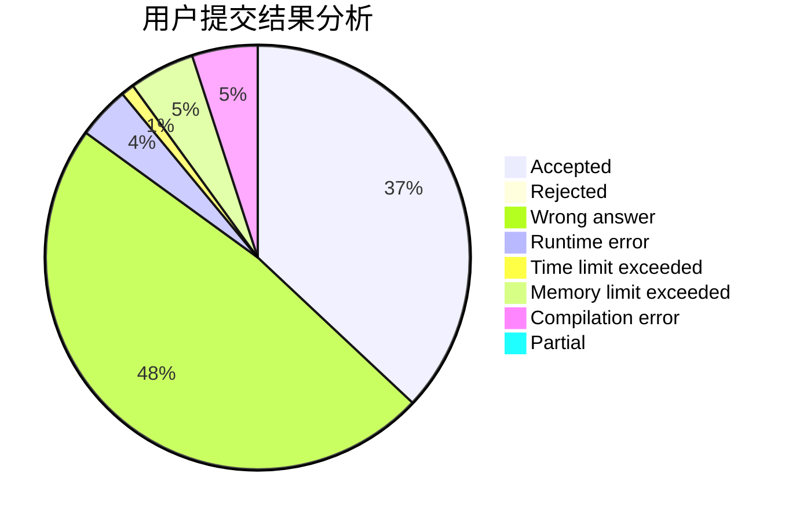
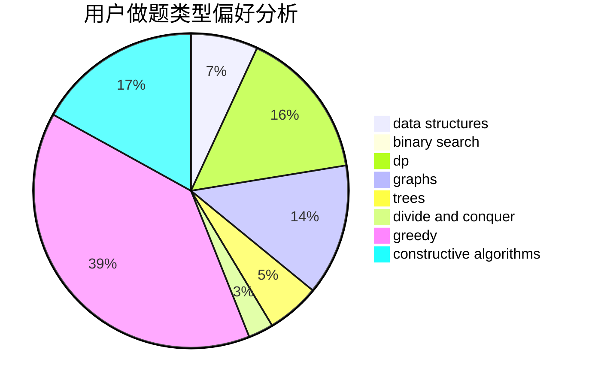
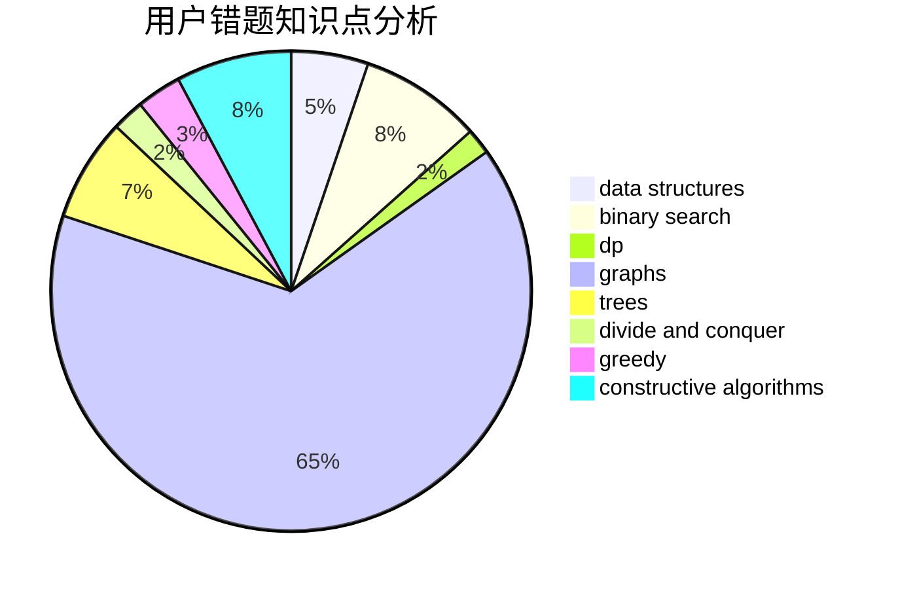

# lyk248289469
<!-- tabs:start -->
#### **用户提交结果分析**

#### **用户做题类型偏好分析**

#### **用户错题知识点分析**

<!-- tabs:end -->
# 推荐题目
[Lamps on a Circle](http://codeforces.com/problemset/problem/1368/F)		games,
                        implementation,
                        interactive,
                        math		  
[GukiZ and GukiZiana](http://codeforces.com/problemset/problem/551/E)		binary search,
                        data structures,
                        implementation		  
[Multicolored Markers](http://codeforces.com/problemset/problem/1029/F)		binary search,
                        brute force,
                        math,
                        number theory		  
[Unusual Product](http://codeforces.com/problemset/problem/405/C)		implementation,
                        math		  
[Lucky Tickets](http://codeforces.com/problemset/problem/1096/G)		divide and conquer,
                        dp,
                        fft		  
[Résumé Review](https://codeforces.com/contest/1345/problem/F)		binary search,
                        greedy,
                        math		  
[Filling the Grid](http://codeforces.com/problemset/problem/1228/B)		implementation,
                        math		  
[Watermelon](http://codeforces.com/problemset/problem/4/A)		brute force,
                        math		  
[Bash's Big Day](http://codeforces.com/problemset/problem/757/B)		greedy,
                        math,
                        number theory		  
[Diverse Substrings](http://codeforces.com/problemset/problem/386/C)		dp,
                        strings,
                        two pointers		  
<!-- tabs:start -->
#### **data structures**
[Lamps on a Circle](http://codeforces.com/problemset/problem/551/E)		binary search,
                        data structures,
                        implementation		  
[GukiZ and GukiZiana](http://codeforces.com/problemset/problem/940/E)		data structures,
                        dp,
                        greedy,
                        math		  
[Multicolored Markers](http://codeforces.com/problemset/problem/707/E)		data structures		  
[Unusual Product](https://codeforces.com/contest/1240/problem/D)		data structures,
                        divide and conquer,
                        dp,
                        hashing		  
[Lucky Tickets](http://codeforces.com/problemset/problem/1198/B)		binary search,
                        brute force,
                        data structures,
                        sortings		  
[Résumé Review](http://codeforces.com/problemset/problem/739/C)		data structures		  
[Filling the Grid](http://codeforces.com/problemset/problem/1493/D)		brute force,
                        data structures,
                        hashing,
                        implementation,
                        math,
                        number theory,
                        sortings,
                        two pointers		  
[Watermelon](http://codeforces.com/problemset/problem/1492/C)		binary search,
                        data structures,
                        dp,
                        greedy,
                        two pointers		  
[Bash's Big Day](http://codeforces.com/problemset/problem/1490/G)		binary search,
                        data structures,
                        math		  
[Diverse Substrings](http://codeforces.com/problemset/problem/1479/D)		binary search,
                        bitmasks,
                        brute force,
                        data structures,
                        probabilities,
                        trees		  
#### **binary search**
[Lamps on a Circle](http://codeforces.com/problemset/problem/551/E)		binary search,
                        data structures,
                        implementation		  
[GukiZ and GukiZiana](http://codeforces.com/problemset/problem/1029/F)		binary search,
                        brute force,
                        math,
                        number theory		  
[Multicolored Markers](https://codeforces.com/contest/1345/problem/F)		binary search,
                        greedy,
                        math		  
[Unusual Product](http://codeforces.com/problemset/problem/1198/B)		binary search,
                        brute force,
                        data structures,
                        sortings		  
[Lucky Tickets](http://codeforces.com/problemset/problem/505/E)		binary search,
                        greedy		  
[Résumé Review](http://codeforces.com/problemset/problem/1492/C)		binary search,
                        data structures,
                        dp,
                        greedy,
                        two pointers		  
[Filling the Grid](http://codeforces.com/problemset/problem/1463/D)		binary search,
                        constructive algorithms,
                        greedy,
                        two pointers		  
[Watermelon](http://codeforces.com/problemset/problem/1490/G)		binary search,
                        data structures,
                        math		  
[Bash's Big Day](http://codeforces.com/problemset/problem/1479/D)		binary search,
                        bitmasks,
                        brute force,
                        data structures,
                        probabilities,
                        trees		  
[Diverse Substrings](http://codeforces.com/problemset/problem/1436/E)		binary search,
                        data structures,
                        two pointers		  
#### **dp**
[Lamps on a Circle](http://codeforces.com/problemset/problem/1096/G)		divide and conquer,
                        dp,
                        fft		  
[GukiZ and GukiZiana](http://codeforces.com/problemset/problem/386/C)		dp,
                        strings,
                        two pointers		  
[Multicolored Markers](http://codeforces.com/problemset/problem/940/E)		data structures,
                        dp,
                        greedy,
                        math		  
[Unusual Product](https://codeforces.com/contest/1240/problem/D)		data structures,
                        divide and conquer,
                        dp,
                        hashing		  
[Lucky Tickets](http://codeforces.com/problemset/problem/1472/B)		dp,
                        greedy,
                        math		  
[Résumé Review](http://codeforces.com/problemset/problem/1485/B)		dp,
                        implementation,
                        math		  
[Filling the Grid](http://codeforces.com/problemset/problem/1469/C)		dp,
                        greedy,
                        implementation,
                        two pointers		  
[Watermelon](http://codeforces.com/problemset/problem/1492/C)		binary search,
                        data structures,
                        dp,
                        greedy,
                        two pointers		  
[Bash's Big Day](https://codeforces.com/contest/1457/problem/C)		brute force,
                        dp,
                        implementation		  
[Diverse Substrings](http://codeforces.com/problemset/problem/1491/C)		brute force,
                        data structures,
                        dp,
                        greedy,
                        implementation		  
#### **graph**
[Lamps on a Circle](http://codeforces.com/problemset/problem/131/D)		dfs and similar,
                        graphs		  
[GukiZ and GukiZiana](http://codeforces.com/problemset/problem/1089/M)		constructive algorithms,
                        graphs		  
[Multicolored Markers](http://codeforces.com/problemset/problem/1487/C)		brute force,
                        constructive algorithms,
                        dfs and similar,
                        graphs,
                        greedy,
                        implementation,
                        math		  
[Unusual Product](http://codeforces.com/problemset/problem/1437/C)		dp,
                        flows,
                        graph matchings,
                        greedy,
                        math,
                        sortings		  
[Lucky Tickets](http://codeforces.com/problemset/problem/1470/D)		constructive algorithms,
                        dfs and similar,
                        graph matchings,
                        graphs,
                        greedy		  
[Résumé Review](http://codeforces.com/problemset/problem/1476/C)		dp,
                        graphs,
                        greedy		  
[Filling the Grid](http://codeforces.com/problemset/problem/1304/D)		constructive algorithms,
                        graphs,
                        greedy,
                        two pointers		  
[Watermelon](http://codeforces.com/problemset/problem/1475/C)		combinatorics,
                        graphs,
                        math		  
[Bash's Big Day](http://codeforces.com/problemset/problem/553/E)		dp,
                        fft,
                        graphs,
                        math,
                        probabilities		  
[Diverse Substrings](http://codeforces.com/problemset/problem/1495/C)		constructive algorithms,
                        graphs		  
#### **trees**
[Lamps on a Circle](http://codeforces.com/problemset/problem/1283/F)		constructive algorithms,
                        greedy,
                        trees		  
[GukiZ and GukiZiana](http://codeforces.com/problemset/problem/1479/D)		binary search,
                        bitmasks,
                        brute force,
                        data structures,
                        probabilities,
                        trees		  
[Multicolored Markers](http://codeforces.com/problemset/problem/1511/C)		brute force,
                        data structures,
                        implementation,
                        trees		  
[Unusual Product](http://codeforces.com/problemset/problem/1499/F)		combinatorics,
                        dfs and similar,
                        dp,
                        trees		  
[Lucky Tickets](http://codeforces.com/problemset/problem/1491/E)		brute force,
                        dfs and similar,
                        divide and conquer,
                        number theory,
                        trees		  
[Résumé Review](http://codeforces.com/problemset/problem/1466/D)		data structures,
                        greedy,
                        sortings,
                        trees		  
[Filling the Grid](http://codeforces.com/problemset/problem/1495/D)		combinatorics,
                        dfs and similar,
                        graphs,
                        math,
                        shortest paths,
                        trees		  
[Watermelon](http://codeforces.com/problemset/problem/1303/G)		data structures,
                        divide and conquer,
                        geometry,
                        trees		  
[Bash's Big Day](http://codeforces.com/problemset/problem/1454/E)		combinatorics,
                        dfs and similar,
                        graphs,
                        trees		  
[Diverse Substrings](http://codeforces.com/problemset/problem/1494/D)		constructive algorithms,
                        data structures,
                        dfs and similar,
                        divide and conquer,
                        dsu,
                        greedy,
                        sortings,
                        trees		  
#### **divide and conquer**
[Lamps on a Circle](http://codeforces.com/problemset/problem/1096/G)		divide and conquer,
                        dp,
                        fft		  
[GukiZ and GukiZiana](https://codeforces.com/contest/1240/problem/D)		data structures,
                        divide and conquer,
                        dp,
                        hashing		  
[Multicolored Markers](http://codeforces.com/problemset/problem/1461/D)		binary search,
                        brute force,
                        data structures,
                        divide and conquer,
                        implementation,
                        sortings		  
[Unusual Product](http://codeforces.com/problemset/problem/1466/G)		combinatorics,
                        divide and conquer,
                        hashing,
                        math,
                        string suffix structures,
                        strings		  
[Lucky Tickets](http://codeforces.com/problemset/problem/1490/D)		dfs and similar,
                        divide and conquer,
                        implementation		  
[Résumé Review](https://codeforces.com/contest/1483/problem/C)		data structures,
                        divide and conquer,
                        dp		  
[Filling the Grid](http://codeforces.com/problemset/problem/1491/E)		brute force,
                        dfs and similar,
                        divide and conquer,
                        number theory,
                        trees		  
[Watermelon](http://codeforces.com/problemset/problem/1303/G)		data structures,
                        divide and conquer,
                        geometry,
                        trees		  
[Bash's Big Day](http://codeforces.com/problemset/problem/1494/D)		constructive algorithms,
                        data structures,
                        dfs and similar,
                        divide and conquer,
                        dsu,
                        greedy,
                        sortings,
                        trees		  
[Diverse Substrings](http://codeforces.com/problemset/problem/1482/E)		data structures,
                        divide and conquer,
                        dp		  
#### **greedy**
[Lamps on a Circle](https://codeforces.com/contest/1345/problem/F)		binary search,
                        greedy,
                        math		  
[GukiZ and GukiZiana](http://codeforces.com/problemset/problem/757/B)		greedy,
                        math,
                        number theory		  
[Multicolored Markers](http://codeforces.com/problemset/problem/494/A)		greedy		  
[Unusual Product](http://codeforces.com/problemset/problem/1283/F)		constructive algorithms,
                        greedy,
                        trees		  
[Lucky Tickets](http://codeforces.com/problemset/problem/940/E)		data structures,
                        dp,
                        greedy,
                        math		  
[Résumé Review](http://codeforces.com/problemset/problem/1472/B)		dp,
                        greedy,
                        math		  
[Filling the Grid](http://codeforces.com/problemset/problem/1371/C)		greedy,
                        implementation,
                        math		  
[Watermelon](http://codeforces.com/problemset/problem/505/E)		binary search,
                        greedy		  
[Bash's Big Day](http://codeforces.com/problemset/problem/1469/C)		dp,
                        greedy,
                        implementation,
                        two pointers		  
[Diverse Substrings](http://codeforces.com/problemset/problem/985/C)		greedy		  
#### **constructive algorithms**
[Lamps on a Circle](http://codeforces.com/problemset/problem/1283/F)		constructive algorithms,
                        greedy,
                        trees		  
[GukiZ and GukiZiana](http://codeforces.com/problemset/problem/1352/B)		constructive algorithms,
                        math		  
[Multicolored Markers](http://codeforces.com/problemset/problem/1512/C)		constructive algorithms,
                        implementation,
                        strings		  
[Unusual Product](http://codeforces.com/problemset/problem/1244/F)		constructive algorithms,
                        implementation		  
[Lucky Tickets](http://codeforces.com/problemset/problem/1391/A)		constructive algorithms,
                        math		  
[Résumé Review](http://codeforces.com/problemset/problem/1089/M)		constructive algorithms,
                        graphs		  
[Filling the Grid](http://codeforces.com/problemset/problem/621/D)		brute force,
                        constructive algorithms,
                        math		  
[Watermelon](http://codeforces.com/problemset/problem/1450/F)		constructive algorithms,
                        greedy		  
[Bash's Big Day](http://codeforces.com/problemset/problem/1352/F)		constructive algorithms,
                        dfs and similar,
                        math		  
[Diverse Substrings](http://codeforces.com/problemset/problem/1493/A)		constructive algorithms,
                        greedy		  
#### **sortings**
[Lamps on a Circle](http://codeforces.com/problemset/problem/1198/B)		binary search,
                        brute force,
                        data structures,
                        sortings		  
[GukiZ and GukiZiana](http://codeforces.com/problemset/problem/1493/D)		brute force,
                        data structures,
                        hashing,
                        implementation,
                        math,
                        number theory,
                        sortings,
                        two pointers		  
[Multicolored Markers](https://codeforces.com/contest/1496/problem/C)		geometry,
                        greedy,
                        math,
                        sortings		  
[Unusual Product](http://codeforces.com/problemset/problem/1495/A)		geometry,
                        greedy,
                        math,
                        sortings		  
[Lucky Tickets](http://codeforces.com/problemset/problem/1497/A)		brute force,
                        data structures,
                        greedy,
                        sortings		  
[Résumé Review](http://codeforces.com/problemset/problem/1427/A)		math,
                        sortings		  
[Filling the Grid](http://codeforces.com/problemset/problem/1461/D)		binary search,
                        brute force,
                        data structures,
                        divide and conquer,
                        implementation,
                        sortings		  
[Watermelon](http://codeforces.com/problemset/problem/1437/C)		dp,
                        flows,
                        graph matchings,
                        greedy,
                        math,
                        sortings		  
[Bash's Big Day](http://codeforces.com/problemset/problem/1473/A)		greedy,
                        implementation,
                        math,
                        sortings		  
[Diverse Substrings](http://codeforces.com/problemset/problem/1486/B)		binary search,
                        geometry,
                        shortest paths,
                        sortings		  
<!-- tabs:end -->
