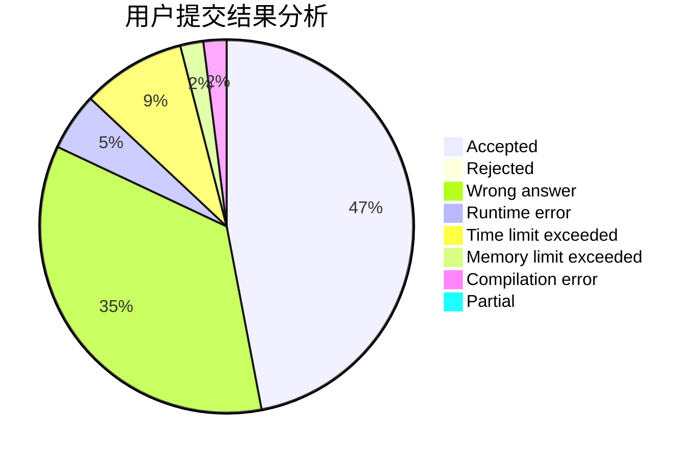
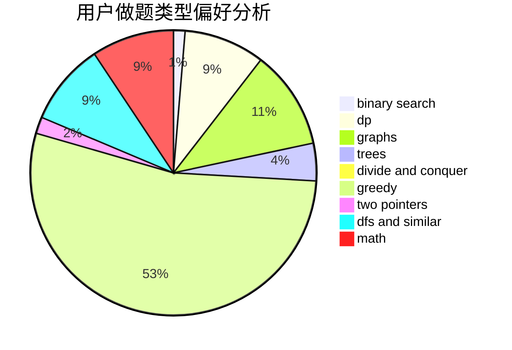

# lyoi_ycz

<!-- tabs:start -->

#### **用户提交结果分析**

#### **用户做题类型偏好分析**

<!-- tabs:end -->
# 推荐题目
[1503A](https://codeforces.com/contest/1503/problem/A)
[1453B](https://codeforces.com/contest/1453/problem/B)
[913A](https://codeforces.com/contest/913/problem/A)
[1399C](https://codeforces.com/contest/1399/problem/C)
[1509F](https://codeforces.com/contest/1509/problem/F)
[883D](https://codeforces.com/contest/883/problem/D)
[825E](https://codeforces.com/contest/825/problem/E)
[699A](https://codeforces.com/contest/699/problem/A)
[1143A](https://codeforces.com/contest/1143/problem/A)
[1029A](https://codeforces.com/contest/1029/problem/A)
