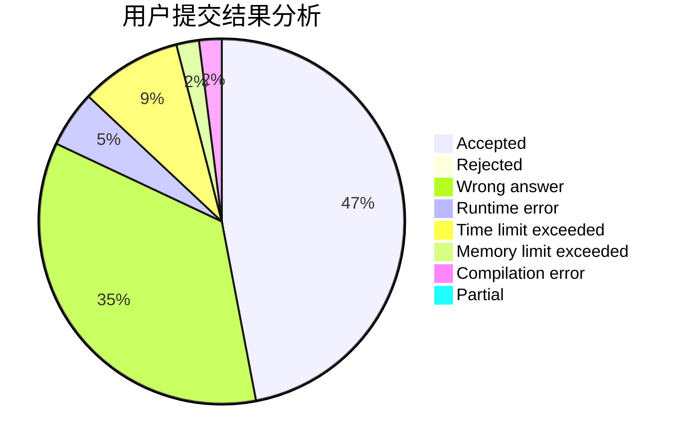
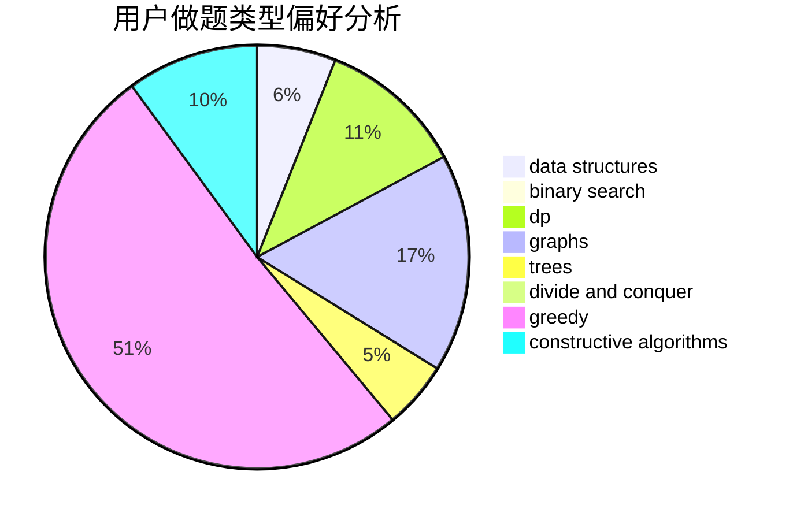

# lyoi_ycz

<!-- tabs:start -->

#### **用户提交结果分析**

#### **用户做题类型偏好分析**

#### **用户错题知识点分析**

<!-- tabs:end -->
# 推荐题目
[1503A](https://codeforces.com/contest/1503/problem/A)		constructive algorithms,
                        greedy		  
[1453B](https://codeforces.com/contest/1453/problem/B)		constructive algorithms,
                        implementation		  
[913A](https://codeforces.com/contest/913/problem/A)		implementation,
                        math		  
[1399C](https://codeforces.com/contest/1399/problem/C)		brute force,
                        greedy,
                        two pointers		  
[1509F](https://codeforces.com/contest/1509/problem/F)		dsu,graphs,sortings,trees		  
[883D](https://codeforces.com/contest/883/problem/D)		binary search,
                        dp,
                        math		  
[825E](https://codeforces.com/contest/825/problem/E)		data structures,
                        dfs and similar,
                        graphs,
                        greedy		  
[699A](https://codeforces.com/contest/699/problem/A)		implementation		  
[1143A](https://codeforces.com/contest/1143/problem/A)		implementation		  
[1029A](https://codeforces.com/contest/1029/problem/A)		implementation,
                        strings		  
