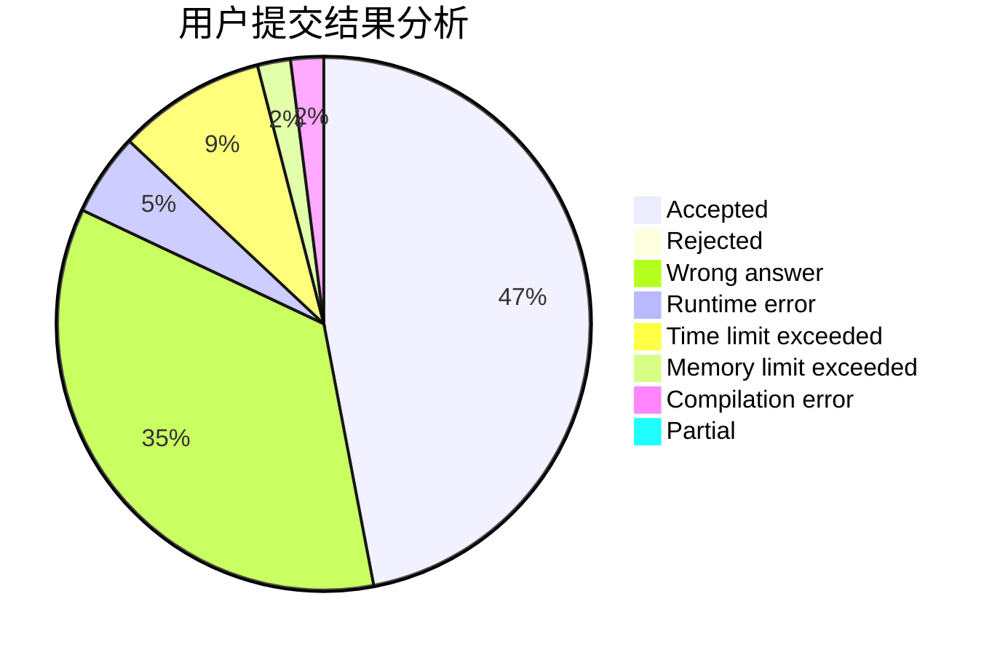
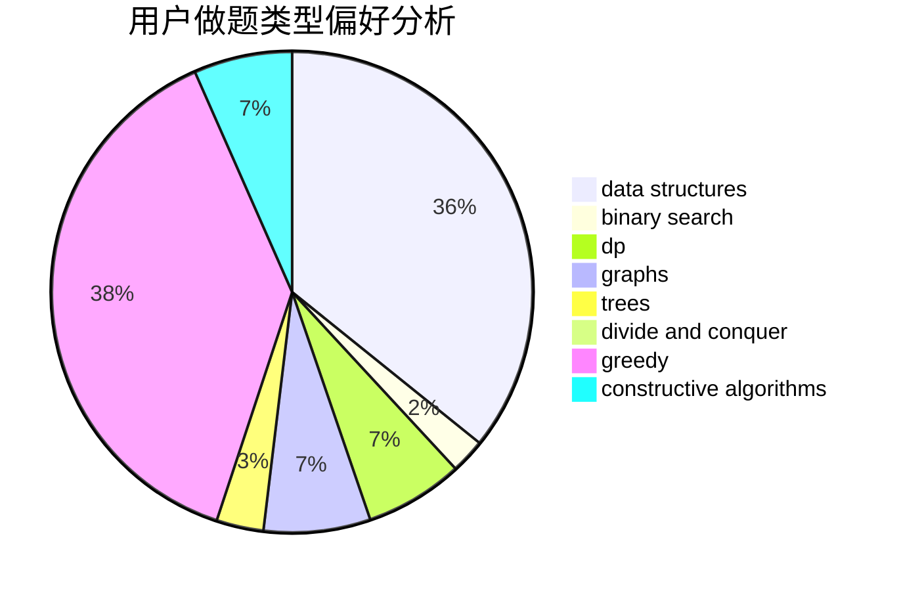

# lyoi_ycz

<!-- tabs:start -->

#### **用户提交结果分析**

#### **用户做题类型偏好分析**

#### **用户错题知识点分析**

<!-- tabs:end -->
# 推荐题目
[1494A](https://codeforces.com/contest/1494/problem/A)		bitmasks,
                        brute force,
                        implementation		  
[1443D](https://codeforces.com/contest/1443/problem/D)		dsu,graphs,sortings,trees		  
[895C](https://codeforces.com/contest/895/problem/C)		bitmasks,
                        combinatorics,
                        dp,
                        math		  
[138D](https://codeforces.com/contest/138/problem/D)		dp,
                        games		  
[1499F](https://codeforces.com/contest/1499/problem/F)		combinatorics,
                        dfs and similar,
                        dp,
                        trees		  
[863B](https://codeforces.com/contest/863/problem/B)		brute force,
                        greedy,
                        sortings		  
[808F](https://codeforces.com/contest/808/problem/F)		binary search,
                        flows,
                        graphs		  
[673B](https://codeforces.com/contest/673/problem/B)		greedy,
                        implementation		  
[1141A](https://codeforces.com/contest/1141/problem/A)		implementation,
                        math		  
[1028E](https://codeforces.com/contest/1028/problem/E)		constructive algorithms		  
