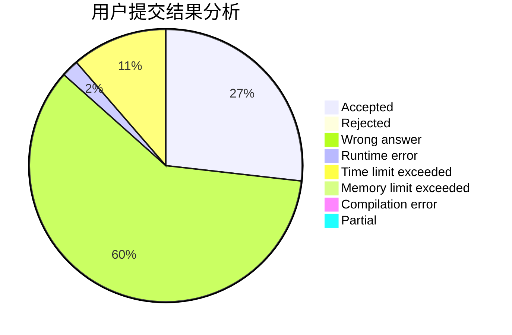
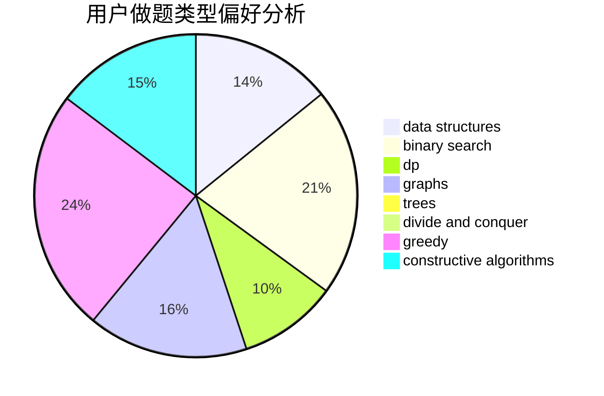
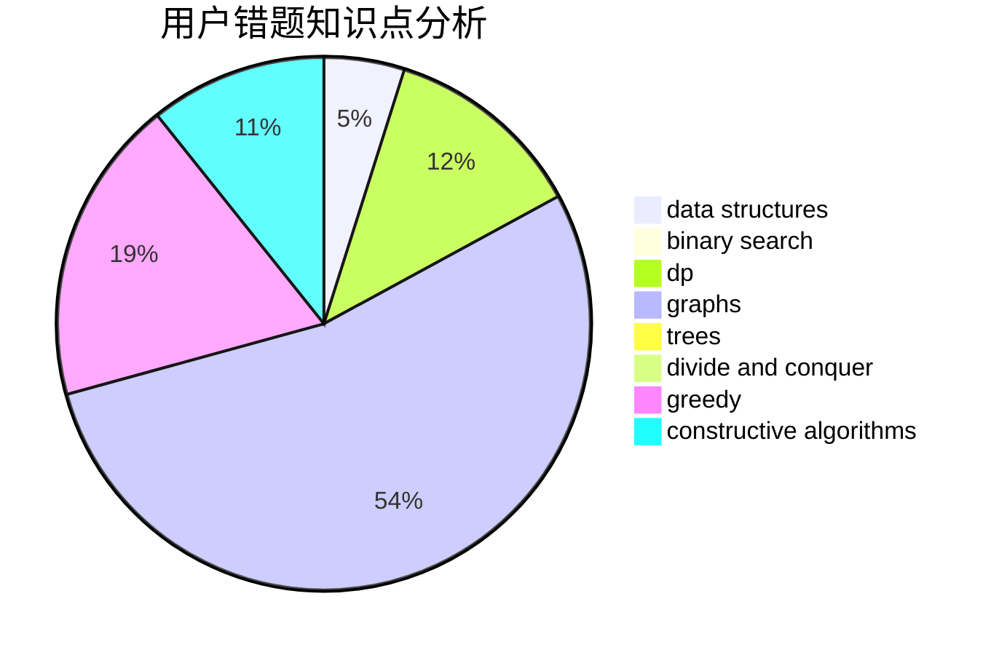

# lytQAQ
<!-- tabs:start -->
#### **用户提交结果分析**

#### **用户做题类型偏好分析**

#### **用户错题知识点分析**

<!-- tabs:end -->
# 推荐题目
[Ahahahahahahahaha](http://codeforces.com/problemset/problem/1407/A)		constructive algorithms,
                        math		  
[The Queue](http://codeforces.com/problemset/problem/767/B)		brute force,
                        greedy		  
[Zuma](https://codeforces.com/contest/608/problem/D)		dp		  
[Uncle Bogdan and Projections](http://codeforces.com/problemset/problem/1388/E)		data structures,
                        geometry,
                        sortings		  
[Nephren Runs a Cinema](http://codeforces.com/problemset/problem/896/D)		chinese remainder theorem,
                        combinatorics,
                        math,
                        number theory		  
[Azamon Web Services](http://codeforces.com/problemset/problem/1281/B)		greedy		  
[Regular Polygon (1 point)](https://codeforces.com/contest/1164/problem/F)		nan		  
[Wall Bars](http://codeforces.com/problemset/problem/268/D)		dp		  
[Robot Breakout](http://codeforces.com/problemset/problem/1196/C)		implementation		  
[Bear and Fair Set](http://codeforces.com/problemset/problem/628/F)		flows		  
<!-- tabs:start -->
#### **data structures**
[Ahahahahahahahaha](http://codeforces.com/problemset/problem/1388/E)		data structures,
                        geometry,
                        sortings		  
[The Queue](http://codeforces.com/problemset/problem/1083/F)		data structures		  
[Zuma](http://codeforces.com/problemset/problem/869/E)		data structures,
                        hashing		  
[Uncle Bogdan and Projections](http://codeforces.com/problemset/problem/713/D)		binary search,
                        data structures		  
[Nephren Runs a Cinema](http://codeforces.com/problemset/problem/930/D)		data structures,
                        games,
                        implementation		  
[Azamon Web Services](http://codeforces.com/problemset/problem/44/G)		data structures,
                        implementation		  
[Regular Polygon (1 point)](http://codeforces.com/problemset/problem/1469/F)		binary search,
                        data structures,
                        greedy		  
[Wall Bars](http://codeforces.com/problemset/problem/138/C)		binary search,
                        data structures,
                        probabilities,
                        sortings		  
[Robot Breakout](http://codeforces.com/problemset/problem/1503/D)		2-sat,
                        constructive algorithms,
                        data structures,
                        greedy,
                        sortings,
                        two pointers		  
[Bear and Fair Set](http://codeforces.com/problemset/problem/936/E)		data structures,
                        dfs and similar,
                        divide and conquer,
                        dsu,
                        shortest paths,
                        trees		  
#### **binary search**
[Ahahahahahahahaha](http://codeforces.com/problemset/problem/713/D)		binary search,
                        data structures		  
[The Queue](http://codeforces.com/problemset/problem/1469/F)		binary search,
                        data structures,
                        greedy		  
[Zuma](http://codeforces.com/problemset/problem/721/E)		binary search,
                        dp		  
[Uncle Bogdan and Projections](http://codeforces.com/problemset/problem/138/C)		binary search,
                        data structures,
                        probabilities,
                        sortings		  
[Nephren Runs a Cinema](http://codeforces.com/problemset/problem/1492/C)		binary search,
                        data structures,
                        dp,
                        greedy,
                        two pointers		  
[Azamon Web Services](http://codeforces.com/problemset/problem/1463/D)		binary search,
                        constructive algorithms,
                        greedy,
                        two pointers		  
[Regular Polygon (1 point)](http://codeforces.com/problemset/problem/1490/G)		binary search,
                        data structures,
                        math		  
[Wall Bars](http://codeforces.com/problemset/problem/1479/D)		binary search,
                        bitmasks,
                        brute force,
                        data structures,
                        probabilities,
                        trees		  
[Robot Breakout](http://codeforces.com/problemset/problem/1436/E)		binary search,
                        data structures,
                        two pointers		  
[Bear and Fair Set](http://codeforces.com/problemset/problem/1461/D)		binary search,
                        brute force,
                        data structures,
                        divide and conquer,
                        implementation,
                        sortings		  
#### **dp**
[Ahahahahahahahaha](https://codeforces.com/contest/608/problem/D)		dp		  
[The Queue](http://codeforces.com/problemset/problem/268/D)		dp		  
[Zuma](http://codeforces.com/problemset/problem/1117/D)		dp,
                        math,
                        matrices		  
[Uncle Bogdan and Projections](https://codeforces.com/contest/116/problem/C)		bitmasks,
                        brute force,
                        dp,
                        graphs		  
[Nephren Runs a Cinema](http://codeforces.com/problemset/problem/798/B)		brute force,
                        dp,
                        strings		  
[Azamon Web Services](http://codeforces.com/problemset/problem/721/E)		binary search,
                        dp		  
[Regular Polygon (1 point)](http://codeforces.com/problemset/problem/27/E)		brute force,
                        dp,
                        number theory		  
[Wall Bars](http://codeforces.com/problemset/problem/724/F)		combinatorics,
                        dp,
                        trees		  
[Robot Breakout](http://codeforces.com/problemset/problem/1492/C)		binary search,
                        data structures,
                        dp,
                        greedy,
                        two pointers		  
[Bear and Fair Set](https://codeforces.com/contest/1457/problem/C)		brute force,
                        dp,
                        implementation		  
#### **graph**
[Ahahahahahahahaha](http://codeforces.com/problemset/problem/869/D)		brute force,
                        dfs and similar,
                        graphs		  
[The Queue](http://codeforces.com/problemset/problem/225/D)		bitmasks,
                        dfs and similar,
                        graphs,
                        implementation		  
[Zuma](https://codeforces.com/contest/116/problem/C)		bitmasks,
                        brute force,
                        dp,
                        graphs		  
[Uncle Bogdan and Projections](http://codeforces.com/problemset/problem/1147/D)		dfs and similar,
                        graphs		  
[Nephren Runs a Cinema](https://codeforces.com/contest/1489/problem/G)		dsu,
                        graphs,
                        greedy		  
[Azamon Web Services](http://codeforces.com/problemset/problem/1487/C)		brute force,
                        constructive algorithms,
                        dfs and similar,
                        graphs,
                        greedy,
                        implementation,
                        math		  
[Regular Polygon (1 point)](http://codeforces.com/problemset/problem/1437/C)		dp,
                        flows,
                        graph matchings,
                        greedy,
                        math,
                        sortings		  
[Wall Bars](http://codeforces.com/problemset/problem/1470/D)		constructive algorithms,
                        dfs and similar,
                        graph matchings,
                        graphs,
                        greedy		  
[Robot Breakout](http://codeforces.com/problemset/problem/1476/C)		dp,
                        graphs,
                        greedy		  
[Bear and Fair Set](http://codeforces.com/problemset/problem/1304/D)		constructive algorithms,
                        graphs,
                        greedy,
                        two pointers		  
#### **trees**
[Ahahahahahahahaha](http://codeforces.com/problemset/problem/936/E)		data structures,
                        dfs and similar,
                        divide and conquer,
                        dsu,
                        shortest paths,
                        trees		  
[The Queue](http://codeforces.com/problemset/problem/724/F)		combinatorics,
                        dp,
                        trees		  
[Zuma](http://codeforces.com/problemset/problem/1479/D)		binary search,
                        bitmasks,
                        brute force,
                        data structures,
                        probabilities,
                        trees		  
[Uncle Bogdan and Projections](http://codeforces.com/problemset/problem/1511/C)		brute force,
                        data structures,
                        implementation,
                        trees		  
[Nephren Runs a Cinema](http://codeforces.com/problemset/problem/1499/F)		combinatorics,
                        dfs and similar,
                        dp,
                        trees		  
[Azamon Web Services](http://codeforces.com/problemset/problem/1491/E)		brute force,
                        dfs and similar,
                        divide and conquer,
                        number theory,
                        trees		  
[Regular Polygon (1 point)](http://codeforces.com/problemset/problem/1466/D)		data structures,
                        greedy,
                        sortings,
                        trees		  
[Wall Bars](http://codeforces.com/problemset/problem/1495/D)		combinatorics,
                        dfs and similar,
                        graphs,
                        math,
                        shortest paths,
                        trees		  
[Robot Breakout](http://codeforces.com/problemset/problem/1303/G)		data structures,
                        divide and conquer,
                        geometry,
                        trees		  
[Bear and Fair Set](http://codeforces.com/problemset/problem/1454/E)		combinatorics,
                        dfs and similar,
                        graphs,
                        trees		  
#### **divide and conquer**
[Ahahahahahahahaha](http://codeforces.com/problemset/problem/936/E)		data structures,
                        dfs and similar,
                        divide and conquer,
                        dsu,
                        shortest paths,
                        trees		  
[The Queue](http://codeforces.com/problemset/problem/1461/D)		binary search,
                        brute force,
                        data structures,
                        divide and conquer,
                        implementation,
                        sortings		  
[Zuma](http://codeforces.com/problemset/problem/1466/G)		combinatorics,
                        divide and conquer,
                        hashing,
                        math,
                        string suffix structures,
                        strings		  
[Uncle Bogdan and Projections](http://codeforces.com/problemset/problem/1490/D)		dfs and similar,
                        divide and conquer,
                        implementation		  
[Nephren Runs a Cinema](https://codeforces.com/contest/1483/problem/C)		data structures,
                        divide and conquer,
                        dp		  
[Azamon Web Services](http://codeforces.com/problemset/problem/1491/E)		brute force,
                        dfs and similar,
                        divide and conquer,
                        number theory,
                        trees		  
[Regular Polygon (1 point)](http://codeforces.com/problemset/problem/1303/G)		data structures,
                        divide and conquer,
                        geometry,
                        trees		  
[Wall Bars](http://codeforces.com/problemset/problem/1494/D)		constructive algorithms,
                        data structures,
                        dfs and similar,
                        divide and conquer,
                        dsu,
                        greedy,
                        sortings,
                        trees		  
[Robot Breakout](http://codeforces.com/problemset/problem/1482/E)		data structures,
                        divide and conquer,
                        dp		  
[Bear and Fair Set](http://codeforces.com/problemset/problem/566/C)		dfs and similar,
                        divide and conquer,
                        trees		  
#### **greedy**
[Ahahahahahahahaha](http://codeforces.com/problemset/problem/767/B)		brute force,
                        greedy		  
[The Queue](http://codeforces.com/problemset/problem/1281/B)		greedy		  
[Zuma](http://codeforces.com/problemset/problem/285/A)		greedy,
                        implementation		  
[Uncle Bogdan and Projections](http://codeforces.com/problemset/problem/496/E)		greedy,
                        sortings		  
[Nephren Runs a Cinema](http://codeforces.com/problemset/problem/1469/F)		binary search,
                        data structures,
                        greedy		  
[Azamon Web Services](https://codeforces.com/contest/1489/problem/G)		dsu,
                        graphs,
                        greedy		  
[Regular Polygon (1 point)](http://codeforces.com/problemset/problem/1471/B)		brute force,
                        greedy,
                        implementation,
                        math		  
[Wall Bars](http://codeforces.com/problemset/problem/1015/D)		constructive algorithms,
                        greedy		  
[Robot Breakout](http://codeforces.com/problemset/problem/1480/B)		greedy,
                        implementation,
                        sortings		  
[Bear and Fair Set](http://codeforces.com/problemset/problem/1503/D)		2-sat,
                        constructive algorithms,
                        data structures,
                        greedy,
                        sortings,
                        two pointers		  
#### **constructive algorithms**
[Ahahahahahahahaha](http://codeforces.com/problemset/problem/1407/A)		constructive algorithms,
                        math		  
[The Queue](http://codeforces.com/problemset/problem/715/A)		constructive algorithms,
                        math		  
[Zuma](http://codeforces.com/problemset/problem/1015/D)		constructive algorithms,
                        greedy		  
[Uncle Bogdan and Projections](http://codeforces.com/problemset/problem/1503/D)		2-sat,
                        constructive algorithms,
                        data structures,
                        greedy,
                        sortings,
                        two pointers		  
[Nephren Runs a Cinema](https://codeforces.com/contest/1480/problem/E)		bitmasks,
                        constructive algorithms		  
[Azamon Web Services](https://codeforces.com/contest/764/problem/D)		constructive algorithms,
                        geometry		  
[Regular Polygon (1 point)](http://codeforces.com/problemset/problem/1406/D)		constructive algorithms,
                        data structures,
                        greedy,
                        math		  
[Wall Bars](http://codeforces.com/problemset/problem/1493/A)		constructive algorithms,
                        greedy		  
[Robot Breakout](http://codeforces.com/problemset/problem/1463/D)		binary search,
                        constructive algorithms,
                        greedy,
                        two pointers		  
[Bear and Fair Set](https://codeforces.com/contest/1456/problem/B)		bitmasks,
                        brute force,
                        constructive algorithms		  
#### **sortings**
[Ahahahahahahahaha](http://codeforces.com/problemset/problem/1388/E)		data structures,
                        geometry,
                        sortings		  
[The Queue](http://codeforces.com/problemset/problem/496/E)		greedy,
                        sortings		  
[Zuma](http://codeforces.com/problemset/problem/138/C)		binary search,
                        data structures,
                        probabilities,
                        sortings		  
[Uncle Bogdan and Projections](http://codeforces.com/problemset/problem/1480/B)		greedy,
                        implementation,
                        sortings		  
[Nephren Runs a Cinema](http://codeforces.com/problemset/problem/1503/D)		2-sat,
                        constructive algorithms,
                        data structures,
                        greedy,
                        sortings,
                        two pointers		  
[Azamon Web Services](https://codeforces.com/contest/1496/problem/C)		geometry,
                        greedy,
                        math,
                        sortings		  
[Regular Polygon (1 point)](http://codeforces.com/problemset/problem/1495/A)		geometry,
                        greedy,
                        math,
                        sortings		  
[Wall Bars](http://codeforces.com/problemset/problem/1497/A)		brute force,
                        data structures,
                        greedy,
                        sortings		  
[Robot Breakout](http://codeforces.com/problemset/problem/1427/A)		math,
                        sortings		  
[Bear and Fair Set](http://codeforces.com/problemset/problem/1461/D)		binary search,
                        brute force,
                        data structures,
                        divide and conquer,
                        implementation,
                        sortings		  
<!-- tabs:end -->
