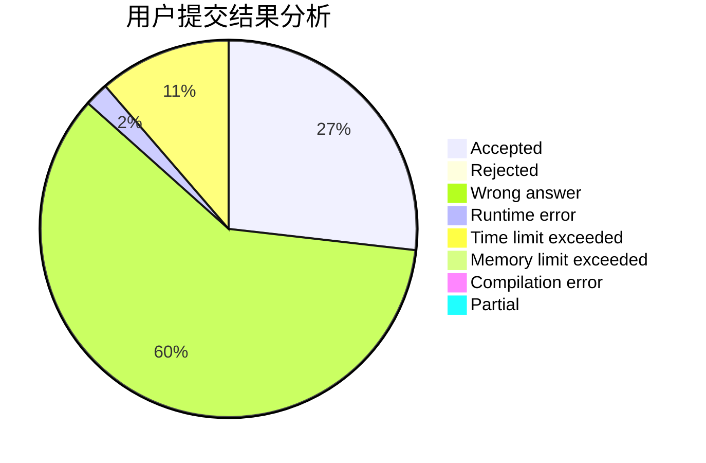
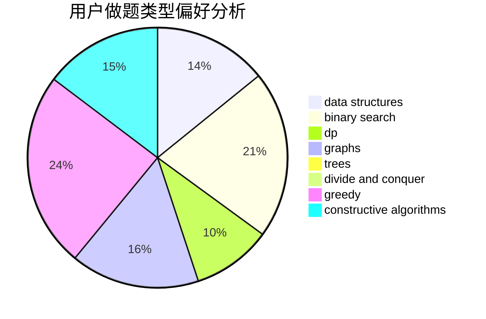
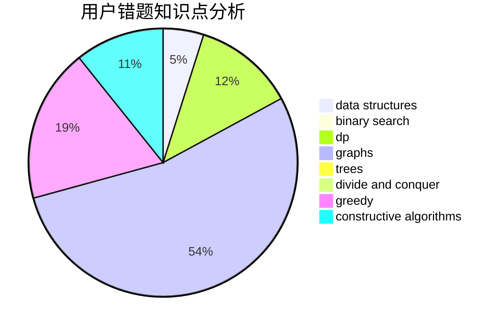

# lytQAQ

<!-- tabs:start -->

#### **用户提交结果分析**

#### **用户做题类型偏好分析**

#### **用户错题知识点分析**

<!-- tabs:end -->
# 推荐题目
[767B](https://codeforces.com/contest/767/problem/B)		brute force,
                        greedy		  
[608D](https://codeforces.com/contest/608/problem/D)		dsu,graphs,sortings,trees		  
[896D](https://codeforces.com/contest/896/problem/D)		chinese remainder theorem,
                        combinatorics,
                        math,
                        number theory		  
[285A](https://codeforces.com/contest/285/problem/A)		greedy,
                        implementation		  
[628F](https://codeforces.com/contest/628/problem/F)		flows		  
[27E](https://codeforces.com/contest/27/problem/E)		brute force,
                        dp,
                        number theory		  
[225D](https://codeforces.com/contest/225/problem/D)		bitmasks,
                        dfs and similar,
                        graphs,
                        implementation		  
[1281B](https://codeforces.com/contest/1281/problem/B)		greedy		  
[268D](https://codeforces.com/contest/268/problem/D)		dp		  
[44G](https://codeforces.com/contest/44/problem/G)		data structures,
                        implementation		  
