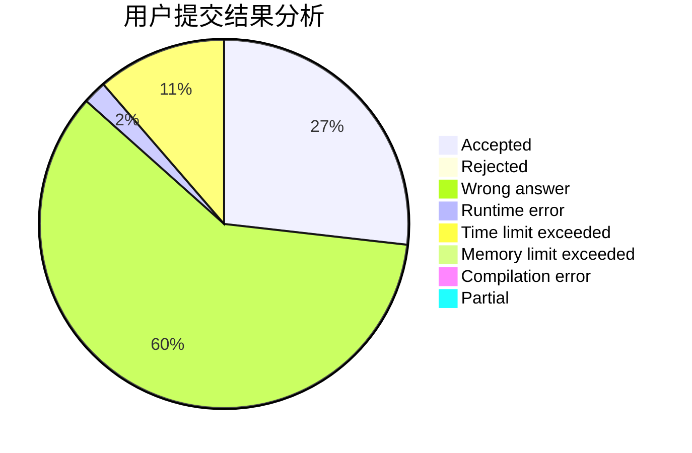
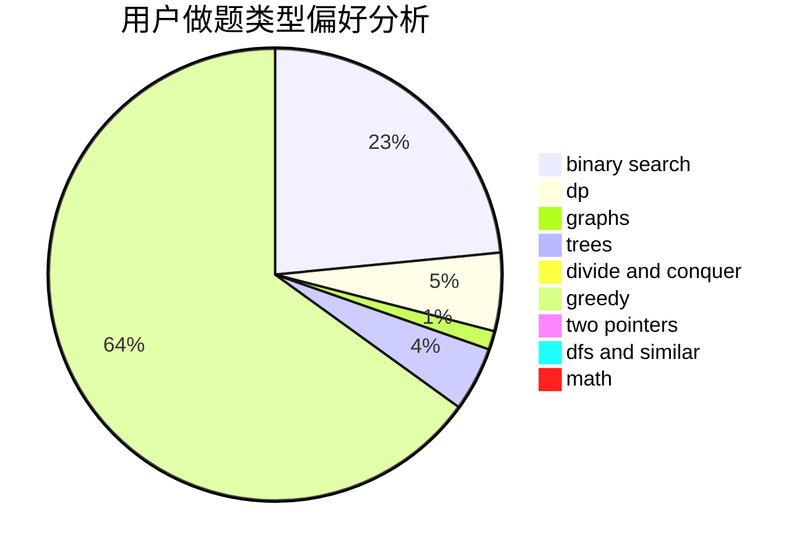

# lytQAQ

<!-- tabs:start -->

#### **用户提交结果分析**

#### **用户做题类型偏好分析**

<!-- tabs:end -->
# 推荐题目
[786D](https://codeforces.com/contest/786/problem/D)
[627E](https://codeforces.com/contest/627/problem/E)
[913G](https://codeforces.com/contest/913/problem/G)
[2C](https://codeforces.com/contest/2/problem/C)
[656F](https://codeforces.com/contest/656/problem/F)
[295D](https://codeforces.com/contest/295/problem/D)
[243D](https://codeforces.com/contest/243/problem/D)
[1287B](https://codeforces.com/contest/1287/problem/B)
[283E](https://codeforces.com/contest/283/problem/E)
[472A](https://codeforces.com/contest/472/problem/A)
