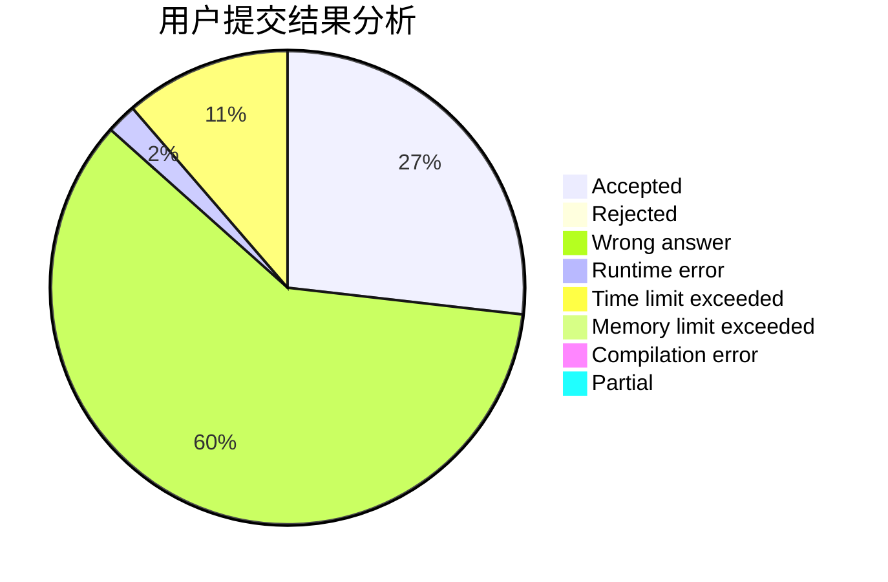
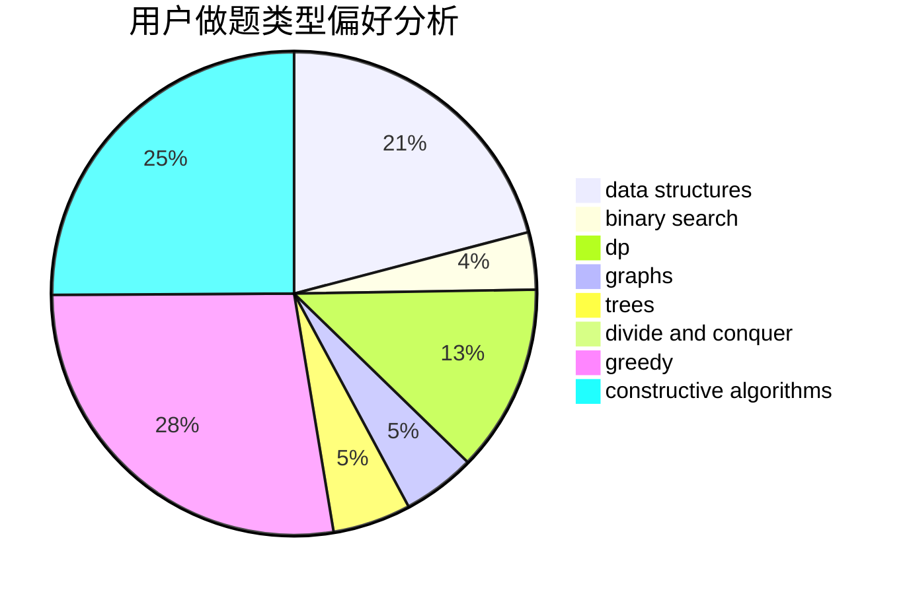
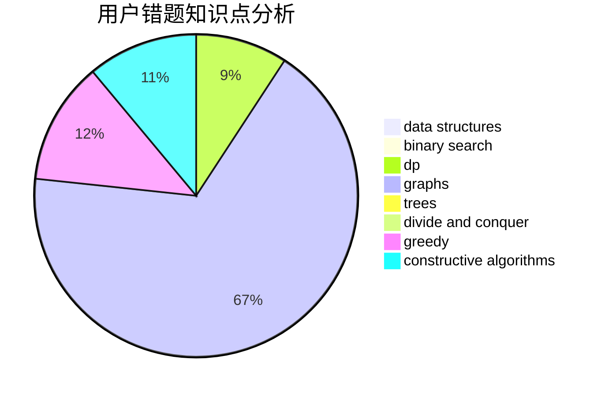

# lytQAQ

<!-- tabs:start -->

#### **用户提交结果分析**

#### **用户做题类型偏好分析**

#### **用户错题知识点分析**

<!-- tabs:end -->
# 推荐题目
[786D](https://codeforces.com/contest/786/problem/D)		data structures,
                        dfs and similar,
                        hashing,
                        strings,
                        trees		  
[627E](https://codeforces.com/contest/627/problem/E)		two pointers		  
[913G](https://codeforces.com/contest/913/problem/G)		math,
                        number theory		  
[2C](https://codeforces.com/contest/2/problem/C)		geometry		  
[656F](https://codeforces.com/contest/656/problem/F)		*special problem		  
[295D](https://codeforces.com/contest/295/problem/D)		combinatorics,
                        dp		  
[243D](https://codeforces.com/contest/243/problem/D)		data structures,
                        dp,
                        geometry,
                        two pointers		  
[1287B](https://codeforces.com/contest/1287/problem/B)		brute force,
                        data structures,
                        implementation		  
[283E](https://codeforces.com/contest/283/problem/E)		combinatorics,
                        data structures,
                        math		  
[472A](https://codeforces.com/contest/472/problem/A)		math,
                        number theory		  
