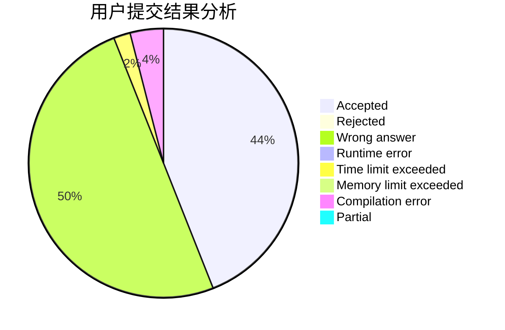
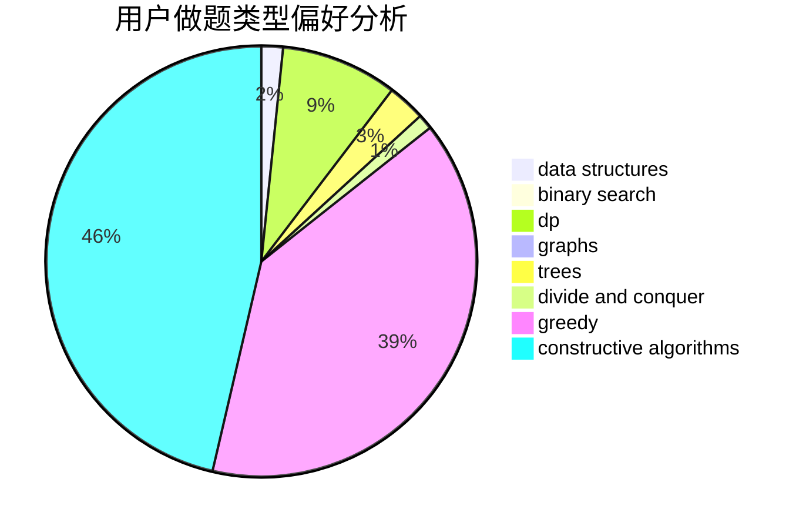
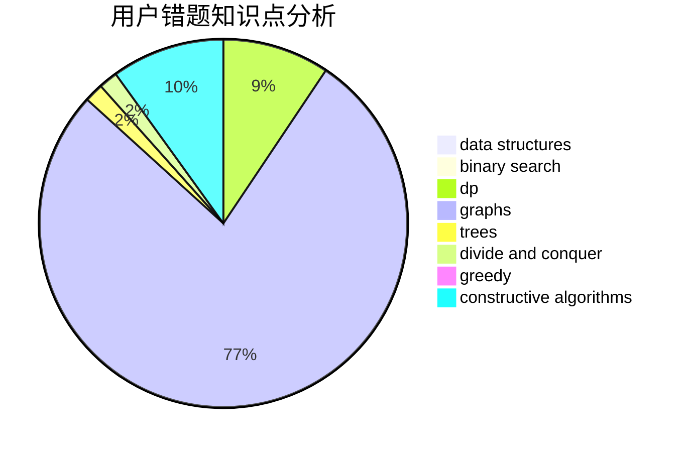

# lyx12138

<!-- tabs:start -->

#### **用户提交结果分析**

#### **用户做题类型偏好分析**

#### **用户错题知识点分析**

<!-- tabs:end -->
# 推荐题目
[986C](https://codeforces.com/contest/986/problem/C)		bitmasks,
                        dfs and similar,
                        dsu,
                        graphs		  
[738D](https://codeforces.com/contest/738/problem/D)		dsu,graphs,sortings,trees		  
[1099C](https://codeforces.com/contest/1099/problem/C)		constructive algorithms,
                        implementation		  
[810A](https://codeforces.com/contest/810/problem/A)		implementation,
                        math		  
[1138A](https://codeforces.com/contest/1138/problem/A)		binary search,
                        greedy,
                        implementation		  
[1474C](https://codeforces.com/contest/1474/problem/C)		brute force,
                        constructive algorithms,
                        data structures,
                        greedy,
                        implementation,
                        sortings		  
[1157C1](https://codeforces.com/contest/1157C/problem/1)		greedy		  
[1068C](https://codeforces.com/contest/1068/problem/C)		constructive algorithms,
                        graphs		  
[1303B](https://codeforces.com/contest/1303/problem/B)		math		  
[765F](https://codeforces.com/contest/765/problem/F)		data structures		  
