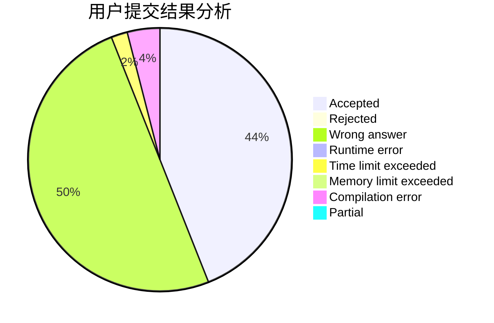
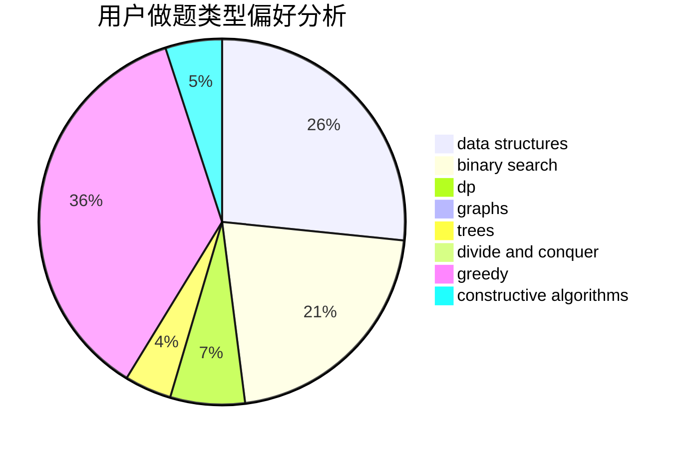
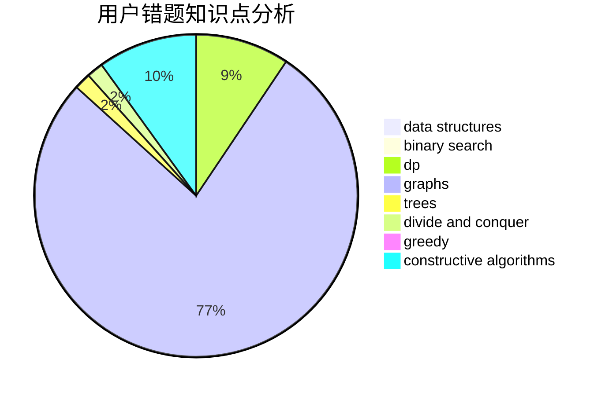

# lyx12138

<!-- tabs:start -->

#### **用户提交结果分析**

#### **用户做题类型偏好分析**

#### **用户错题知识点分析**

<!-- tabs:end -->
# 推荐题目
[acmsguru5](https://codeforces.com/contest/acmsguru/problem/5)		dsu,graphs,sortings,trees		  
[759D](https://codeforces.com/contest/759/problem/D)		dsu,graphs,sortings,trees		  
[1099F](https://codeforces.com/contest/1099/problem/F)		binary search,
                        data structures,
                        dfs and similar,
                        dp,
                        games,
                        trees		  
[828A](https://codeforces.com/contest/828/problem/A)		implementation		  
[113C](https://codeforces.com/contest/113/problem/C)		brute force,
                        math,
                        number theory		  
[1482H](https://codeforces.com/contest/1482/problem/H)		data structures,
                        string suffix structures,
                        trees		  
[1159C](https://codeforces.com/contest/1159/problem/C)		dsu,graphs,sortings,trees		  
[106A](https://codeforces.com/contest/106/problem/A)		implementation		  
[1311F](https://codeforces.com/contest/1311/problem/F)		data structures,
                        divide and conquer,
                        implementation,
                        sortings		  
[785B](https://codeforces.com/contest/785/problem/B)		greedy,
                        sortings		  
