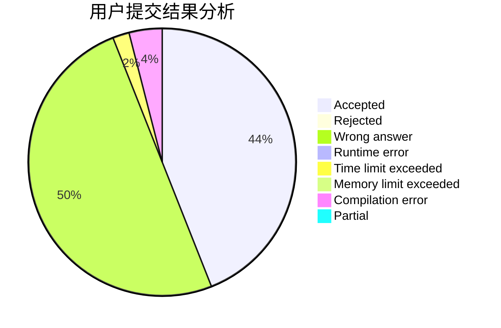
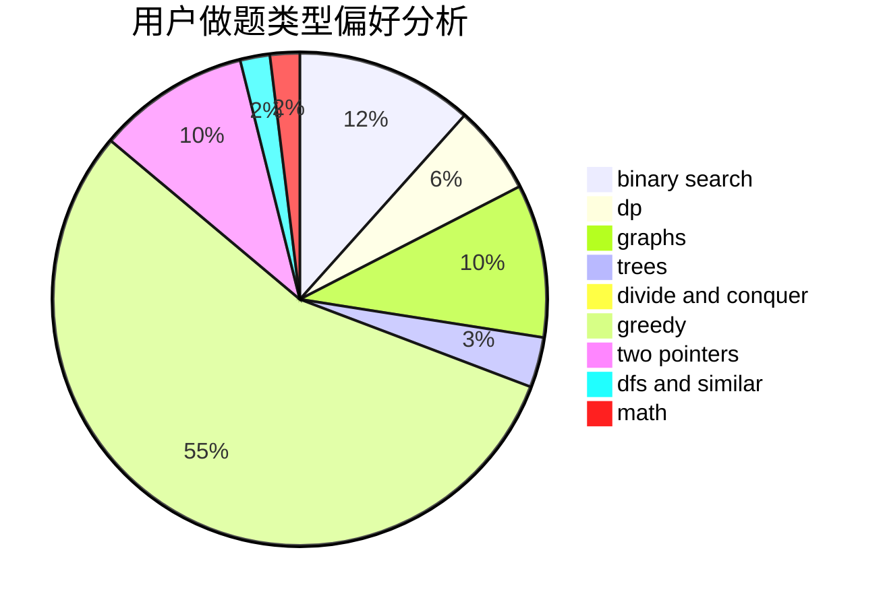

# lyx12138

<!-- tabs:start -->

#### **用户提交结果分析**

#### **用户做题类型偏好分析**

<!-- tabs:end -->
# 推荐题目
[acmsguru5](https://codeforces.com/contest/acmsguru/problem/5)
[759D](https://codeforces.com/contest/759/problem/D)
[1099F](https://codeforces.com/contest/1099/problem/F)
[828A](https://codeforces.com/contest/828/problem/A)
[113C](https://codeforces.com/contest/113/problem/C)
[1482H](https://codeforces.com/contest/1482/problem/H)
[1159C](https://codeforces.com/contest/1159/problem/C)
[106A](https://codeforces.com/contest/106/problem/A)
[1311F](https://codeforces.com/contest/1311/problem/F)
[785B](https://codeforces.com/contest/785/problem/B)
