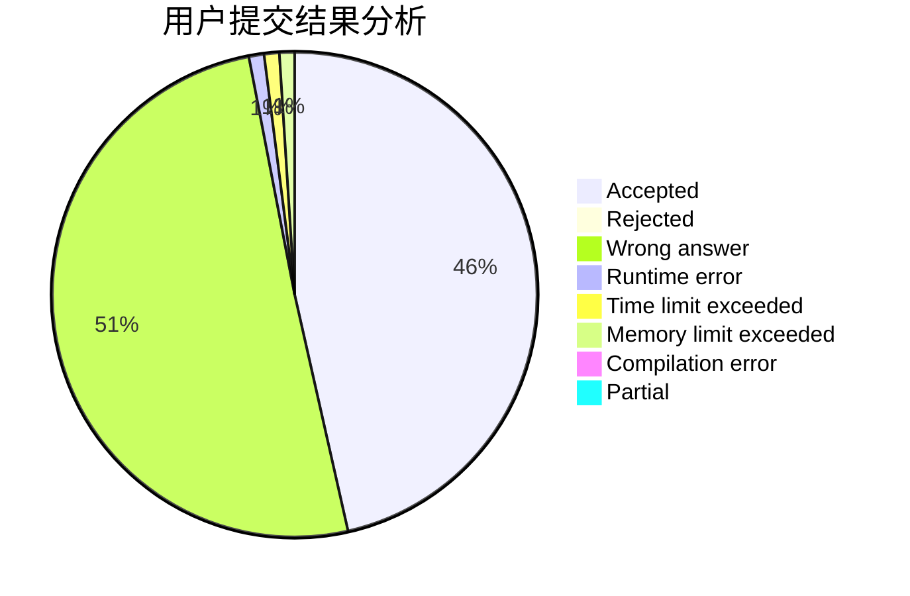
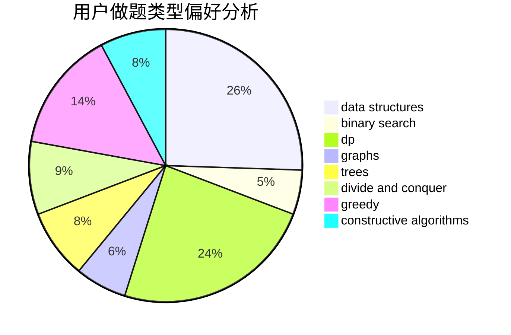
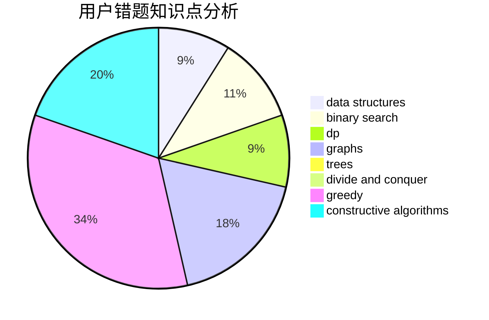

# lyyyyy

<!-- tabs:start -->

#### **用户提交结果分析**

#### **用户做题类型偏好分析**

#### **用户错题知识点分析**

<!-- tabs:end -->
# 推荐题目
[1358C](https://codeforces.com/contest/1358/problem/C)		math		  
[1322C](https://codeforces.com/contest/1322/problem/C)		graphs,
                        hashing,
                        math,
                        number theory		  
[848C](https://codeforces.com/contest/848/problem/C)		data structures,
                        divide and conquer		  
[1144F](https://codeforces.com/contest/1144/problem/F)		dfs and similar,
                        graphs		  
[614D](https://codeforces.com/contest/614/problem/D)		dsu,graphs,sortings,trees		  
[567A](https://codeforces.com/contest/567/problem/A)		greedy,
                        implementation		  
[36C](https://codeforces.com/contest/36/problem/C)		geometry,
                        implementation		  
[780G](https://codeforces.com/contest/780/problem/G)		data structures,
                        dp		  
[665D](https://codeforces.com/contest/665/problem/D)		constructive algorithms,
                        greedy,
                        number theory		  
[999B](https://codeforces.com/contest/999/problem/B)		implementation		  
