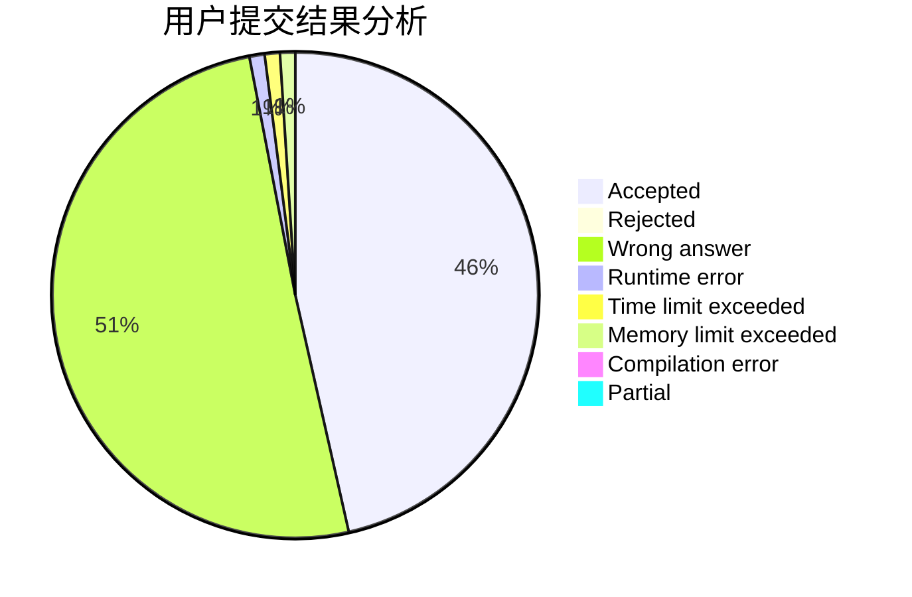
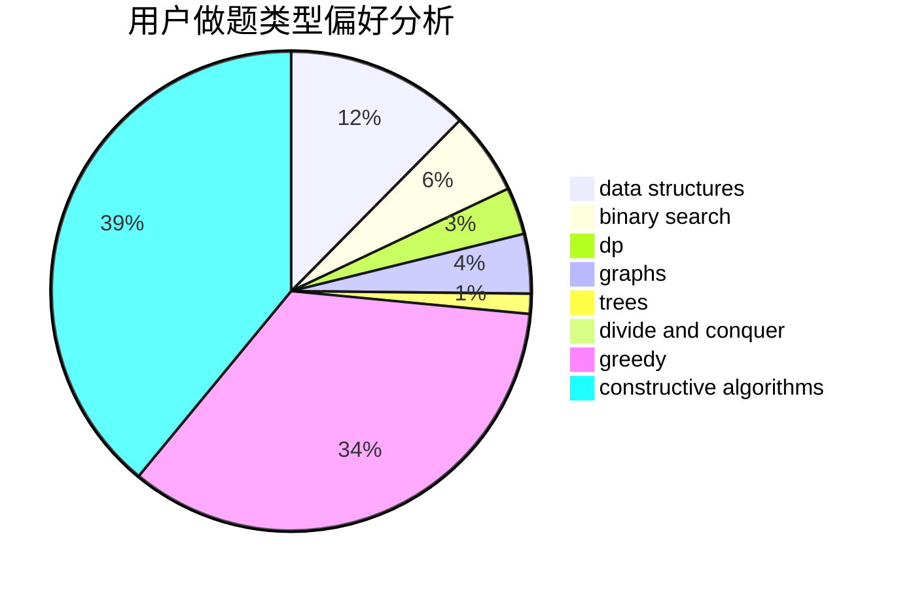
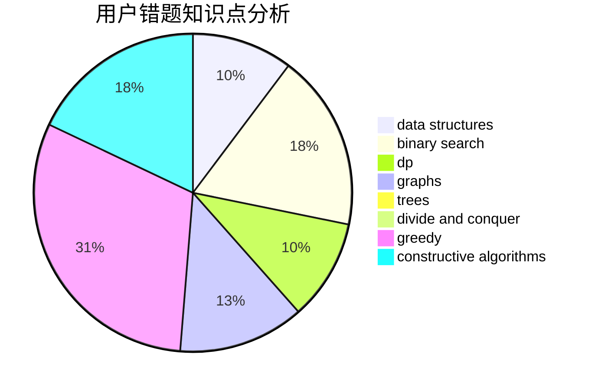

# lyyyyy

<!-- tabs:start -->

#### **用户提交结果分析**

#### **用户做题类型偏好分析**

#### **用户错题知识点分析**

<!-- tabs:end -->
# 推荐题目
[1351B](https://codeforces.com/contest/1351/problem/B)		brute force,
                        implementation,
                        math		  
[1312G](https://codeforces.com/contest/1312/problem/G)		data structures,
                        dfs and similar,
                        dp		  
[830C](https://codeforces.com/contest/830/problem/C)		brute force,
                        data structures,
                        implementation,
                        math,
                        number theory,
                        sortings,
                        two pointers		  
[1142D](https://codeforces.com/contest/1142/problem/D)		dp		  
[597C](https://codeforces.com/contest/597/problem/C)		data structures,
                        dp		  
[542E](https://codeforces.com/contest/542/problem/E)		graphs,
                        shortest paths		  
[343B](https://codeforces.com/contest/343/problem/B)		data structures,
                        greedy,
                        implementation		  
[762C](https://codeforces.com/contest/762/problem/C)		binary search,
                        hashing,
                        strings,
                        two pointers		  
[633B](https://codeforces.com/contest/633/problem/B)		brute force,
                        constructive algorithms,
                        math,
                        number theory		  
[983C](https://codeforces.com/contest/983/problem/C)		dp,
                        graphs,
                        shortest paths		  
