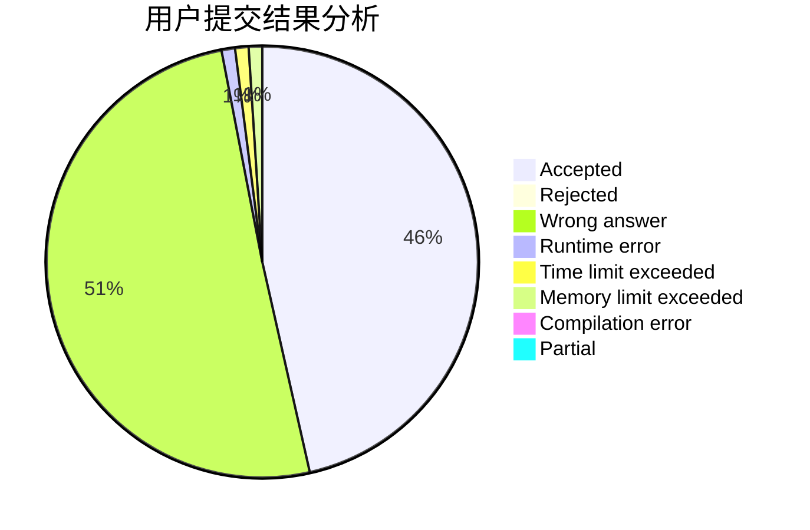
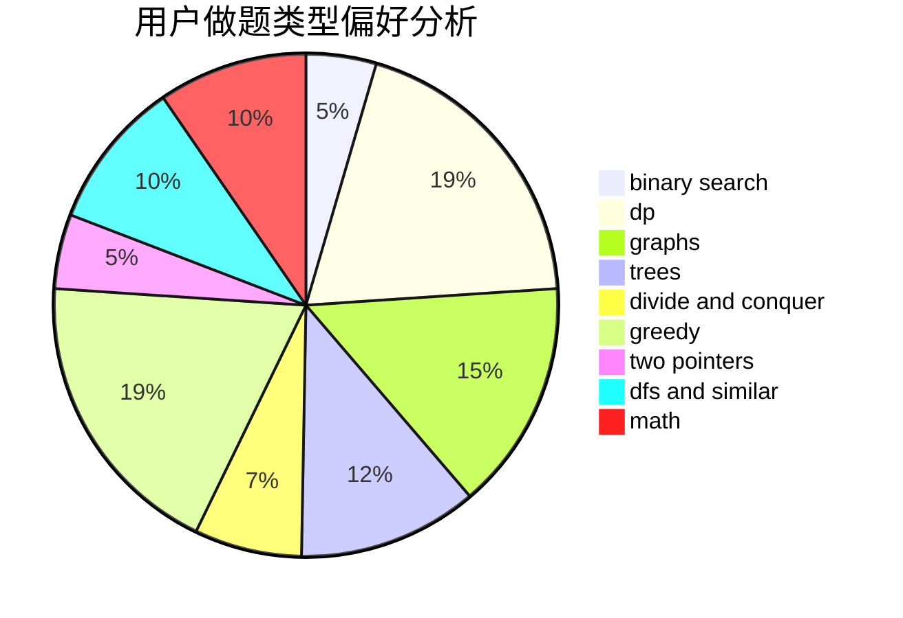

# lyyyyy

<!-- tabs:start -->

#### **用户提交结果分析**

#### **用户做题类型偏好分析**

<!-- tabs:end -->
# 推荐题目
[1358C](https://codeforces.com/contest/1358/problem/C)
[1322C](https://codeforces.com/contest/1322/problem/C)
[848C](https://codeforces.com/contest/848/problem/C)
[1144F](https://codeforces.com/contest/1144/problem/F)
[614D](https://codeforces.com/contest/614/problem/D)
[567A](https://codeforces.com/contest/567/problem/A)
[36C](https://codeforces.com/contest/36/problem/C)
[780G](https://codeforces.com/contest/780/problem/G)
[665D](https://codeforces.com/contest/665/problem/D)
[999B](https://codeforces.com/contest/999/problem/B)
