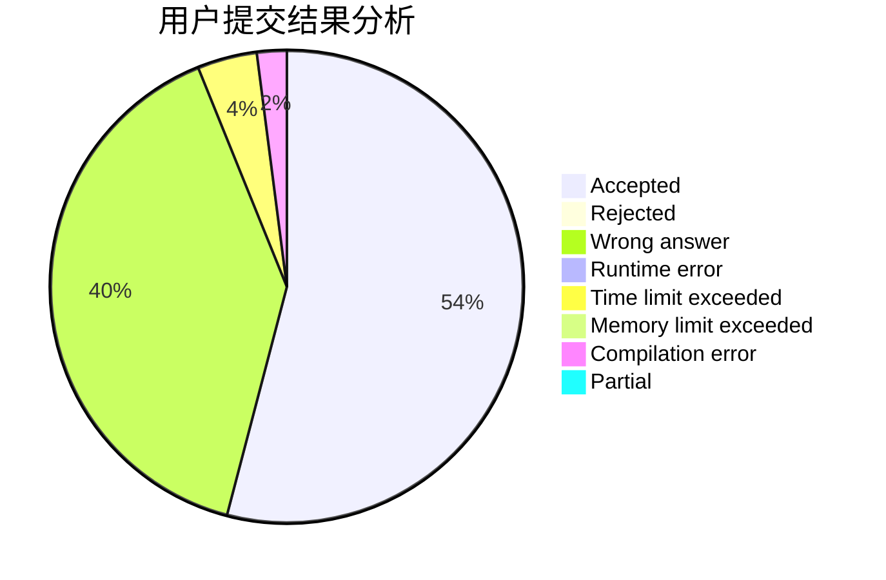
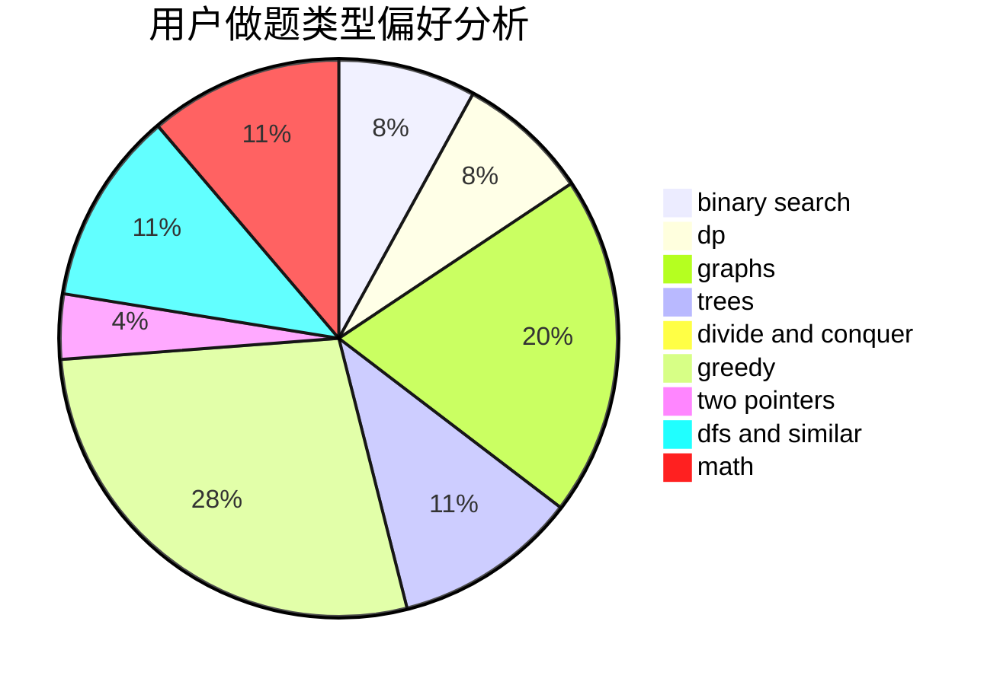

# Blogggggg

<!-- tabs:start -->

#### **用户提交结果分析**

#### **用户做题类型偏好分析**

<!-- tabs:end -->
# 推荐题目
[1445A](https://codeforces.com/contest/1445/problem/A)
[103E](https://codeforces.com/contest/103/problem/E)
[1404C](https://codeforces.com/contest/1404/problem/C)
[570E](https://codeforces.com/contest/570/problem/E)
[1140D](https://codeforces.com/contest/1140/problem/D)
[1068D](https://codeforces.com/contest/1068/problem/D)
[1174D](https://codeforces.com/contest/1174/problem/D)
[570D](https://codeforces.com/contest/570/problem/D)
[103D](https://codeforces.com/contest/103/problem/D)
[1176B](https://codeforces.com/contest/1176/problem/B)
