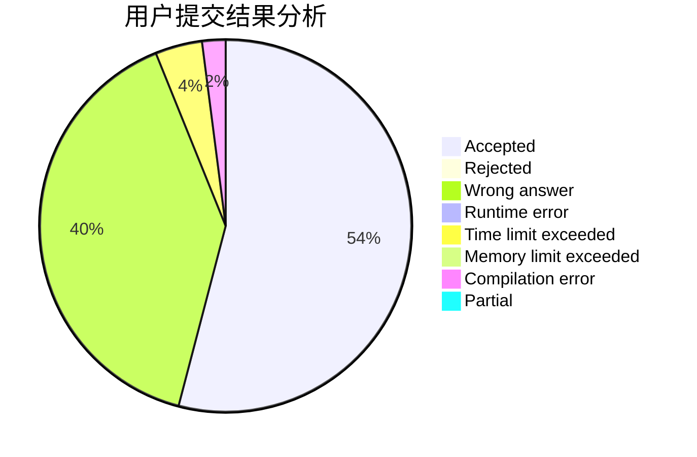
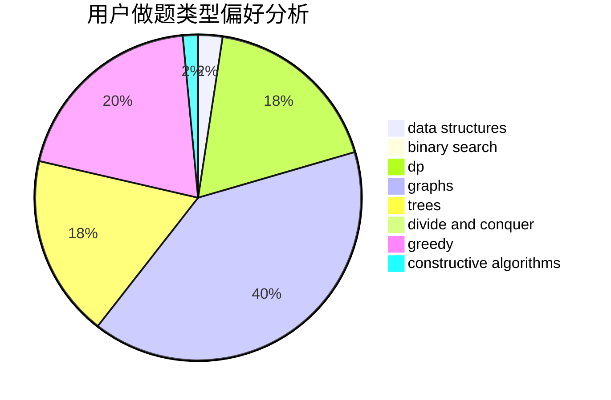
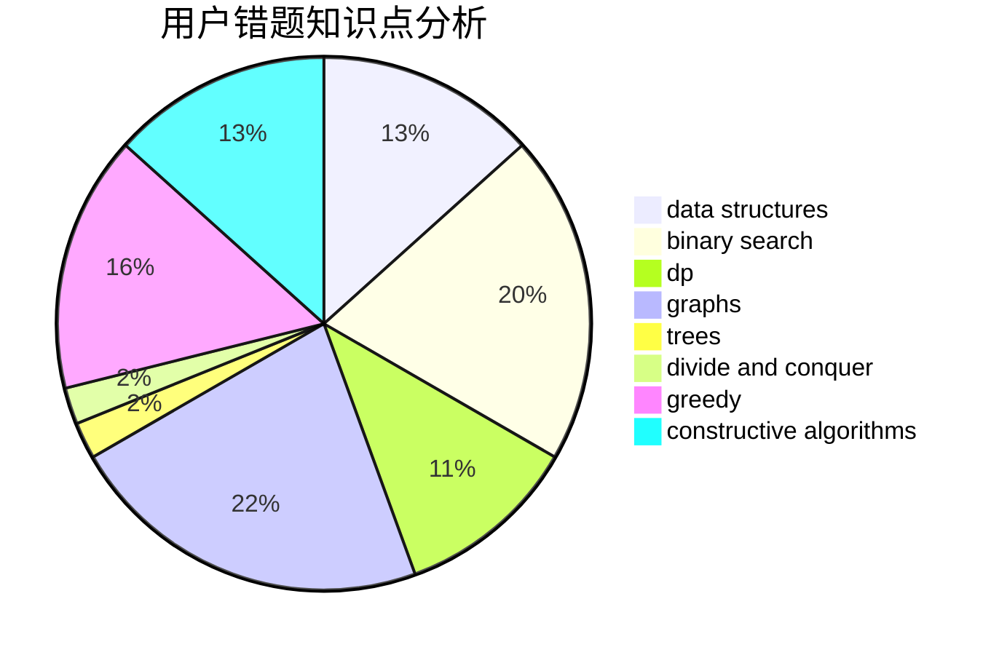

# Blogggggg

<!-- tabs:start -->

#### **用户提交结果分析**

#### **用户做题类型偏好分析**

#### **用户错题知识点分析**

<!-- tabs:end -->
# 推荐题目
[1445A](https://codeforces.com/contest/1445/problem/A)		greedy,
                        sortings		  
[103E](https://codeforces.com/contest/103/problem/E)		flows,
                        graph matchings		  
[1404C](https://codeforces.com/contest/1404/problem/C)		binary search,
                        constructive algorithms,
                        data structures,
                        greedy,
                        two pointers		  
[570E](https://codeforces.com/contest/570/problem/E)		combinatorics,
                        dp		  
[1140D](https://codeforces.com/contest/1140/problem/D)		dp,
                        greedy,
                        math		  
[1068D](https://codeforces.com/contest/1068/problem/D)		dsu,graphs,sortings,trees		  
[1174D](https://codeforces.com/contest/1174/problem/D)		bitmasks,
                        constructive algorithms		  
[570D](https://codeforces.com/contest/570/problem/D)		binary search,
                        bitmasks,
                        constructive algorithms,
                        dfs and similar,
                        graphs,
                        trees		  
[103D](https://codeforces.com/contest/103/problem/D)		brute force,
                        data structures,
                        sortings		  
[1176B](https://codeforces.com/contest/1176/problem/B)		math		  
