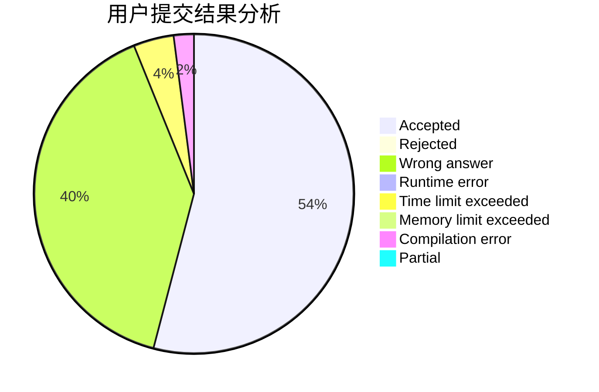
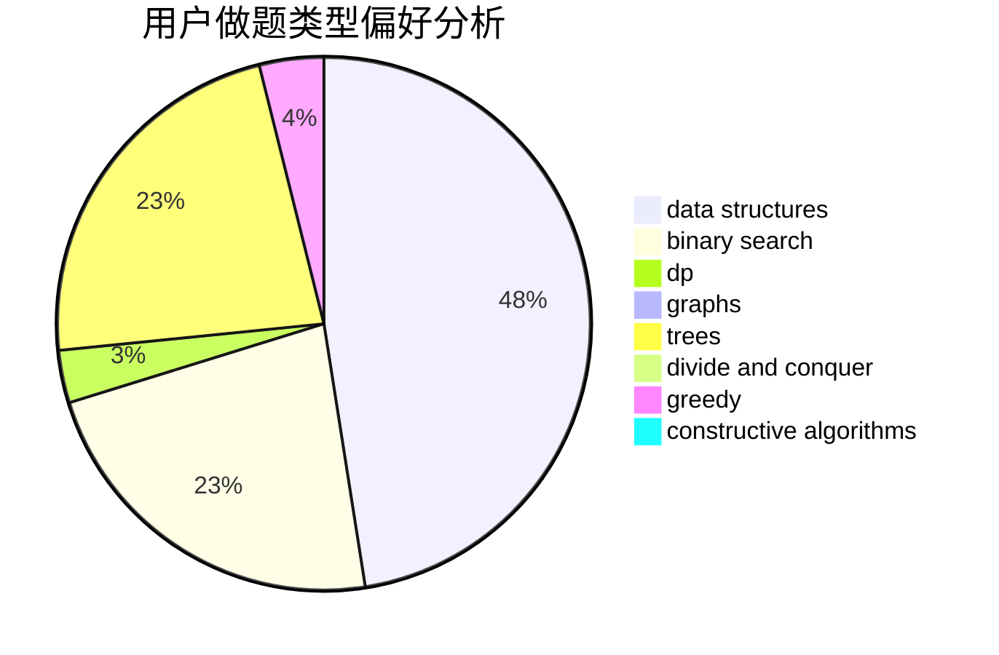
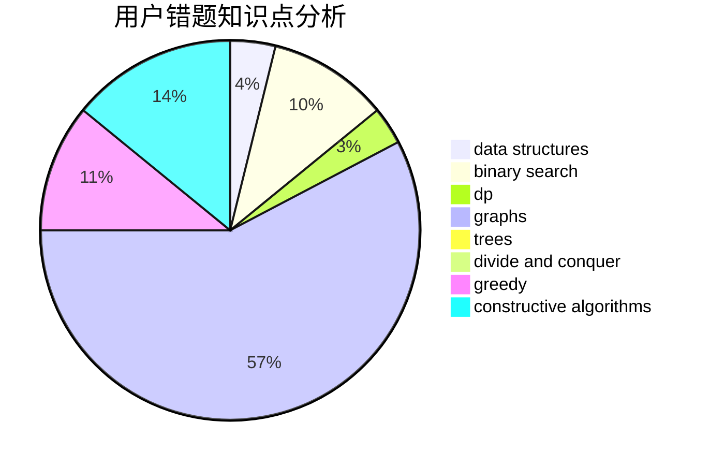

# Blogggggg

<!-- tabs:start -->

#### **用户提交结果分析**

#### **用户做题类型偏好分析**

#### **用户错题知识点分析**

<!-- tabs:end -->
# 推荐题目
[1435A](https://codeforces.com/contest/1435/problem/A)		dsu,graphs,sortings,trees		  
[103B](https://codeforces.com/contest/103/problem/B)		dfs and similar,
                        dsu,
                        graphs		  
[1395E](https://codeforces.com/contest/1395/problem/E)		dsu,graphs,sortings,trees		  
[546D](https://codeforces.com/contest/546/problem/D)		constructive algorithms,
                        dp,
                        math,
                        number theory		  
[1138F](https://codeforces.com/contest/1138/problem/F)		dsu,graphs,sortings,trees		  
[1068A](https://codeforces.com/contest/1068/problem/A)		math		  
[1172B](https://codeforces.com/contest/1172/problem/B)		combinatorics,
                        dfs and similar,
                        dp,
                        trees		  
[546C](https://codeforces.com/contest/546/problem/C)		brute force,
                        dfs and similar,
                        games		  
[103A](https://codeforces.com/contest/103/problem/A)		greedy,
                        implementation,
                        math		  
[1173F](https://codeforces.com/contest/1173/problem/F)		dsu,graphs,sortings,trees		  
