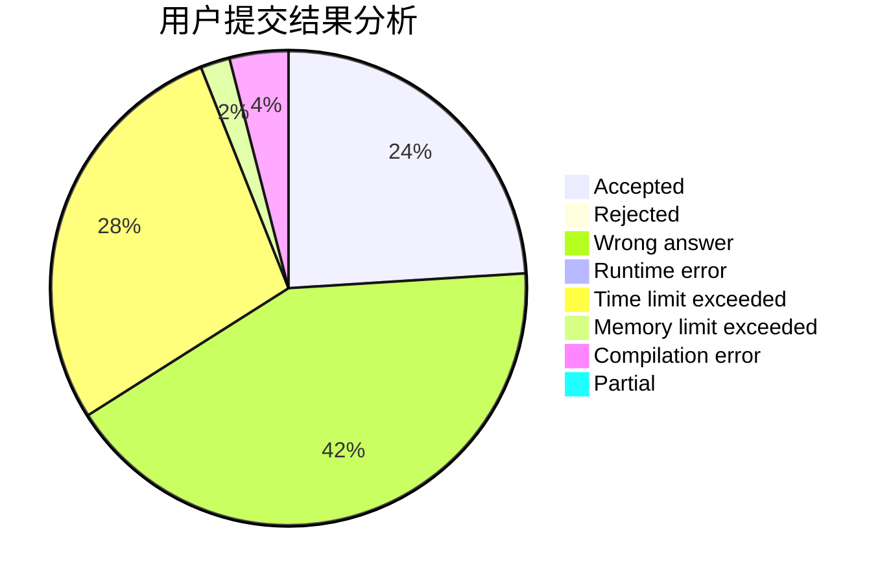
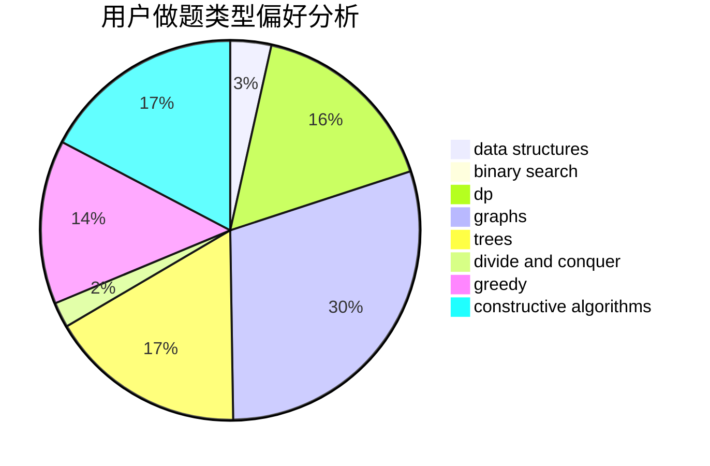
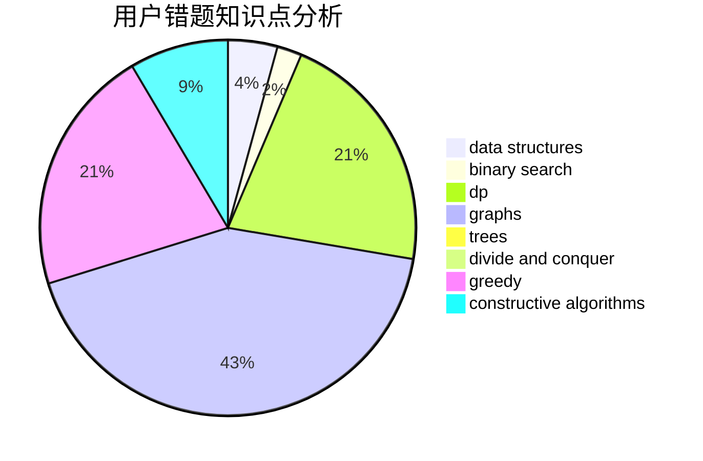

# lz1vyy

<!-- tabs:start -->

#### **用户提交结果分析**

#### **用户做题类型偏好分析**

#### **用户错题知识点分析**

<!-- tabs:end -->
# 推荐题目
[282C](https://codeforces.com/contest/282/problem/C)		constructive algorithms,
                        implementation,
                        math		  
[20A](https://codeforces.com/contest/20/problem/A)		implementation		  
[319C](https://codeforces.com/contest/319/problem/C)		dp,
                        geometry		  
[1210D](https://codeforces.com/contest/1210/problem/D)		graphs		  
[962B](https://codeforces.com/contest/962/problem/B)		constructive algorithms,
                        greedy,
                        implementation		  
[594D](https://codeforces.com/contest/594/problem/D)		data structures,
                        number theory		  
[318A](https://codeforces.com/contest/318/problem/A)		math		  
[12542](https://codeforces.com/contest/1254/problem/2)		dsu,graphs,sortings,trees		  
[1180C](https://codeforces.com/contest/1180/problem/C)		dsu,graphs,sortings,trees		  
[35C](https://codeforces.com/contest/35/problem/C)		brute force,
                        dfs and similar,
                        shortest paths		  
