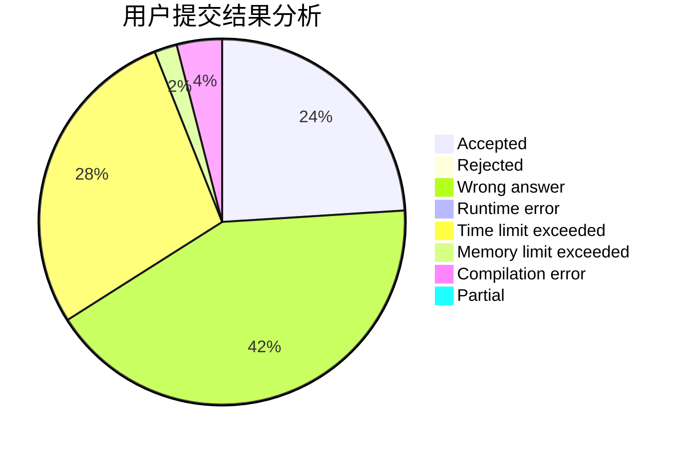
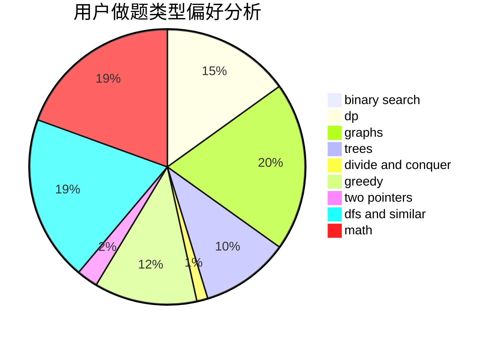

# lz1vyy

<!-- tabs:start -->

#### **用户提交结果分析**

#### **用户做题类型偏好分析**

<!-- tabs:end -->
# 推荐题目
[282C](https://codeforces.com/contest/282/problem/C)
[20A](https://codeforces.com/contest/20/problem/A)
[319C](https://codeforces.com/contest/319/problem/C)
[1210D](https://codeforces.com/contest/1210/problem/D)
[962B](https://codeforces.com/contest/962/problem/B)
[594D](https://codeforces.com/contest/594/problem/D)
[318A](https://codeforces.com/contest/318/problem/A)
[12542](https://codeforces.com/contest/1254/problem/2)
[1180C](https://codeforces.com/contest/1180/problem/C)
[35C](https://codeforces.com/contest/35/problem/C)
