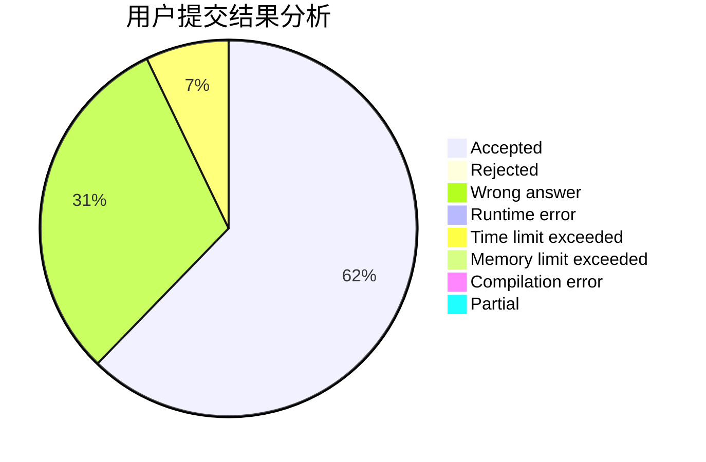
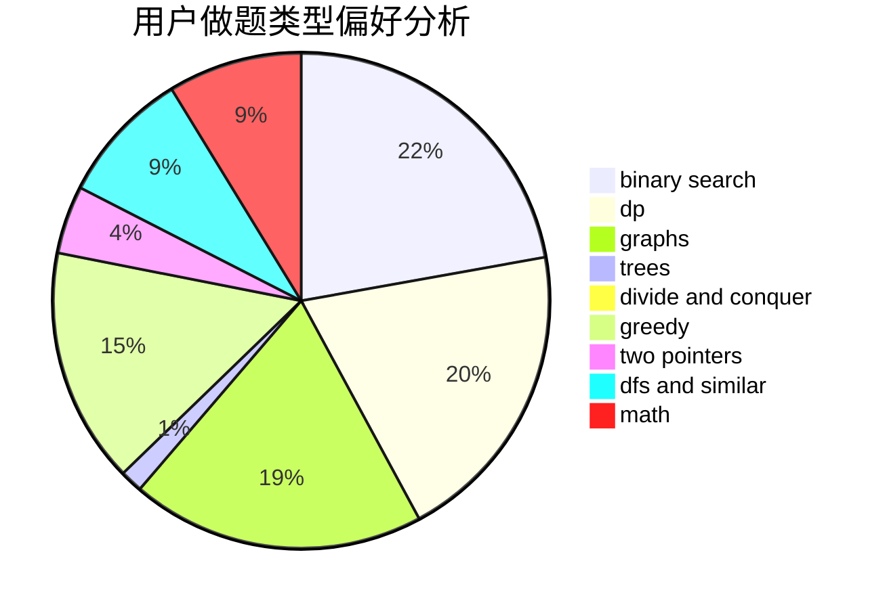

# lzc2001

<!-- tabs:start -->

#### **用户提交结果分析**

#### **用户做题类型偏好分析**

<!-- tabs:end -->
# 推荐题目
[13352](https://codeforces.com/contest/1335/problem/2)
[952E](https://codeforces.com/contest/952/problem/E)
[1379A](https://codeforces.com/contest/1379/problem/A)
[300E](https://codeforces.com/contest/300/problem/E)
[901A](https://codeforces.com/contest/901/problem/A)
[847E](https://codeforces.com/contest/847/problem/E)
[1246C](https://codeforces.com/contest/1246/problem/C)
[713A](https://codeforces.com/contest/713/problem/A)
[1346B](https://codeforces.com/contest/1346/problem/B)
[908F](https://codeforces.com/contest/908/problem/F)
