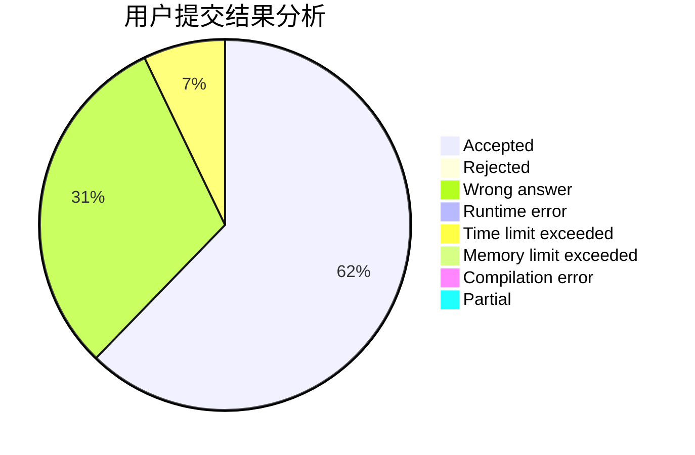
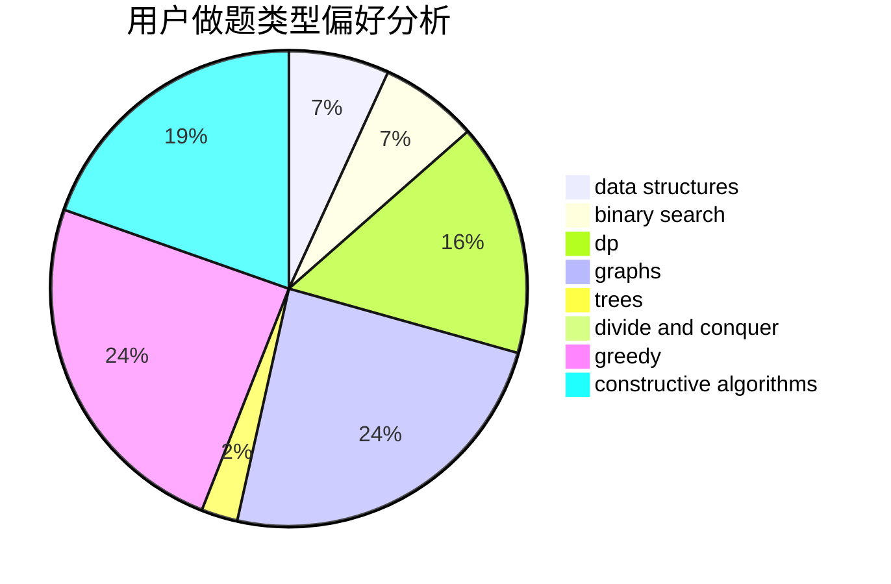
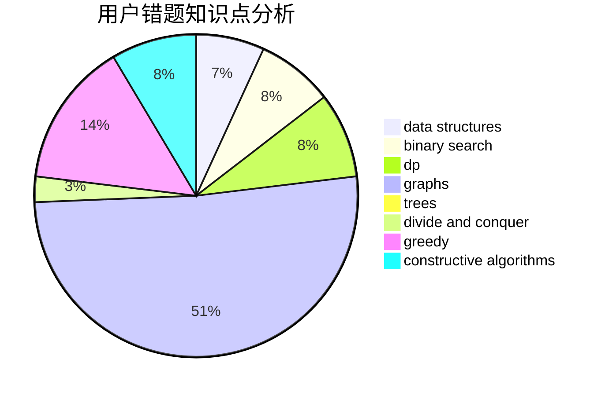

# lzc2001

<!-- tabs:start -->

#### **用户提交结果分析**

#### **用户做题类型偏好分析**

#### **用户错题知识点分析**

<!-- tabs:end -->
# 推荐题目
[13352](https://codeforces.com/contest/1335/problem/2)		dsu,graphs,sortings,trees		  
[952E](https://codeforces.com/contest/952/problem/E)		nan		  
[1379A](https://codeforces.com/contest/1379/problem/A)		brute force,
                        implementation,
                        strings		  
[300E](https://codeforces.com/contest/300/problem/E)		binary search,
                        math,
                        number theory		  
[901A](https://codeforces.com/contest/901/problem/A)		constructive algorithms,
                        trees		  
[847E](https://codeforces.com/contest/847/problem/E)		binary search,
                        dp		  
[1246C](https://codeforces.com/contest/1246/problem/C)		dsu,graphs,sortings,trees		  
[713A](https://codeforces.com/contest/713/problem/A)		data structures,
                        implementation		  
[1346B](https://codeforces.com/contest/1346/problem/B)		*special problem,
                        greedy		  
[908F](https://codeforces.com/contest/908/problem/F)		graphs,
                        greedy,
                        implementation		  
