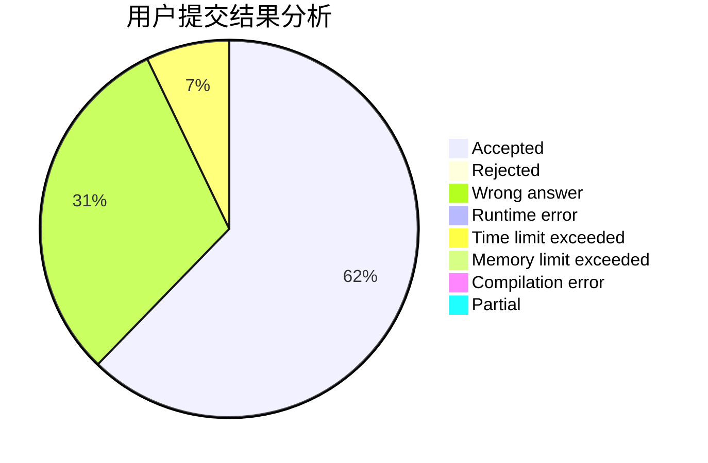
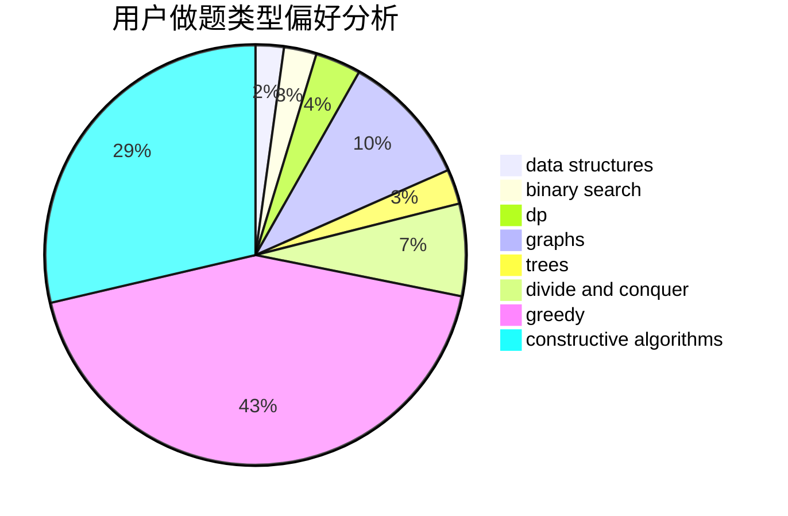
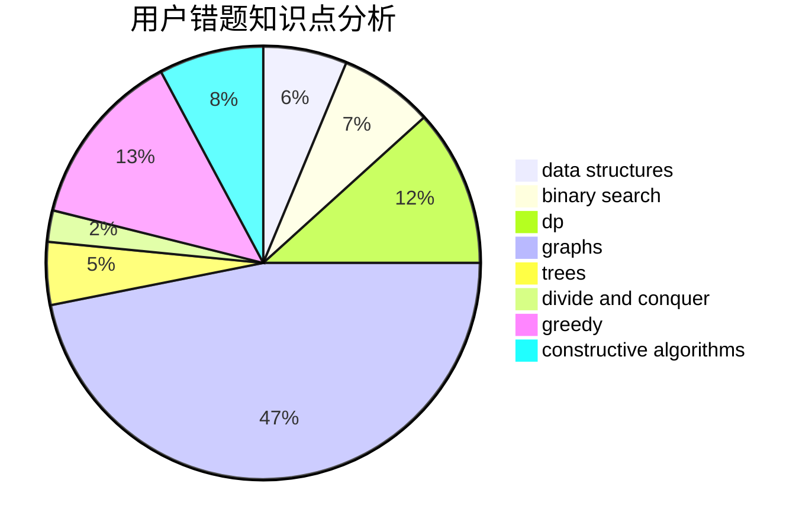

# lzc2001

<!-- tabs:start -->

#### **用户提交结果分析**

#### **用户做题类型偏好分析**

#### **用户错题知识点分析**

<!-- tabs:end -->
# 推荐题目
[1328F](https://codeforces.com/contest/1328/problem/F)		greedy		  
[931F](https://codeforces.com/contest/931/problem/F)		dsu,graphs,sortings,trees		  
[1370D](https://codeforces.com/contest/1370/problem/D)		binary search,
                        dp,
                        dsu,
                        greedy,
                        implementation		  
[286D](https://codeforces.com/contest/286/problem/D)		data structures,
                        sortings		  
[883G](https://codeforces.com/contest/883/problem/G)		dfs and similar,
                        graphs		  
[828E](https://codeforces.com/contest/828/problem/E)		dsu,graphs,sortings,trees		  
[1240F](https://codeforces.com/contest/1240/problem/F)		graphs		  
[696C](https://codeforces.com/contest/696/problem/C)		combinatorics,
                        dp,
                        implementation,
                        math,
                        matrices		  
[1339B](https://codeforces.com/contest/1339/problem/B)		constructive algorithms,
                        sortings		  
[888G](https://codeforces.com/contest/888/problem/G)		bitmasks,
                        constructive algorithms,
                        data structures		  
