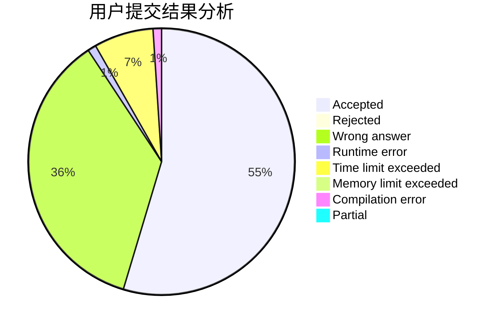
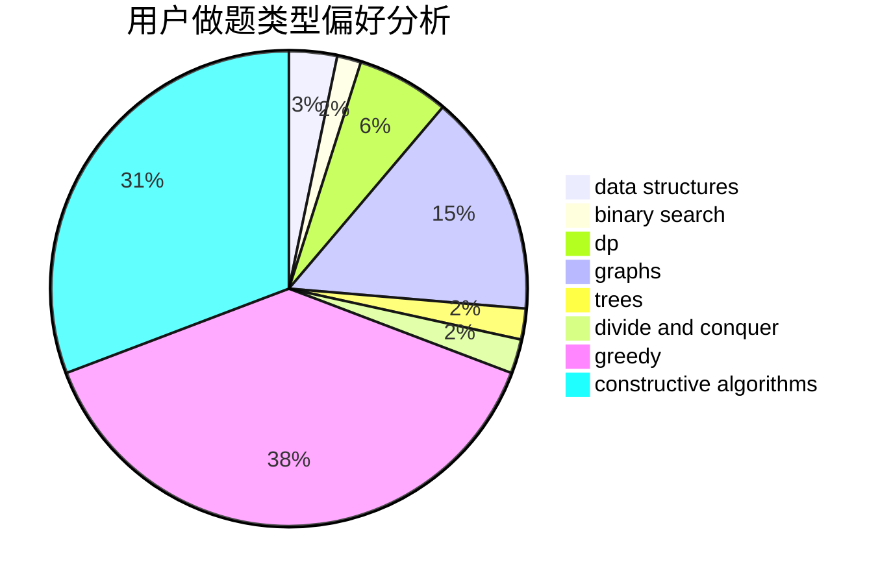
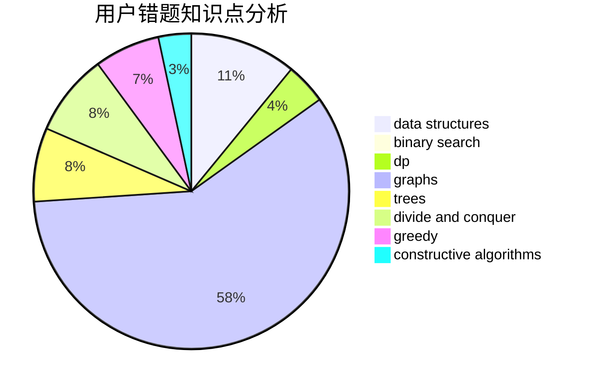

# lzj0614

<!-- tabs:start -->

#### **用户提交结果分析**

#### **用户做题类型偏好分析**

#### **用户错题知识点分析**

<!-- tabs:end -->
# 推荐题目
[200C](https://codeforces.com/contest/200/problem/C)		brute force,
                        implementation		  
[1156B](https://codeforces.com/contest/1156/problem/B)		dfs and similar,
                        greedy,
                        implementation,
                        sortings,
                        strings		  
[420C](https://codeforces.com/contest/420/problem/C)		data structures,
                        graphs,
                        implementation,
                        two pointers		  
[359C](https://codeforces.com/contest/359/problem/C)		math,
                        number theory		  
[559E](https://codeforces.com/contest/559/problem/E)		dp,
                        sortings		  
[1165C](https://codeforces.com/contest/1165/problem/C)		greedy		  
[909A](https://codeforces.com/contest/909/problem/A)		brute force,
                        greedy,
                        sortings		  
[180C](https://codeforces.com/contest/180/problem/C)		dp		  
[136D](https://codeforces.com/contest/136/problem/D)		dsu,graphs,sortings,trees		  
[316E2](https://codeforces.com/contest/316E/problem/2)		data structures,
                        math		  
