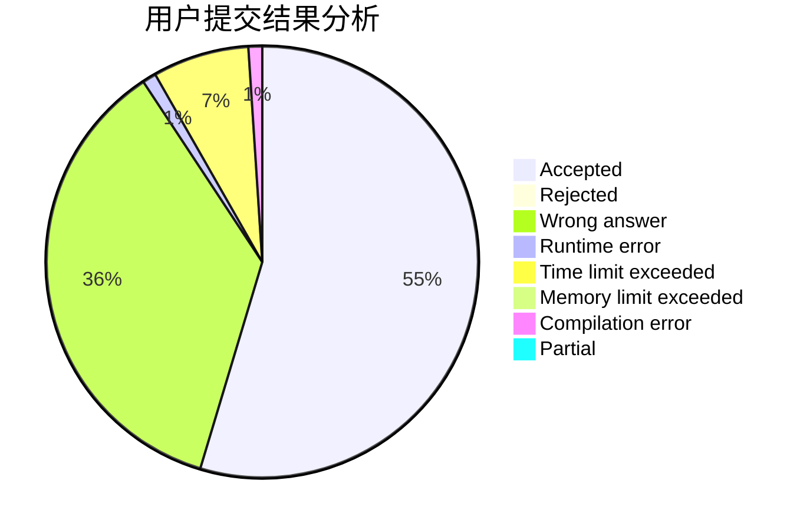
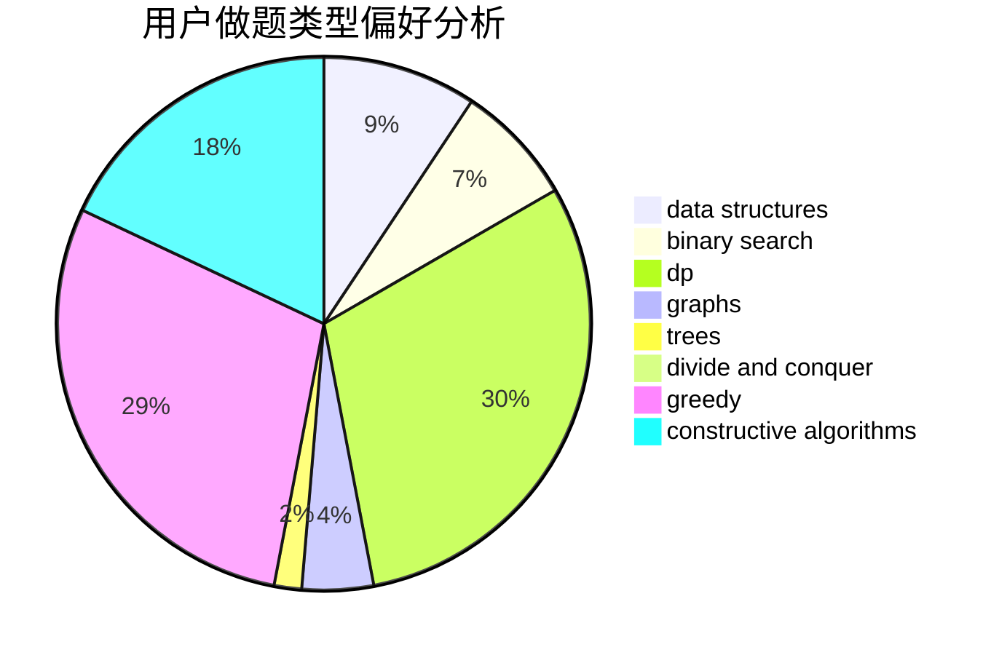
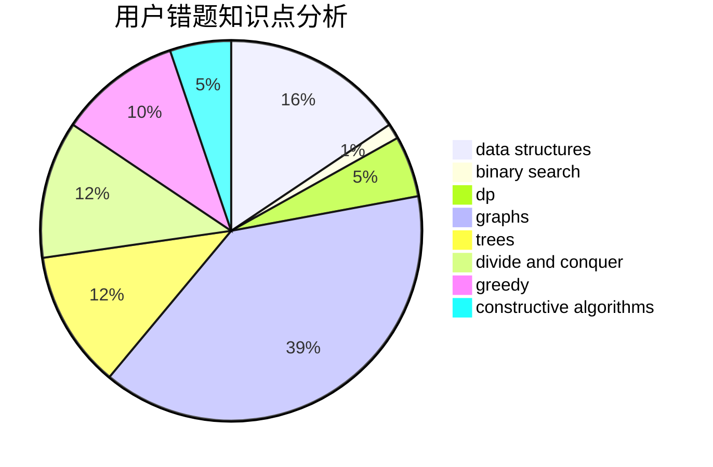

# lzj0614

<!-- tabs:start -->

#### **用户提交结果分析**

#### **用户做题类型偏好分析**

#### **用户错题知识点分析**

<!-- tabs:end -->
# 推荐题目
[225E](https://codeforces.com/contest/225/problem/E)		math,
                        number theory		  
[1157G](https://codeforces.com/contest/1157/problem/G)		brute force,
                        constructive algorithms		  
[446A](https://codeforces.com/contest/446/problem/A)		dp,
                        implementation,
                        two pointers		  
[386C](https://codeforces.com/contest/386/problem/C)		dp,
                        strings,
                        two pointers		  
[582C](https://codeforces.com/contest/582/problem/C)		number theory		  
[1167E](https://codeforces.com/contest/1167/problem/E)		binary search,
                        combinatorics,
                        data structures,
                        two pointers		  
[923D](https://codeforces.com/contest/923/problem/D)		constructive algorithms,
                        implementation,
                        strings		  
[205D](https://codeforces.com/contest/205/problem/D)		dsu,graphs,sortings,trees		  
[13782](https://codeforces.com/contest/1378/problem/2)		dsu,graphs,sortings,trees		  
[343A](https://codeforces.com/contest/343/problem/A)		math,
                        number theory		  
