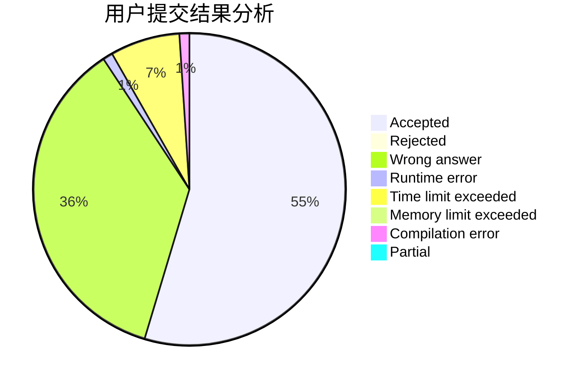
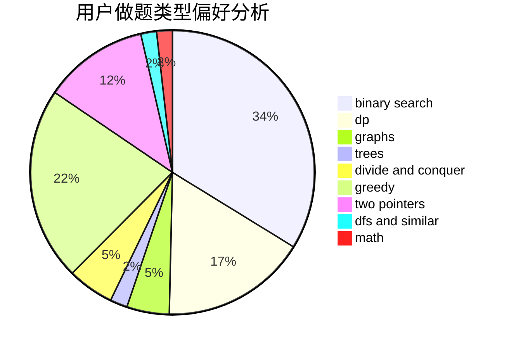

# lzj0614

<!-- tabs:start -->

#### **用户提交结果分析**

#### **用户做题类型偏好分析**

<!-- tabs:end -->
# 推荐题目
[225E](https://codeforces.com/contest/225/problem/E)
[1157G](https://codeforces.com/contest/1157/problem/G)
[446A](https://codeforces.com/contest/446/problem/A)
[386C](https://codeforces.com/contest/386/problem/C)
[582C](https://codeforces.com/contest/582/problem/C)
[1167E](https://codeforces.com/contest/1167/problem/E)
[923D](https://codeforces.com/contest/923/problem/D)
[205D](https://codeforces.com/contest/205/problem/D)
[13782](https://codeforces.com/contest/1378/problem/2)
[343A](https://codeforces.com/contest/343/problem/A)
