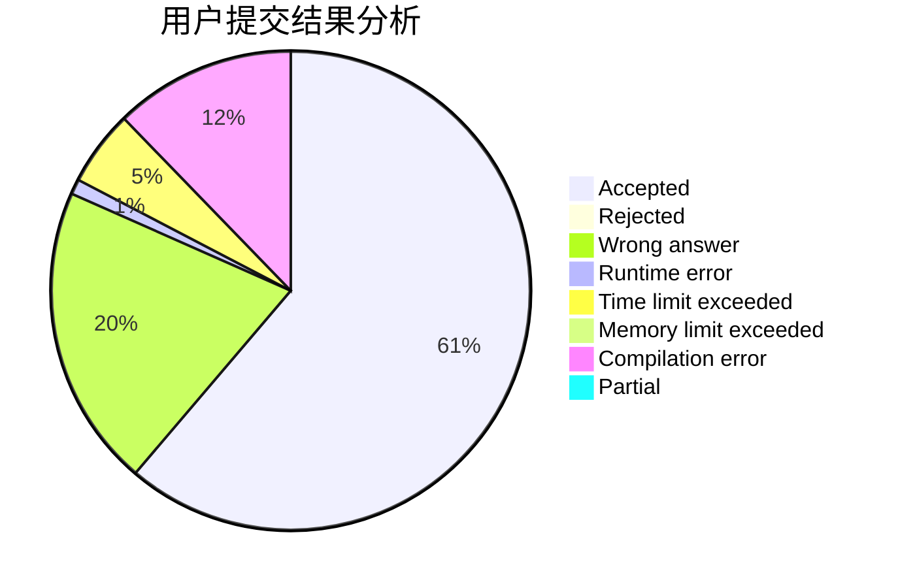
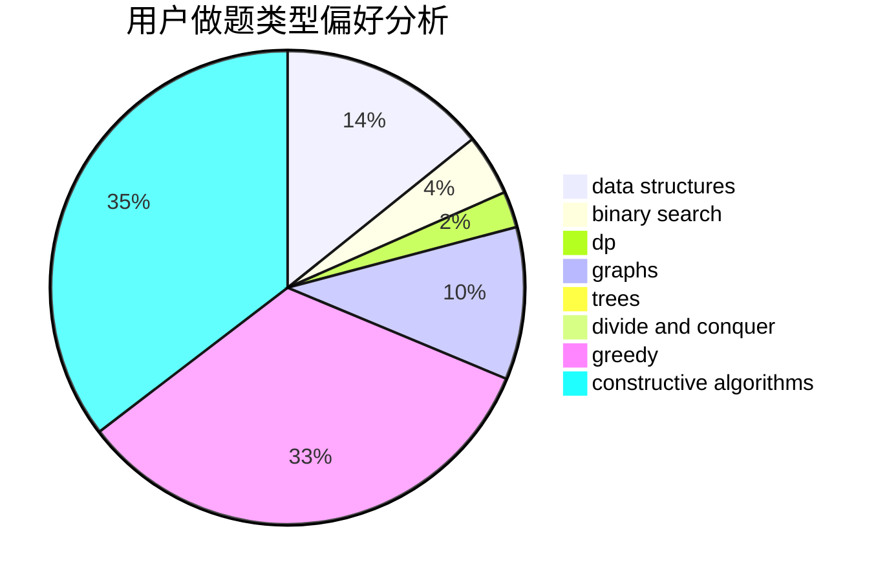

# lzr010506

<!-- tabs:start -->

#### **用户提交结果分析**

#### **用户做题类型偏好分析**

#### **用户错题知识点分析**

<!-- tabs:end -->
# 推荐题目
[110A](https://codeforces.com/contest/110/problem/A)		implementation		  
[1329C](https://codeforces.com/contest/1329/problem/C)		constructive algorithms,
                        data structures,
                        greedy,
                        implementation		  
[1055E](https://codeforces.com/contest/1055/problem/E)		binary search,
                        dp		  
[1324F](https://codeforces.com/contest/1324/problem/F)		dfs and similar,
                        dp,
                        graphs,
                        trees		  
[1264A](https://codeforces.com/contest/1264/problem/A)		greedy,
                        implementation		  
[593D](https://codeforces.com/contest/593/problem/D)		data structures,
                        dfs and similar,
                        graphs,
                        math,
                        trees		  
[724C](https://codeforces.com/contest/724/problem/C)		greedy,
                        hashing,
                        implementation,
                        math,
                        number theory,
                        sortings		  
[1294A](https://codeforces.com/contest/1294/problem/A)		math		  
[682B](https://codeforces.com/contest/682/problem/B)		sortings		  
[494D](https://codeforces.com/contest/494/problem/D)		data structures,
                        dfs and similar,
                        dp,
                        trees		  
