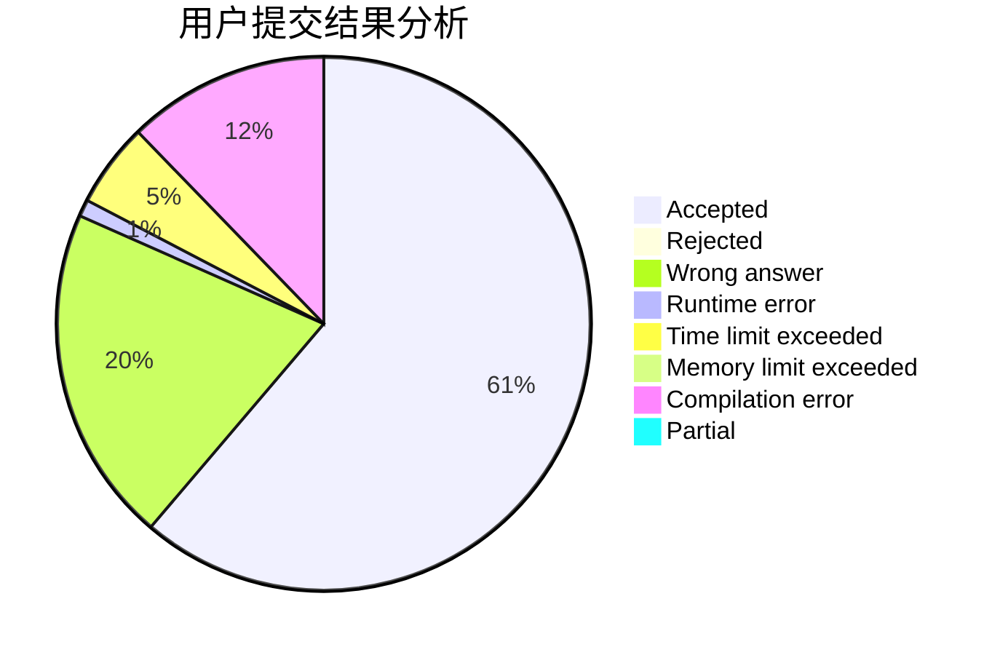
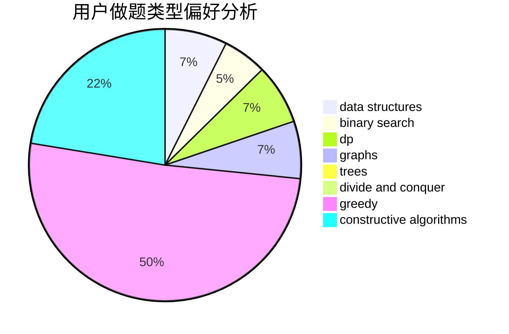

# lzr010506
<!-- tabs:start -->
#### **用户提交结果分析**

#### **用户做题类型偏好分析**

#### **用户错题知识点分析**

<!-- tabs:end -->
# 推荐题目
[Splits](http://codeforces.com/problemset/problem/964/A)		math		  
[Bear and Bowling](http://codeforces.com/problemset/problem/573/E)		data structures,
                        greedy		  
[Neverending competitions](http://codeforces.com/problemset/problem/765/A)		implementation,
                        math		  
[Johnny and James](http://codeforces.com/problemset/problem/1361/D)		greedy,
                        implementation,
                        math,
                        trees		  
[Shooting Gallery](http://codeforces.com/problemset/problem/30/C)		dp,
                        probabilities		  
[Meta-universe](http://codeforces.com/problemset/problem/475/F)		data structures		  
[Balanced Domino Placements](http://codeforces.com/problemset/problem/1237/F)		combinatorics,
                        dp		  
[New Game Plus!](http://codeforces.com/problemset/problem/1415/E)		constructive algorithms,
                        greedy,
                        math		  
[Ramesses and Corner Inversion](http://codeforces.com/problemset/problem/1119/C)		constructive algorithms,
                        greedy,
                        implementation,
                        math		  
[Cooperative Game](https://codeforces.com/contest/1138/problem/F)		constructive algorithms,
                        interactive,
                        number theory		  
<!-- tabs:start -->
#### **data structures**
[Splits](http://codeforces.com/problemset/problem/573/E)		data structures,
                        greedy		  
[Bear and Bowling](http://codeforces.com/problemset/problem/475/F)		data structures		  
[Neverending competitions](http://codeforces.com/problemset/problem/362/C)		data structures,
                        dp,
                        implementation,
                        math		  
[Johnny and James](http://codeforces.com/problemset/problem/311/D)		data structures,
                        math		  
[Shooting Gallery](http://codeforces.com/problemset/problem/900/C)		brute force,
                        data structures,
                        math		  
[Meta-universe](http://codeforces.com/problemset/problem/763/E)		data structures,
                        divide and conquer,
                        dsu		  
[Balanced Domino Placements](http://codeforces.com/problemset/problem/519/B)		data structures,
                        implementation,
                        sortings		  
[New Game Plus!](http://codeforces.com/problemset/problem/666/E)		data structures,
                        string suffix structures		  
[Ramesses and Corner Inversion](http://codeforces.com/problemset/problem/1286/D)		data structures,
                        math,
                        matrices,
                        probabilities		  
[Cooperative Game](https://codeforces.com/contest/860/problem/B)		data structures,
                        implementation,
                        sortings		  
#### **binary search**
[Splits](http://codeforces.com/problemset/problem/1249/C2)		binary search,
                        greedy,
                        math,
                        meet-in-the-middle		  
[Bear and Bowling](https://codeforces.com/contest/1064/problem/E)		binary search,
                        constructive algorithms,
                        geometry,
                        interactive		  
[Neverending competitions](https://codeforces.com/contest/1262/problem/E)		binary search,
                        graphs,
                        graphs,
                        shortest paths		  
[Johnny and James](http://codeforces.com/problemset/problem/842/E)		binary search,
                        dfs and similar,
                        divide and conquer,
                        graphs,
                        trees		  
[Shooting Gallery](http://codeforces.com/problemset/problem/1492/C)		binary search,
                        data structures,
                        dp,
                        greedy,
                        two pointers		  
[Meta-universe](http://codeforces.com/problemset/problem/1463/D)		binary search,
                        constructive algorithms,
                        greedy,
                        two pointers		  
[Balanced Domino Placements](http://codeforces.com/problemset/problem/1490/G)		binary search,
                        data structures,
                        math		  
[New Game Plus!](http://codeforces.com/problemset/problem/1479/D)		binary search,
                        bitmasks,
                        brute force,
                        data structures,
                        probabilities,
                        trees		  
[Ramesses and Corner Inversion](http://codeforces.com/problemset/problem/1436/E)		binary search,
                        data structures,
                        two pointers		  
[Cooperative Game](http://codeforces.com/problemset/problem/1461/D)		binary search,
                        brute force,
                        data structures,
                        divide and conquer,
                        implementation,
                        sortings		  
#### **dp**
[Splits](http://codeforces.com/problemset/problem/30/C)		dp,
                        probabilities		  
[Bear and Bowling](http://codeforces.com/problemset/problem/1237/F)		combinatorics,
                        dp		  
[Neverending competitions](http://codeforces.com/problemset/problem/1322/D)		bitmasks,
                        dp		  
[Johnny and James](http://codeforces.com/problemset/problem/362/C)		data structures,
                        dp,
                        implementation,
                        math		  
[Shooting Gallery](http://codeforces.com/problemset/problem/1109/D)		brute force,
                        combinatorics,
                        dp,
                        math,
                        trees		  
[Meta-universe](http://codeforces.com/problemset/problem/1402/C)		*special problem,
                        combinatorics,
                        dfs and similar,
                        dp,
                        games,
                        graphs,
                        matrices,
                        trees		  
[Balanced Domino Placements](http://codeforces.com/problemset/problem/1299/D)		bitmasks,
                        combinatorics,
                        dfs and similar,
                        dp,
                        graphs,
                        graphs,
                        math,
                        trees		  
[New Game Plus!](http://codeforces.com/problemset/problem/703/E)		dp,
                        number theory		  
[Ramesses and Corner Inversion](http://codeforces.com/problemset/problem/1029/E)		dp,
                        graphs,
                        greedy		  
[Cooperative Game](http://codeforces.com/problemset/problem/677/D)		data structures,
                        dp,
                        graphs,
                        shortest paths		  
#### **graph**
[Splits](http://codeforces.com/problemset/problem/1198/E)		flows,
                        graph matchings,
                        graphs		  
[Bear and Bowling](http://codeforces.com/problemset/problem/1402/C)		*special problem,
                        combinatorics,
                        dfs and similar,
                        dp,
                        games,
                        graphs,
                        matrices,
                        trees		  
[Neverending competitions](http://codeforces.com/problemset/problem/1299/D)		bitmasks,
                        combinatorics,
                        dfs and similar,
                        dp,
                        graphs,
                        graphs,
                        math,
                        trees		  
[Johnny and James](http://codeforces.com/problemset/problem/1029/E)		dp,
                        graphs,
                        greedy		  
[Shooting Gallery](http://codeforces.com/problemset/problem/662/B)		dfs and similar,
                        graphs		  
[Meta-universe](http://codeforces.com/problemset/problem/246/D)		brute force,
                        dfs and similar,
                        graphs		  
[Balanced Domino Placements](https://codeforces.com/contest/1262/problem/E)		binary search,
                        graphs,
                        graphs,
                        shortest paths		  
[New Game Plus!](http://codeforces.com/problemset/problem/842/E)		binary search,
                        dfs and similar,
                        divide and conquer,
                        graphs,
                        trees		  
[Ramesses and Corner Inversion](http://codeforces.com/problemset/problem/677/D)		data structures,
                        dp,
                        graphs,
                        shortest paths		  
[Cooperative Game](http://codeforces.com/problemset/problem/1461/E)		brute force,
                        graphs,
                        greedy,
                        implementation,
                        math		  
#### **trees**
[Splits](http://codeforces.com/problemset/problem/1361/D)		greedy,
                        implementation,
                        math,
                        trees		  
[Bear and Bowling](http://codeforces.com/problemset/problem/1109/D)		brute force,
                        combinatorics,
                        dp,
                        math,
                        trees		  
[Neverending competitions](http://codeforces.com/problemset/problem/1402/C)		*special problem,
                        combinatorics,
                        dfs and similar,
                        dp,
                        games,
                        graphs,
                        matrices,
                        trees		  
[Johnny and James](http://codeforces.com/problemset/problem/1299/D)		bitmasks,
                        combinatorics,
                        dfs and similar,
                        dp,
                        graphs,
                        graphs,
                        math,
                        trees		  
[Shooting Gallery](http://codeforces.com/problemset/problem/842/E)		binary search,
                        dfs and similar,
                        divide and conquer,
                        graphs,
                        trees		  
[Meta-universe](http://codeforces.com/problemset/problem/1276/D)		dp,
                        trees		  
[Balanced Domino Placements](http://codeforces.com/problemset/problem/1479/D)		binary search,
                        bitmasks,
                        brute force,
                        data structures,
                        probabilities,
                        trees		  
[New Game Plus!](http://codeforces.com/problemset/problem/1511/C)		brute force,
                        data structures,
                        implementation,
                        trees		  
[Ramesses and Corner Inversion](http://codeforces.com/problemset/problem/1499/F)		combinatorics,
                        dfs and similar,
                        dp,
                        trees		  
[Cooperative Game](http://codeforces.com/problemset/problem/1491/E)		brute force,
                        dfs and similar,
                        divide and conquer,
                        number theory,
                        trees		  
#### **divide and conquer**
[Splits](http://codeforces.com/problemset/problem/763/E)		data structures,
                        divide and conquer,
                        dsu		  
[Bear and Bowling](http://codeforces.com/problemset/problem/842/E)		binary search,
                        dfs and similar,
                        divide and conquer,
                        graphs,
                        trees		  
[Neverending competitions](http://codeforces.com/problemset/problem/1461/D)		binary search,
                        brute force,
                        data structures,
                        divide and conquer,
                        implementation,
                        sortings		  
[Johnny and James](http://codeforces.com/problemset/problem/1466/G)		combinatorics,
                        divide and conquer,
                        hashing,
                        math,
                        string suffix structures,
                        strings		  
[Shooting Gallery](http://codeforces.com/problemset/problem/1490/D)		dfs and similar,
                        divide and conquer,
                        implementation		  
[Meta-universe](https://codeforces.com/contest/1483/problem/C)		data structures,
                        divide and conquer,
                        dp		  
[Balanced Domino Placements](http://codeforces.com/problemset/problem/1491/E)		brute force,
                        dfs and similar,
                        divide and conquer,
                        number theory,
                        trees		  
[New Game Plus!](http://codeforces.com/problemset/problem/1303/G)		data structures,
                        divide and conquer,
                        geometry,
                        trees		  
[Ramesses and Corner Inversion](http://codeforces.com/problemset/problem/1494/D)		constructive algorithms,
                        data structures,
                        dfs and similar,
                        divide and conquer,
                        dsu,
                        greedy,
                        sortings,
                        trees		  
[Cooperative Game](http://codeforces.com/problemset/problem/1482/E)		data structures,
                        divide and conquer,
                        dp		  
#### **greedy**
[Splits](http://codeforces.com/problemset/problem/573/E)		data structures,
                        greedy		  
[Bear and Bowling](http://codeforces.com/problemset/problem/1361/D)		greedy,
                        implementation,
                        math,
                        trees		  
[Neverending competitions](http://codeforces.com/problemset/problem/1415/E)		constructive algorithms,
                        greedy,
                        math		  
[Johnny and James](http://codeforces.com/problemset/problem/1119/C)		constructive algorithms,
                        greedy,
                        implementation,
                        math		  
[Shooting Gallery](http://codeforces.com/problemset/problem/1249/C2)		binary search,
                        greedy,
                        math,
                        meet-in-the-middle		  
[Meta-universe](http://codeforces.com/problemset/problem/709/B)		greedy,
                        implementation,
                        sortings		  
[Balanced Domino Placements](http://codeforces.com/problemset/problem/354/A)		brute force,
                        greedy,
                        math		  
[New Game Plus!](http://codeforces.com/problemset/problem/550/E)		constructive algorithms,
                        greedy,
                        implementation,
                        math		  
[Ramesses and Corner Inversion](http://codeforces.com/problemset/problem/1029/E)		dp,
                        graphs,
                        greedy		  
[Cooperative Game](http://codeforces.com/problemset/problem/1257/A)		greedy,
                        math		  
#### **constructive algorithms**
[Splits](http://codeforces.com/problemset/problem/1415/E)		constructive algorithms,
                        greedy,
                        math		  
[Bear and Bowling](http://codeforces.com/problemset/problem/1119/C)		constructive algorithms,
                        greedy,
                        implementation,
                        math		  
[Neverending competitions](https://codeforces.com/contest/1138/problem/F)		constructive algorithms,
                        interactive,
                        number theory		  
[Johnny and James](https://codeforces.com/contest/1064/problem/E)		binary search,
                        constructive algorithms,
                        geometry,
                        interactive		  
[Shooting Gallery](http://codeforces.com/problemset/problem/550/E)		constructive algorithms,
                        greedy,
                        implementation,
                        math		  
[Meta-universe](http://codeforces.com/problemset/problem/1481/C)		brute force,
                        constructive algorithms,
                        greedy		  
[Balanced Domino Placements](http://codeforces.com/problemset/problem/1413/A)		constructive algorithms,
                        math		  
[New Game Plus!](http://codeforces.com/problemset/problem/1493/A)		constructive algorithms,
                        greedy		  
[Ramesses and Corner Inversion](http://codeforces.com/problemset/problem/1463/D)		binary search,
                        constructive algorithms,
                        greedy,
                        two pointers		  
[Cooperative Game](https://codeforces.com/contest/1456/problem/B)		bitmasks,
                        brute force,
                        constructive algorithms		  
#### **sortings**
[Splits](http://codeforces.com/problemset/problem/709/B)		greedy,
                        implementation,
                        sortings		  
[Bear and Bowling](http://codeforces.com/problemset/problem/723/A)		implementation,
                        math,
                        sortings		  
[Neverending competitions](http://codeforces.com/problemset/problem/519/B)		data structures,
                        implementation,
                        sortings		  
[Johnny and James](https://codeforces.com/contest/860/problem/B)		data structures,
                        implementation,
                        sortings		  
[Shooting Gallery](https://codeforces.com/contest/1496/problem/C)		geometry,
                        greedy,
                        math,
                        sortings		  
[Meta-universe](http://codeforces.com/problemset/problem/1495/A)		geometry,
                        greedy,
                        math,
                        sortings		  
[Balanced Domino Placements](http://codeforces.com/problemset/problem/1497/A)		brute force,
                        data structures,
                        greedy,
                        sortings		  
[New Game Plus!](http://codeforces.com/problemset/problem/1427/A)		math,
                        sortings		  
[Ramesses and Corner Inversion](http://codeforces.com/problemset/problem/1461/D)		binary search,
                        brute force,
                        data structures,
                        divide and conquer,
                        implementation,
                        sortings		  
[Cooperative Game](http://codeforces.com/problemset/problem/1437/C)		dp,
                        flows,
                        graph matchings,
                        greedy,
                        math,
                        sortings		  
<!-- tabs:end -->
